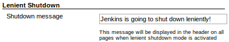
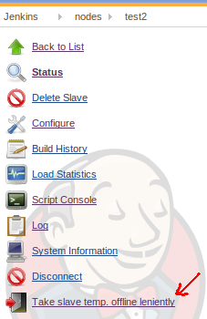

## Features

This plugin lets you put Jenkins in shutdown mode but still allow any
downstream builds of those currently running to also complete. Similar
functionality for taking nodes temporarily offline.

### Global lenient shutdown

#### Activation

The global lenient shutdown mode for taking the Jenkins master offline
is activated under "Manage Jenkins":

#### Page decorator

After activating global lenient shutdown, all pages get the following
header:

This message can be configured in the Jenkins global settings page:

### Lenient offline for slaves

A single slave can be taken offline leniently (letting slave specific
downstream builds finish) by going to the node's page and pressing the
button:

## Changelog

#### Version 1.1.1 (released Mar 07 2017)

-   Fixed a problem when security is enabled. *([pr
    \#4](https://github.com/jenkinsci/lenient-shutdown-plugin/pull/4))*

#### Version 1.1.0 (released Nov 28 2016)

-   Switch the required version of Jenkins 1.601; this allows to track
    the Upstream causes via the queue id and not by matching the project
    names. *([pr
    \#2](https://github.com/jenkinsci/lenient-shutdown-plugin/pull/2))*
-   Allow all items in the queue to finish, not just those that have
    been started by an upstream project. *([pr
    \#2](https://github.com/jenkinsci/lenient-shutdown-plugin/pull/2))*
-   You can maintain a list of white listed projects that are allowed to
    run even though lenient shutdown is active. *([pr
    \#2](https://github.com/jenkinsci/lenient-shutdown-plugin/pull/2))*

#### Version 1.0.0 (released Jul 11 2014)

Initial release
