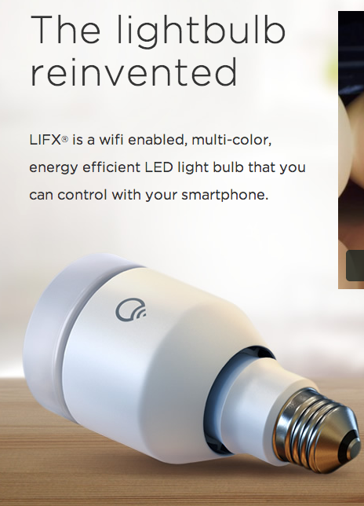

  

Discover your smart [LIFX](http://lifx.co/) lightbulbs on the network
and use them as a build notifier.

Just install the plugin and be prepared to be surprised.

### Colors configuration

## Changelog

### 0.3.0 (Nov 29 2016)

-   Add possibility to configure colors (in progress, success/failure)
