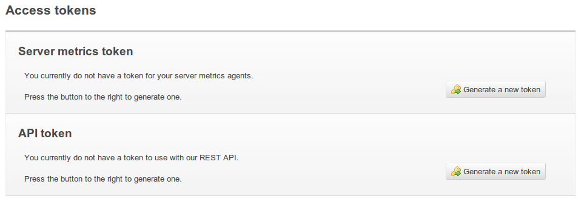
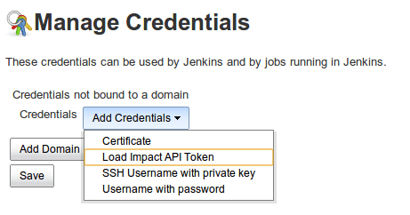
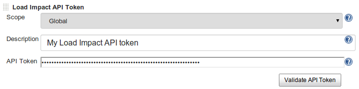
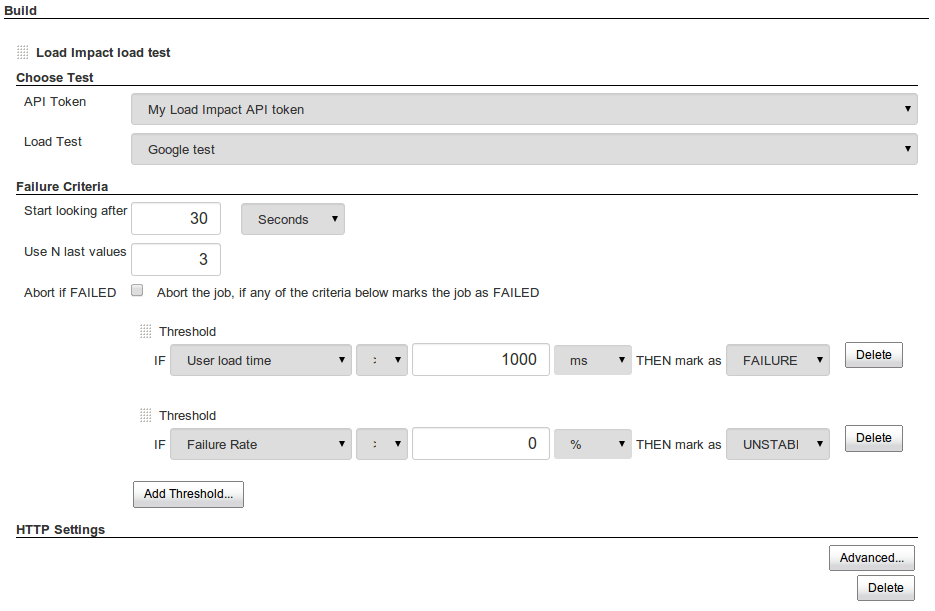
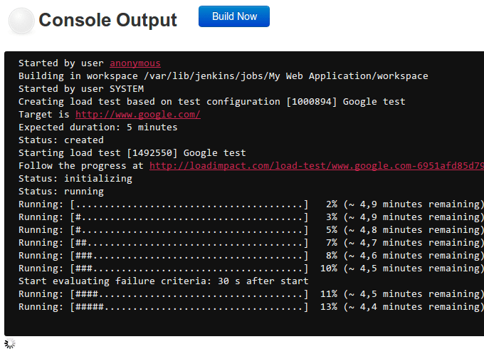
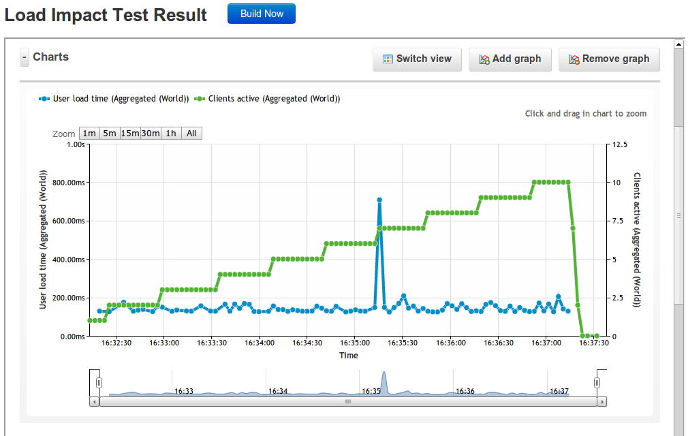

This plugin allows you to execute [Load Impact](http://loadimpact.com/)
load tests from Jenkins, and mark a build as failed if it doesn't meet
your performance criteria

## Prerequisites

-   You need Jenkins 1.535 or higher to use the Load Impact plugin
-   You will also need to have the
    [Credentials](https://wiki.jenkins-ci.org/display/JENKINS/Credentials+Plugin)
    plugin installed
-   You need to have a Load Impact user account (a free account will
    work) - register one [here](https://loadimpact.com/account/register)

## Installation instructions

#### 1. Generate a Load Impact API token

If you don't already have one. You do this by logging into your Load
Impact account and going to the
[Account](https://loadimpact.com/account/) page on loadimpact.com, where
you will find this section:

Click the button to generate a new token, then copy it to the clipboard.

#### 2. Add the API token to your "credentials" in Jenkins

Go to the Credentials management page and choose "Add Credentials" and
then select "Load Impact API Token" from the drop-down menu:

Then choose a name for the token and paste the actual token string into
the "API token" field:

#### 3. Start testing!

1.  **[Create a Load Impact test
    configuration](https://loadimpact.com/test/config/create)** **(if
    you don't already have one)**
2.  **Add the test as a build- or post-build step in Jenkins (both are
    supported):**

**You get information about test progress and pass/unstable/fail
criteria analyis through the test:**

**After the build step has completed you can view the test results from
inside of Jenkins:**

