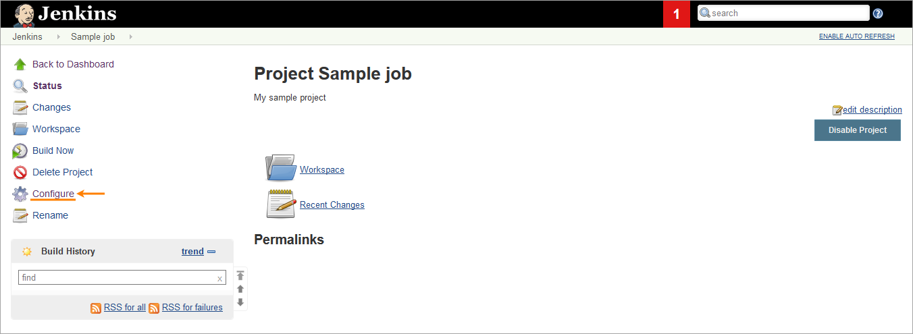
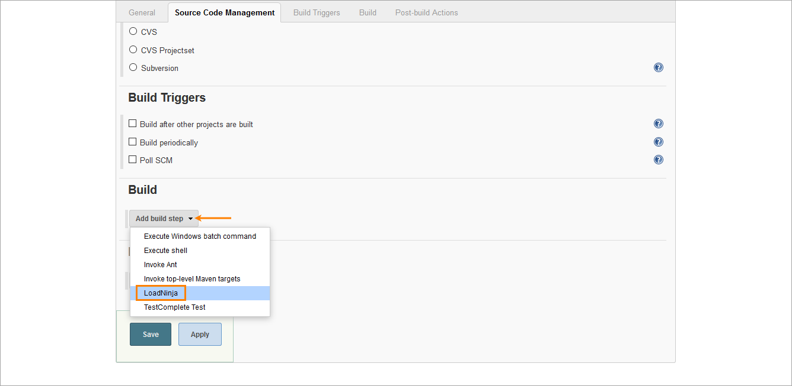
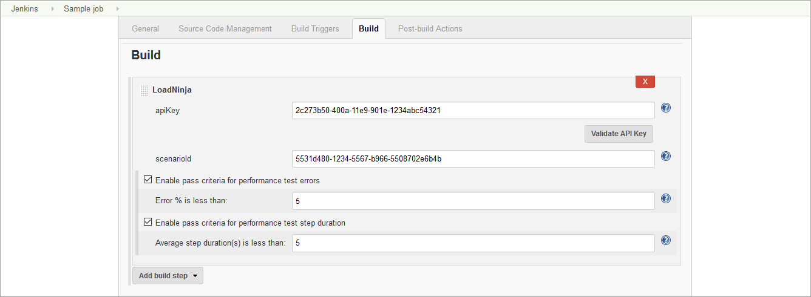

The LoadNinja Load Testing Plugin allows
integrating [LoadNinja ](https://loadninja.com/)tests in your Jenkins
builds.

## What is LoadNinja?

LoadNinja is a cloud-based load testing and performance testing platform
for web applications. It helps developers, QA teams, and performance
engineers check if their web servers sustain a massive load and if the
servers are robust and scalable.

## Install plugin

Install this plugin in the Jenkins plugin manager.

> **Tip**: To post test results as Zephyr items, also install
> the [Z](https://plugins.jenkins.io/zephyr-for-jira-test-management)ephyr
> for JIRA Test Management plugin.

## Add LoadNinja tests to your builds

To run a LoadNinja test as part of your build, configure the needed
build:

1.  In Jenkins, select a job and click **Configure**.  
    {width="600"}
2.  In the **Build** section, click **Add build step \> LoadNinja**.
    This step is added by the LoadNinja Load Testing Plugin.  
    {width="600"}  
3.  Specify the LoadNinja settings for this build:  
    {width="600"}  

    [TABLE]

4.  (*Optional*) To command Jenkins to mark a test as passed only if the
    percentage of errors in this test is less than some value, select
    the **Enable pass criteria for performance test errors**** **check
    box and specify the desired value in the edit box that appears.

5.  (*Optional*) To command Jenkins to mark a test as passed only if the
    average duration of a test step during the run is less than some
    value (in seconds), select the **Enable pass criteria for
    performance test step duration** check box and specify the desired
    value in the edit box that appears.  

6.  In the Post-build Actions section, click **Add post-build
    action **and select **Publish JUnit test result report** to receive
    a JUnit XML report.  Make sure to specify the name of the target
    file for reports in the **Test report XMLs **field.   
    {width="600"}

    **Tip**: To publish the load test results as a Zephyr item in JIRA,
    configure the Zephyr plugin and select the corresponding post-build
    action in Jenkins. To learn more, see the LoadNinja documentation.

7.  Click **Save**.

## Usage notes

-   When a LoadNinja test is running, the plugin posts the current
    status of the test run to the Jenkins console output every 1 minute.
