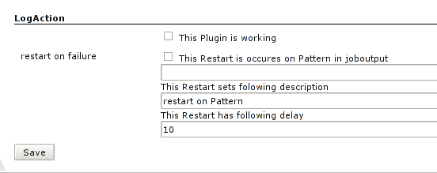

Centralized configuration to restart jobs when a pattern occurs in the
job console output.

## Intention

To reschedule build in a centralized way when a predefined pattern exist
in the job output

## Configuration

at `http://<yourHudson>/configure`

By default this plugin is **not** active.  

## Change Log

#### Version 1.2 (Dec 9, 2011)

-   Updated requiredCore
    [JENKINS-12060](https://issues.jenkins-ci.org/browse/JENKINS-12060)

#### Version 1.1 (Feb 5, 2010)

-   Update code for more recent Hudson
-   Some text updates

#### Version 1.0 (Apr 2, 2009)

-   Initial release
