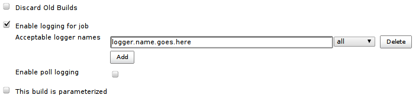

#### Developed by


## Purpose

This plugin enables slave and per build logging. Each build will get a
single log file, collected from the master and the possible slave.

This plugin is intended for remote debugging/tracing other plugins where
a traditional debugger is unavailable.

## Setup

In the configuration page enter those logger names to be logged. These
logs will end up in their respective build folders.

 


Check the "Enable poll logging" if logging should be in the polling
phase. This log will end up in a special folder called "poll-logging" in
the job folder.

Java Logger

The plugin only works with the java.util.logging.Logger. Use it as you
normally would.

## Logs

Each build, run with this plugin enabled, gets a menu item called
"Logging". This links to the log of this particular build.

The poll logs are available from the projects main page.

## Jenkins Job DSL

###### *Available options*

``` syntaxhighlighter-pre
job{
    properties{ 
        logging{
            pollLogging (boolean enablePollLogging)
            pruneDays (int daysToKeepPollLogs)
            target{
                name (String targetName)
                level (String loggingLevel) //SEVERE, WARNING, INFO, CONFIG, FINE, FINER or FINEST
            }
        }
    }
}
```

###### *Example*

``` syntaxhighlighter-pre
job('foo'){
    properties{ 
        logging{
            pollLogging true
            pruneDays 20
            target{
                name 'org.techworld.sonar'
                level 'FINE'
            }
        }
    }
}
```

## Known Issues

type

key

summary

Data cannot be retrieved due to an unexpected error.

[View these issues in
Jira](http://issues.jenkins-ci.org/secure/IssueNavigator.jspa?reset=true&jqlQuery=project%20=%20JENKINS%20AND%20status%20in%20%28Open,%20%22In%20Progress%22,%20Reopened%29%20AND%20component%20=%20%27logging-plugin%27&src=confmacro)

## Changes

#### 1.0.0 (October 13, 2015)

-   Added JobDSL support

#### 0.2.7(April 16, 2012)

-   When Jenkins restarts a NullPointerException is thrown on poll
    logging
    ([\#17633](https://issues.jenkins-ci.org/browse/JENKINS-17633))

#### 0.2.6(November 6, 2012)

-   Persisting too much
    ([\#15730](https://issues.jenkins-ci.org/browse/JENKINS-15730))

#### 0.2.2-5(September 27, 2012)

-   Various bug fixes

#### 0.2.1(September 26, 2012)

-   Corrected typo
-   Throwns are actually logged

#### 0.2.0(September 24, 2012)

-   Make use of FileCallableWrapperFactory
    ([\#15147](https://issues.jenkins-ci.org/browse/JENKINS-15147))
-   Pruning of poll logs
    ([\#15022](https://issues.jenkins-ci.org/browse/JENKINS-15022))
-   Easy download of logs
    ([\#15021](https://issues.jenkins-ci.org/browse/JENKINS-15021))

#### 0.1.2(August 28, 2012)

-   When using the new FileCallable implementation and not enabling
    logging gives null pointer
    ([\#14961](https://issues.jenkins-ci.org/browse/JENKINS-14961))

#### 0.1.1(July 10, 2012)

Initial version
