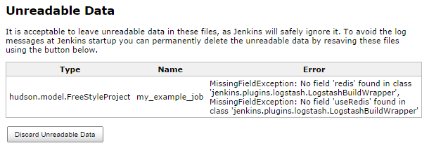

This plugin pushes logs and build data to a Logstash indexer such as
Redis, RabbitMQ ElasticSearch, Logstash or Valo. 

# Migration from v1.x

With version 2.0 the global configuration has been moved from Global
Tool Configuration to the regular Jenkins configuration page (**Jenkins
→ Manage Jenkins → Configure System**). There was also a major change in
the way the plugin works. It is no longer a BuildWrapper but a
ConsoleLogFilter and you enable it via a JobProperty. This is necessary
to reliably ensure that passwords are masked when the MaskPasswords
plugin is installed and allow to enable log forwarding globally.

An existing global configuration will be migrated and FreeStyleJobs that
use the BuildWrapper will be converted to use the JobProperty after
updating the plugin and restarting Jenkins.

The migration from v0.8.0 to 2.0 is not tested. You will definitely need
to configure the indexer in the global configuration.

# Migration from v0.8.0 to v1.x

Beginning with version 1.0.0, connection information for the Logstash
indexer is stored in a global config (version 0.8.0 and older stored
this information in the project settings). Upon upgrading you will need
to go to **Jenkins → Manage Jenkins → Global Tool Configuration** to
re-enter the connection information.

You should also refresh the configuration of every job that uses this
plugin to eliminate the obsolete fields and prevent warnings from
occurring in the Jenkins server logs. To do this, either edit the jobs
individually in the UI and click the "Save" button, or go to **Jenkins →
Manage Jenkins → Manage Old Data** and click "Discard Unreadable
Data".  
  
Figure 1: Global configuration settings

  
Figure 2: Obsolete configuration data found in jobs using v0.8.0 or
older.

# Features

## Indexers Currently Supported

The following data stores are currently supported for pushing logs and
build data to:

-   Redis
-   RabbitMQ, vhosts are supported
-   Syslog
-   Elastissearch (you have to configure the url including the index and
    a type, e.g.
    [http://elasticseach:9200/logstash/jenkins.](http://elasticseach:9200/logstash/jenkins).)
    Specifying just the index is not sufficient)
-   Logstash  
    1.  When configured with a tcp input choose logstash mode
    2.  When configured with a http input choose elasticsearch mode. In
        that case index and type are not required.

 

## Enable Globally

It is now possible to enable the log forwarding globally.

Note: Enable globally doesn't work for pipeline jobs currently as the
workflow api doesn't support this yet (see
[JENKINS-45693](https://issues.jenkins-ci.org/browse/JENKINS-45693))

## JobProperty

This component streams individual log lines to the indexer for
post-processing, along with any build data that is available at the
start (some information such as the build status is unavailable or
incomplete).

## Post-Build Publisher

This component pushes the tail of the job's log to the indexer for
post-processing, along with all build data at the time the post-build
action had started (if any post-build actions are scheduled after this
plugin they will not be recorded).

## Pipeline

#### Publisher

Logstash plugin can be used as a publisher in pipeline jobs to send the
tail of the log as a single document.

**Example for publisher in pipeline**

``` syntaxhighlighter-pre
node('master') {
    sh'''
        echo 'Hello, world!'
    '''
    logstashSend failBuild: true, maxLines: 1000
}
```

     

Note: Due to the way logging works in pipeline currently, the
logstashSend step might not transfer the lines logged directly before
the step is called. Adding a sleep of 1 second might help here.

Note: In order to get the the result set in pipeline it must be [set
before the logstashSend
step](https://support.cloudbees.com/hc/en-us/articles/218554077-How-to-set-current-build-result-in-Pipeline-).

Note: the `logstashSend` step requires a node to run.

#### Step with Block

It can be used as a wrapper step to send each log line separately.

Once the result is set, it will appear in the data sent to the indexer.

Note: when you combine with timestamps step, you should make the
timestamps the outer most block. Otherwise you get the timestamps as
part of the log lines, basically duplicating the timestamp information.

**Example for pipeline step**

``` syntaxhighlighter-pre
timestamps {
  logstash {
    node('somelabel') {
      sh'''
        echo 'Hello, World!'
      '''
      try {
        // do something that fails
        sh "exit 1"
        currentBuild.result = 'SUCCESS'
      } catch (Exception err) {
        currentBuild.result = 'FAILURE'
      }    
    }
  }
}
```

 

Note: Information on which agent the steps are executed is not available
at the moment.

 

## JSON Payload Format

**JSON payload Example**

``` syntaxhighlighter-pre
{
   "data":{
      "id":"2014-10-13_19-51-29",
      "result":"SUCCESS",
      "projectName":"my_example_job",
      "fullProjectName":"folder/my_example_job",
      "displayName":"#1",
      "fullDisplayName":"My Example Job #1",
      "url":"job/my_example_job/1/",
      "buildHost":"Jenkins",
      "buildLabel":"",
      "buildNum":1,
      "buildDuration":0,
      "rootProjectName":"my_example_job",
      "rootFullProjectName":"folder/my_example_job",
      "rootProjectDisplayName":"#1",
      "rootBuildNum":1,
      "buildVariables":{
         "PARAM1":"VALUE1",
         "PARAM2":"VALUE2"
      },
      "testResults":{
         "totalCount":45,
         "skipCount":0,
         "failCount":0,
         "failedTests":[]
      }
   },
   "message":[
      "Started by user anonymous",
      "Building in workspace /var/lib/jenkins/jobs/my_example_job/workspace",
      "Hello, World!"
   ],
   "source":"jenkins",
   "source_host":"http://localhost:8080/jenkins/",
   "@timestamp":"2014-10-13T19:51:29-0700",
   "@version":1
}
```

Example payload sent to the indexer (e.g. RabbitMQ) using the post-build
action component. Note that when the buildwrapper is used, some
information such as the build result will be missing or incomplete, and
the "message" array will contain a single log line.

Note that data.testResults will only be present if a publisher records
your test results in the build, for example by using the [JUnit
Plugin](https://wiki.jenkins.io/display/JENKINS/JUnit+Plugin).

# Changelog

See
[Changelog](https://github.com/jenkinsci/logstash-plugin/blob/master/CHANGELOG.md)
on github

# Issues

To report a bug or request an enhancement to this plugin please [create
a ticket in
JIRA](https://issues.jenkins-ci.org/browse/JENKINS/component/17517).

type

priority

key

summary

status

Data cannot be retrieved due to an unexpected error.

[View these issues in
Jira](https://issues.jenkins-ci.org/secure/IssueNavigator.jspa?reset=true&jqlQuery=project%20=%20JENKINS%20AND%20status%20in%20%28Open,%20%22In%20Progress%22,%20Reopened%29%20AND%20component%20=%20%27logstash-plugin%27&src=confmacro)
