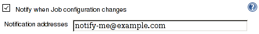
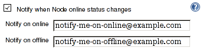

# Mail watcher plugin

This plugin notifies configured email recipients on various events.

# Recipients configuration

Plugin optional configuration section is attached to the watched entity
and usually called "Notify when ...".

Configuration accepts list of addresses delimited by comas.

## Watched events

Recommended Jenkins version for Mail Watcher Plugin is 1.554. Using
earlier version (earlier than 1.551) will cause missing notification for
events that was not supported in the particular version.

### Job configuration

Notify when Job configuration changes. Recipients are configured at job
configuration page. Recipients are notified when one of these events
occurs:

-   [onRenamed](http://javadoc.jenkins-ci.org/hudson/model/listeners/ItemListener.html#onRenamed(hudson.model.Item,%20java.lang.String,%20java.lang.String))
-   [onDeleted](http://javadoc.jenkins-ci.org/hudson/model/listeners/ItemListener.html#onDeleted(hudson.model.Item))
-   [onUpdated](http://javadoc.jenkins-ci.org/hudson/model/listeners/ItemListener.html#onUpdated(hudson.model.Item))

### Node online status

Notify when Node online status changes. Recipients are configured at
node configuration page, section Node Properties. Recipients are
notified when one of these events occurs:

-   [onOffline](http://javadoc.jenkins-ci.org/hudson/slaves/ComputerListener.html#onOffline(hudson.model.Computer))
-   [onOnline](http://javadoc.jenkins-ci.org/hudson/slaves/ComputerListener.html#onOnline(hudson.model.Computer,%20hudson.model.TaskListener))
-   [onTemporarilyOffline](http://javadoc.jenkins-ci.org/hudson/slaves/ComputerListener.html#onTemporarilyOffline(hudson.model.Computer,%20hudson.slaves.OfflineCause))
-   [onTemporarilyOnline](http://javadoc.jenkins-ci.org/hudson/slaves/ComputerListener.html#onTemporarilyOnline(hudson.model.Computer))

Computer configuration offers two recipients lists for users to be
notified on either online or offline event.

### Implicit notifications

-   User is notified when the node he/she put offline becomes available.
    In other words: last build has finished and no new can be scheduled.
    (Since 1.551)

## Changelog

### 1.12

-   Optimization: Do not compose the message when there are no
    recipients
    ([JENKINS-27503](https://issues.jenkins-ci.org/browse/JENKINS-27503))

### 1.11

-   Correctly identify node and initiator of computer idle event.

### 1.10

-   Avoid assertion error thrown during maven build
    ([JENKINS-28888](https://issues.jenkins-ci.org/browse/JENKINS-28888))

### 1.8

-   JENKINS-23496: Notify user that put slave temporarily offline that
    it has become idle
-   JENKINS-23555: Fix NPE when no Reply-To address configured

### 1.7

-   JENKINS-23482: Globally configured ReplyTo header is not sent 
-   JENKINS-20538: No notification for master node going offline
    (effectively fixed once
    [\#1293](https://github.com/jenkinsci/jenkins/pull/1293) is merged
    to core)

### 1.6

-   JENKINS-20535: Subject for bring a node back online is misleading
-   JENKINS-23174: Links for jobs within folders are invalid

### 1.5

-   User identity tracked in 'Initiator' field
-   Links to job config history diffs included in messages when plugin
    installed.
