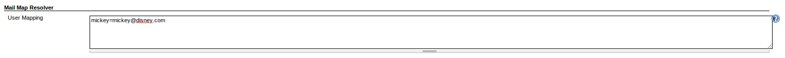

  

This plugin allows you to configure a mapping between usernames and
email addresses. Then when plugins try to resolve a username to an email
address, it will resolve using the provided address.

# Configuration

### Global configuration

The only configuration for this plugin is done via the global
configuration. The map is the same syntax as a Java properties file, so
anything that must be escaped for a Java properties file must be escaped
in the user map.

You can provide multiple usernames per line by separating them with a
comma in the key of the property (escaping may be required).

# Open Issues

type

key

summary

assignee

reporter

priority

status

resolution

created

updated

due

Data cannot be retrieved due to an unexpected error.

[View these issues in
Jira](https://issues.jenkins-ci.org/secure/IssueNavigator.jspa?reset=true&jqlQuery=project=Jenkins%20AND%20component=mailmap-resolver-plugin%20AND%20status%20in%20%28%22In%20Progress%22,%20Open,%20Reopened%29%20ORDER%20BY%20priority,%20status,%20createdDate%20ASC&src=confmacro)

# Version History

#### 0.2 (January 16, 2014)

-   Fixed issue where settings were not propagated after Jenkins
    restart.

#### 0.1 (January 12, 2014)

-   Initial release
