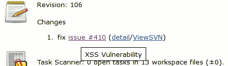
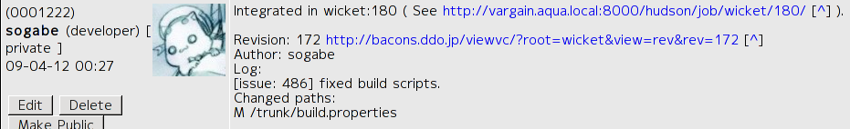
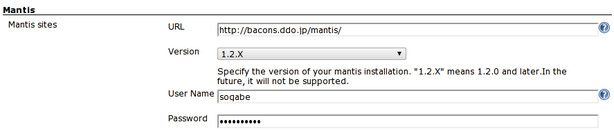
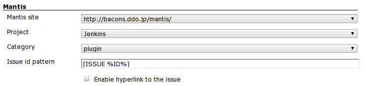
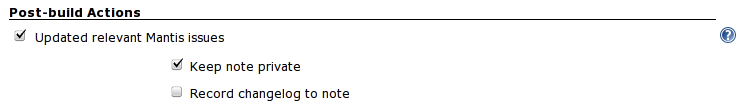
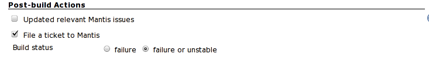
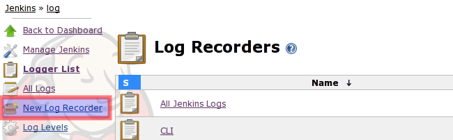
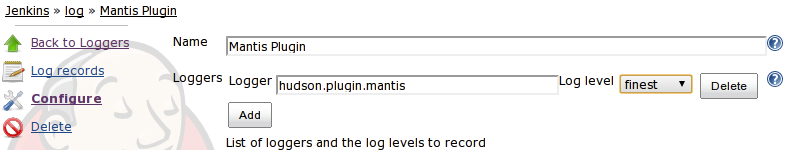

The current version of this plugin may not be safe to use. Please review
the following warnings before use:

-   [CSRF
    vulnerability](https://jenkins.io/security/advisory/2019-12-17/#SECURITY-1603)

# Mantis Plugin

  
This plugin integrates [Mantis Bug Tracker](http://www.mantisbt.org/) to
Jenkins. Mantis is a free popular web-based bugtracking system written
in PHP scripting language.  
This plugin decorates Hudson "Changes" HTML to create links to your
Mantis issues, and update issues with private / public notes.  
As an example, if you committed a change with the following log message
(which is configurable see Project Configuration):  
  
  

    fix issue #410

Mantis keys in changelogs are now hyperlinked to the corresponding
Mantis issue pages (complete with tooltips),
  
and Mantis issues are also updated with note as following.  
  
  
  
  

This plugin only supports **Mantis 1.1.0 and above**.

## Configuration

### System Configuration

First, you need to go to system config screen to tell Jenkins where's
your Mantis.

-   URL - the root URL of your Mantis installation, eg.
    <http://example.org/mantis/>
-   Version - version of your Mantis installation. 1.1.X or
    1.2.X(1.2.0a3 and later, this is experimental)
-   User Name, Password - user name and password of your Mantis
    installation to update relevant Mantis issues.  
    

### Project Configuration

In the top section, select the url of your Mantis installation.  
  
  

-   %ID% is placeholder which means Mantis issue id.
-   Project and Category is mandatory for "File a ticket when build is
    broken or unstable".

#### Update Mantis issue

In the Post-build Actions section, choose "Updated relevant Mantis
issues" (option).  
  
  

This plugin updates Mantis issues if build is stable or unstable.

#### File a ticket if build is broken or unstable

In the Post-build Actions section, choose "File a ticket to Mantis"
(option).

  

To Update Mantis issues, Mantis user must have at least "DEVELOPER".

## Trouble Shooting

If you have ran into trouble,

1.  Select New Log Recorder in System log screen.  
      
2.  Configure Log Recorder. Logger is "hudson.plugins.mantis", log level
    is "finest". and save.
    
3.  Update Mantis issue...
4.  See System log. Check SOAP request and response.

## [Use BASIC\_AUTH](http://localhost:8085/display/JENKINS/Use+BASIC_AUTH) (Workaround)

## Tips

-   "Array to string conversion" while try to connect to
    mantis([JENKINS-27077](https://issues.jenkins-ci.org/browse/JENKINS-27077)).

## Change Log

##### Version 0.26 (Feb 16, 2015)

-   Mantis password written in plain text in
    build.xml([JENKINS-26831](https://issues.jenkins-ci.org/browse/JENKINS-26831)).

##### Version 0.25 (May 31, 2013)

-   View state for newly created Mantis
    ([JENKINS-18038](https://issues.jenkins-ci.org/browse/JENKINS-18038)).

##### Version 0.24 (Apr, 30, 2012)

-   Do not update mantis entry for all downstream jobs
    ([JENKINS-11839](https://issues.jenkins-ci.org/browse/JENKINS-11839)).

##### Version 0.23 (Apr, 1, 2012)

-   NullPointerException when Category have value : not selected
    ([JENKINS-13215](https://issues.jenkins-ci.org/browse/JENKINS-13215)).

##### Version 0.22 (Mar, 12, 2012)

-   NullPointerException when parsing changeset of Matrix project
    ([JENKINS-12849](https://issues.jenkins-ci.org/browse/JENKINS-12849)).
-   Mantis Plugin causes Configuration Loading Overlay to not disappear
    ([JENKINS-13023](https://issues.jenkins-ci.org/browse/JENKINS-13023)).
    -   added "veiyfy" button under advanced button to check
        credentials.
-   Updated wsdl.

##### Version 0.21 (Jan, 1, 2012)

-   enable to select a subproject for filing a ticket.

##### Version 0.20 (Oct, 5, 2011) (unstable)

-   File a ticket if build is broken or unstable

##### Version 0.12 (Oct 9, 2011)

-   updated wsdl to support Mantisbt 1.28

##### Version 0.11 (Apr 29, 2011)

-   Mantis-Plugin fails again to add a
    note.([JENKINS-9554](https://issues.jenkins-ci.org/browse/JENKINS-9554),
    [JENKINS-9552](https://issues.jenkins-ci.org/browse/JENKINS-9552))
-   Jenkins 1.399 or later required.
-   MalformedURLException if malformed url.
    ([JENKINS-9440](https://issues.jenkins-ci.org/browse/JENKINS-9440))

##### Version 0.10.1 (May 2, 2010)

-   Fix 'update relevant mantis issue' is not saved'.
    ([JENKINS-6363](https://issues.jenkins-ci.org/browse/JENKINS-6363))

##### Version 0.10 (April 4, 2010)

-   Support Mantis 1.2.0
    ([JENKINS-6114](https://issues.jenkins-ci.org/browse/JENKINS-6114)).

##### Version 0.9 (Mar 3, 2010)

-   Update code for more recent Hudson.

##### Version 0.8.3 (Jul 26, 2009)

-   Allow empty pattern in form validation.

##### Version 0.8.2

-   check if user has Job.CONFIGURE, not ADMINISTER when configuring
    project
    ([JENKINS-4077](https://issues.jenkins-ci.org/browse/JENKINS-4077)).
-   fixed NPE in M2 project
    ([JENKINS-4049](https://issues.jenkins-ci.org/browse/JENKINS-4049)).
-   replaced deprecated classes and methods.

##### Version 0.8.1

-   Support subversion plugin.
-   Saved regexp pattern per build, which enables link in old history
    even if configuration is changed.

##### Version 0.8.0

-   Regexp pattern support.

##### Version 0.7.1

-   Support Mercurial changelog, which requires Mercurial Plugin 1.15.
-   Support Git changelog, which requires Git Plugin 0.5.
-   Fixed a bit.

##### Version 0.7

-   Record changelog in Mantis note.

##### Version 0.6.1

-   Don't change build status if failing to add note.
    ([JENKINS-3005](https://issues.jenkins-ci.org/browse/JENKINS-3005)).
-   check permission.

##### Version 0.6

-   Hudson 1.281 and later required.
-   Supported Mantis 1.2.0a3 and later (experimental)
    ([JENKINS-2877](https://issues.jenkins-ci.org/browse/JENKINS-2877)).
-   Logged SOAP Request and Response.
-   Improved error diagnostics.

##### Version 0.5.2

-   Use default issue id pattern if project configuration has not saved
    after upgrading
    ([JENKINS-2307](https://issues.jenkins-ci.org/browse/JENKINS-2307)).

##### Version 0.5.1

-   Improved performance of hyperlink to mantis.

##### Version 0.5

-   Configurable Mantis issue IDs patterns
    ([JENKINS-2117](https://issues.jenkins-ci.org/browse/JENKINS-2117)).
-   Hyperlink to mantis even if checkbox is not checked
    ([JENKINS-2117](https://issues.jenkins-ci.org/browse/JENKINS-2117)).

##### Version 0.4.3

-   Fixed UnknownFormatConversionException
    ([JENKINS-2116](https://issues.jenkins-ci.org/browse/JENKINS-2116)).
-   Improved Japanese translation.

##### Version 0.4.2

-   Added more logging for debugging.
-   The username and password of Mantis installation is now optional.

##### Version 0.4.1

-   Fix
    [JENKINS-2039](https://issues.jenkins-ci.org/browse/JENKINS-2039)
    (Mantis plugin breaks Job Save).

##### Version 0.4

-   Update mantis issue if build status is unstable.
-   Support unsigned server certs.

##### Version 0.3.1

-   Fix JavaScript error

##### Version 0.3

-   Support HTTP Basic Authentication(Not Mantis's BASIC\_AUTH)
-   Fix small bug

##### Version 0.2

-   Remove mantisconnect-client-api.jar.

##### Version 0.1

-   First version
