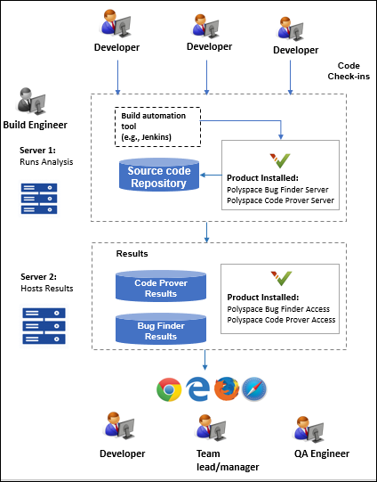

  

  

  
This plugin integrates Polyspace® products with Jenkins for automated
analysis. Polyspace® static code analysis products can prove absence of
critical run-time errors using formal methods, find hundreds of classes
of bugs, and check for adherence to coding rules (MISRA C, MISRA C++,
JSF++) and security rules (CWE, CERT-C, CERT-C++, ISO/IEC 17961).  

  

## Features

-   Automating code analysis with Polyspace Bug Finder Server or
    Polyspace Code Prover Server
-   Avoiding regressions from new code checks-ins with pass/fail
    criteria for builds based on Polyspace results
-   Uploading Polyspace results to a web server for collaborative review
-   Assigning owners to results based on predefined criteria such as
    file ownership
-   Sending e-mail notifications with new findings

  

## Product Requirements

You require these products to use the MathWorks Polyspace plugin in
Jenkins:

-   To run a Polyspace analysis, install **Polyspace Bug Finder Server**
    or **Polyspace Code Prover Server**. The installation provides
    executables for running Polyspace, uploading results to the
    Polyspace Access web interface (if configured) and exporting results
    to a text file.
-   To review Polyspace results along with source code and details on an
    interactive web view, set up the components required to host the
    **Polyspace Access** web interface.

For installation steps, see [Polyspace
documentation](https://www.mathworks.com/help/polyspace_bug_finder_server/gs/install-products-required-for-polyspace-analysis-on-server.html).

Note: These Polyspace products are available in MathWorks releases
R2019a and beyond. For releases prior to R2019a, you can use the Jenkins
plugin with an installation of the desktop products, Polyspace Bug
Finder or Polyspace Code Prover, and use the older Polyspace Metrics web
interface to host results. However, the Polyspace Metrics web interface
shows only an overview of Polyspace results for a project. To see the
result details, you have to download the results back to the desktop
product.

## Getting Started

After you install Polyspace Bug Finder Server or Polyspace Code Prover
Server and set up the Polyspace Access (or Polyspace Metrics) web
interface, you can use the Jenkins plugin to run Polyspace during
continuous integration. To start using the plugin:

1.  Configure the plugin to point to your Polyspace Server installation
    folder and Polyspace Access server settings.  
      
2.  Set up a Jenkins project to run a Polyspace analysis in isolation or
    along with other scripts.

-   -   In the **Build Environment** section of a Jenkins project, refer
        to a specific Polyspace Server installation and Polyspace Access
        server.
    -   In the **Build** section of the project, enter Windows batch
        files or Shell scripts to run Polyspace.
    -   In the **Post-build Actions** section of the project, set up
        e-mail notification to send e-mails with Polyspace result files
        created through your build scripts. You can send a common e-mail
        to all recipients or send individual e-mails to file owners. The
        Polyspace result files contain a list of results along with
        links to results in the Polyspace Access web interface.

  

For a quick start tutorial and example scripts, see the [MathWorks
Polyspace plugin github
repository](https://github.com/jenkinsci/mathworks-polyspace-plugin).
For examples of Polyspace commands, see [Polyspace Bug Finder Server
documentation](https://www.mathworks.com/help/polyspace_bug_finder_server/)
or [Polyspace Code Prover Server
documentation](https://www.mathworks.com/help/polyspace_code_prover_server/).

  

## Release Notes

### Version 1.0.0

Initial version

  
