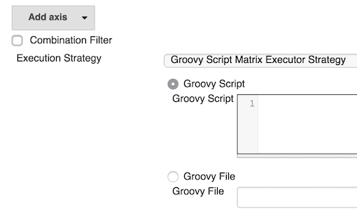

A plugin to decide the execution order and valid combinations of matrix
projects.This uses a user defined groovy script to arrange the order
which will then be executed

## Usage

This plugin makes use of an extension point in the matrix-project plugin
to allow for other execution strategies for matrix projects. When
installed, matrix projects will show a new drop-down to select an
execution strategy. Without the plugin, the default (or classic)
strategy is selected and not even displayed.  


This plugin can also be used as a combination filter/touchstone to feed
builds into the queue with more flexibility than the two stages supplied
as standard. 

## Return Value

New for release 1.0.6. You can now specify if you want to continue after
a failure. If you return a List with two items in it, the second item
can be a true\|false value where true will continue execution even after
a failure. The idea is that you can control whether to continue after a
failure from within the script

    return [result, true]  

The original functionality also works and will work as before

    return result

will fail at the end of the current run as before.

## Bindings

There are several variables available in the script

-   combinations
-   workspace
-   jenkins
-   execution
-   result
-   parameters
-   env
-   out

### combinations

This is a List of a String map of all the matrix combinations  
For example

``` syntaxhighlighter-pre
[
    { axis1: "a", axis2: "x" },
    { axis1: "a", axis2: "y" },
    { axis1: "a", axis2: "z" },
    { axis1: "b", axis2: "x" },
    { axis1: "b", axis2: "y" },
    { axis1: "b", axis2: "z" }
]
```

### workspace

A string of the workspace directory

### jenkins

The Jenkins instance

### execution 

The is the \[OneOffExecutor\](
<http://javadoc.jenkins-ci.org/hudson/model/OneOffExecutor.html>)
running the setup for the matrix job

### result

The script is expected to return a
\[TreeMap\](<http://groovy.codehaus.org/JN1035-Maps>). This is passed in
for use but does not have to be the one returned

 

``` syntaxhighlighter-pre
{
  x: [
    { axis1: "a", axis2: "x" },
    { axis1: "b", axis2: "x" }
  ],
  y: [
    { axis1: "a", axis2: "y" },
    { axis1: "b", axis2: "y" }
  ]
}
```

Notice that axis2: 'z' has not been returned, so these combinations will
not be executed.

The results will be placed onto the build queue in the order they are
placed in the array, so in the above it will be \['a','x'\]
then \['b','x'\]. When they are completed then \['a','y'\]
and \['b','y'\]. The combinations can run in a different order if there
are dependencies on nodes, for example. This is a good way to feed your
combinations in a definite order.

### parameters

This is a hash of any build parameters used, with the parameter name as
the key

### env

This is the environment variables used in the build. It is also aware of
the [envinject](https://wiki.jenkins.io/display/JENKINS/EnvInject+Plugin)
plugin and will use these if installed and defined for the project

### out

This is bound to the output logger for the build and its main use is to
allow println statements to appear in the build log. This will happen
transparently for 

``` syntaxhighlighter-pre
 println 'something for the log'
```

### Execution

The entries in the TreeMap returned will be executed in sequence.  
That is to say, the first list will be executed in parallel, then the
second, and so on  
A failure will stop the build on the next entry but the runs in flight
will not be stopped.  
If no script is specified, all combinations will be run in parallel in
one go.

These will be run in alphabetical order of the keys.

### Scripts

#### Location

The script can be in three locations

-   Added in directly
-   An absolute path available to the node running the job setting up
    the matrix (can be disabled in global config). This file is to exist
    on the master, even if running on a slave node.
-   A relative path in the workspace (can be disabled in global config)

#### Example

How to transform the example above

``` syntaxhighlighter-pre
combinations.each{

             if(it.axis2 == 'z')
                   return

             result[it.axis2] = result[it.axis2] ?: []
             result[it.axis2] << it
}

[result, true]
```

#### Global Configuration

There is an option to disable scripts off the filesystem. This is useful
if you want to secure scripts for non admin users. This option will
change the job display section to only show a script option.

## Release History

##### 1.07

Fixed usage of script when using a fully qualified path. This script
will reside on the master [issue
15](https://github.com/jenkinsci/matrix-groovy-execution-strategy-plugin/issues/15)

##### 1.06 (1.05 not released)

Added return list option to specify if a failure should continue the
main build

``` syntaxhighlighter-pre
return [ result, true]
```

Upgraded to use groovy 3.2.1

##### 1.04

Added parameters binding

Added env binding

Added out binding

Try out all the above with this in your script

``` syntaxhighlighter-pre
println '---------parameters--------'
parameters.each{ k,v ->
    println "${k}-->${v}"
}
println '-------------env--------------'
env.each{ k,v ->
    println "${k}-->${v}"
}
println '--------------------------------'
```

##### 1.0.3

Bugfix to use a safer randomize method

##### 1.0.2

Fixed to work with Matrix Build Listeners like Matrix Combination
parameter

Added Script Security capability

Added global config option to disable using scripts off the filesystem -
to complete script security

Please ask questions
on [github](https://github.com/jenkinsci/matrix-groovy-execution-strategy-plugin/issues) as
I don't get notifications for this page 
