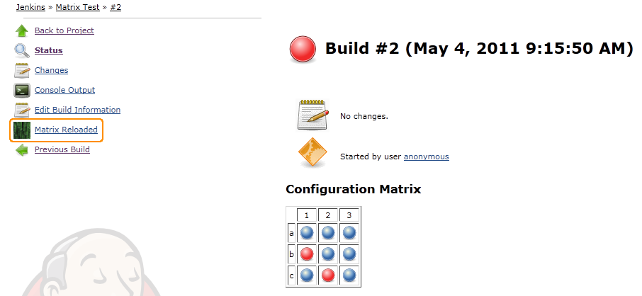
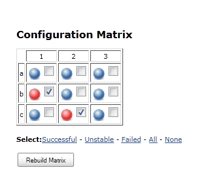
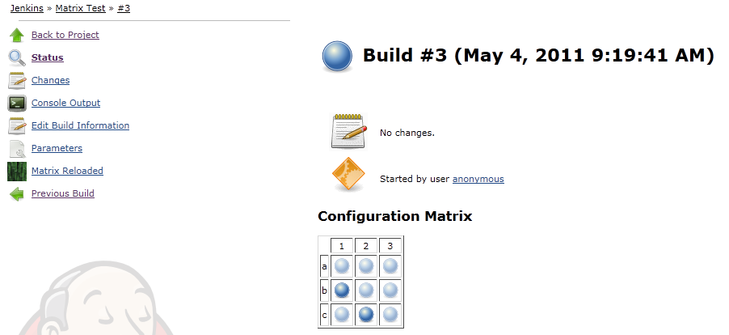
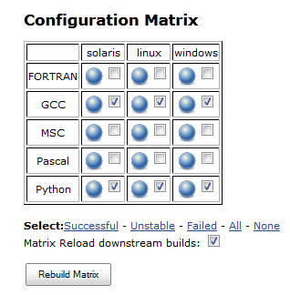

  

  

#### Developed by

#### Sponsored by

{width="125"
height="37"}

{width="114"
height="77"}

The Matrix Reloaded Plugin allows rebuilding parts of an already built
Matrix build.

## Rebuilding a Matrix build

On all Matrix builds that has run while the plugin was installed there
will be a Matrix reloaded link. Click this, and it will take you to a
dialog, where you can check-mark the configurations that should be build
again. Nothing is checked by default, but the check-marks you set will
be cascaded as default settings, if applicable, to any down-stream jobs
triggered by the re-run.

## Typical Use Case

Occasionally when using matrix builds some of the configurations may
fail due to reasons, that are not necessarily related to the quality of
your code. We refer to them as *false negatives*, typical examples could
be that a slave didn't manage to obtain a license for some product you
are dependent on, a glitch in the network communication or a wrong
hard-ware configuration for the particular slave that ran it.

When that happens, you would probably want to rebuild those *false
negatives* simply by rerunning them and then paint over the original
result in the matrix with the new one.

With the Matrix Reloaded Plugin installed, all matrix builds will
hereafter offer a link named "Matrix reloaded" which takes you to a
dialog where you are presented to the original results of the matrix run
and offered an option to mark to ones you want to rebuild.

When you hit the "Rebuild Matrix" button a new Matrix build is scheduled
for execution. In the result all the configurations that were *not*
selected for rebuilding will continue to point to the original build
results, while the configurations that you *did* select are being
rebuilt and replaced in the new resulting matrix.

Reload option sometimes not available

The Matrix Reloaded link is only available on the builds that were
executed while the Matrix Reloaded Plugin was actually installed.
Sometimes you may see a Matrix Build, that doesn't offer the Reload
option, even though you did install the plugin. When that happens you
can simply do a regular re-run (of the entire matrix) and the Matrix
Reloaded option will be available on the new result.

## Using Matrix Reloaded

Once a build has been run, a link in the side panel of the Matrix build
and each of the sub runs have been added. This can be seen in the
following image:

When the "Matrix Reloaded" link is clicked, the user can select which
runs to rebuild. See the following image:

By default the failed and unstable runs are checked.

When the "Rebuild Matrix" button is clicked, the resulting build should,
hopefully, look like:

### Matrix Runs

Selecting a specific Matrix run from a Matrix build, the "Matrix
Reloaded" link checks that specific run by default and no other run.

### Downstream building

It is possible to let downstream builds inherit the Matrix Loaded
configuration. This will rebuild the same combinations in any downstream
project.

-   If the downstream project is a Matrix project and does not have any
    of the selected combinations, none will be build.
-   If the downstream project is a Matrix project and have some of the
    selected combinations, those will be built. Just check *Matrix
    Reload downstream builds*.
-   If the downstream project is a non-matrix project (Freestyle project
    for example), it will be anyway rebuilt.

## Considerations

We do not plan that the Matrix Reloaded plugin should have *any*
influence on jobs actually being rebuilt. This could potentially create
a bit of a paradox: If a build is rebuilding only some configurations
and the job is configured to get the latest commit from a SCM, and a new
commit actually exists, then *some* of the configurations are based on
one commit, while *others* are actually based on the newer commit.

Potentially a mess!

## Issues

type

key

summary

Data cannot be retrieved due to an unexpected error.

[View these issues in
Jira](http://issues.jenkins-ci.org/secure/IssueNavigator.jspa?reset=true&jqlQuery=project%20=%20JENKINS%20AND%20status%20in%20%28Open,%20%22In%20Progress%22,%20Reopened%29%20AND%20component%20=%20%27matrix-reloaded%27&src=confmacro)

## Changelog

##### Version 1.1.3(2014-16-6)

-   Combination filters are now handled properly
    ([JENKINS-22966](https://issues.jenkins-ci.org/browse/JENKINS-22966))
-   Added a filter for aborted builds
    ([JENKINS-22964](https://issues.jenkins-ci.org/browse/JENKINS-22964))

##### Version 1.1.2(2014-9-5)

-   Fixed a detection issue, are we working with MatrixRun or
    MatrixBuild
    ([JENKINS-22535](https://issues.jenkins-ci.org/browse/JENKINS-22535))
-   Avoid NPE by removal of upstream
    ([JENKINS-17964](https://issues.jenkins-ci.org/browse/JENKINS-17964))

##### Version 1.1.1(2013-6-5) Thanks to lvotypko for the contributions.

-   Bubble links on matrix reloaded action have incorect url ([issue
    \#17748](https://issues.jenkins-ci.org/browse/JENKINS-17748))
-   matrix rebuild allows all users to issue builds ([issue
    \#16628](https://issues.jenkins-ci.org/browse/JENKINS-16628))
-   Fix bad url for configurations.

##### Version 1.1.0(2012-6-5)

-   Use Action instead of state object ([issue
    \#13670](https://issues.jenkins-ci.org/browse/JENKINS-13670))
-   Matrix Reloaded should trigger the same combination in downstream
    matrix job ([issue
    \#13514](https://issues.jenkins-ci.org/browse/JENKINS-13514))
-   Link to plugin from plugin configuration page is wrong ([issue
    \#12227](https://issues.jenkins-ci.org/browse/JENKINS-12227))

##### Version 1.0.2(2012-1-27)

-   Matrix Reloaded rebuilds entire matrix instead of just selected ones
    ([issue
    \#11647](https://issues.jenkins-ci.org/browse/JENKINS-11647))

##### Version 1.0.1(2011-6-21)

-   Updated design to comply with baseBuild

##### Version 1.0.0(2011-5-23) Initial release

Design wiki: [Matrix Reloaded Plugin
Design](http://localhost:8085/display/JENKINS/Matrix+Reloaded+Plugin+Design)
