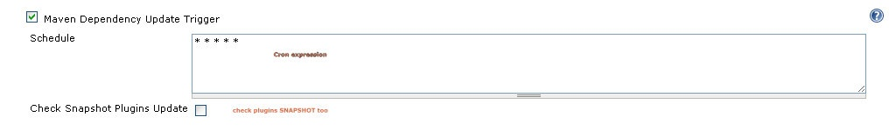
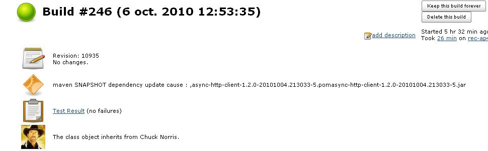

This plugin will check if any SNAPSHOT dependencies (or optionally
plugins SNAPSHOT) have been updated during your project's dependencies
resolution and trigger a build. You have to configure a cron expression.

This plugin use maven 3 apis to update dependencies.

#### Trigger configuration

#### The build cause will display which SNAPSHOTS has been downloaded:

# History

##### **Version 1.5 : 24 April 2015.**

-   Remove dependencies and imports from older maven plugin that used
    \*.aether.\* packages. ([issue
    \#23502](https://issues.jenkins-ci.org/browse/JENKINS-23502))

##### **Version 1.4 : 30 Dec 2011.**

-   Upgrade maven versions.
-   fix use of maven default global settings.
-   various fixes on reading reactors projects.

##### Version 1.3 : 13 Aug 2011.

-   Update for Jenkins

##### Version 1.2 : 6 Oct 2010.

-   Build is triggered whene maven-metadata-${repoId}.xml is downloaded
    ([JENKINS-7688](https://issues.jenkins-ci.org/browse/JENKINS-7688))

##### Version 1.1 : 5 Oct 2010.

-   Fix execution on remote nodes (plugin version 1.0 works only for
    jobs on master)
    ([JENKINS-7650](https://issues.jenkins-ci.org/browse/JENKINS-7650))
-   Maven Dependency Update trigger doesn't use defined settings xml or
    properties
    ([JENKINS-7660](https://issues.jenkins-ci.org/browse/JENKINS-7660))

##### Version 1.0 : 2 Oct 2010.

-   First release
