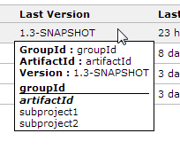
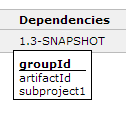
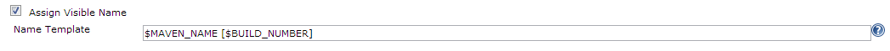
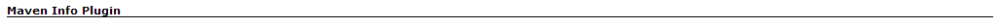
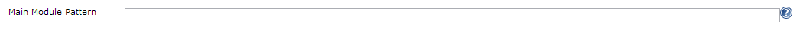
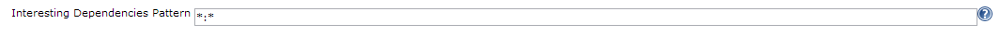
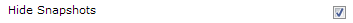
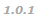
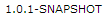
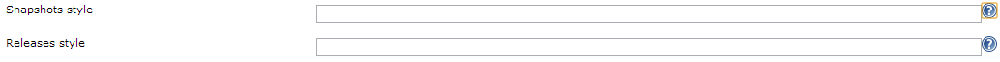

This plugin add features related to Maven jobs info. Adds columns
configurable in views (version, dependencies, modules, ...) and extract
information from Maven jobs (update name and description from POM, ...)

Tested On

Jenkins: 1.500, 1.509.4  
Chrome: 30  
Internet Explorer: 10  
Firefox: 24

# Features

## Column: Selected Module Last Version

Shows last build version.

If you move mouse over the version, an info panel is shown.

This panel shows main module's info and all modules grouped by
`groupId`. If a module has different version then it's also shown
between brackets.

Main module is shown in ***bold italic*** .

## Column: Selected Dependencies

Show version of selected dependencies.

If you move the mouse pointer over the version, an info panel is also
shown.

Only one version by column. If there is more than one version by
dependency, then the column is marked with an asterisk ( \* ) and all
the versions are shown in the info panel.

This panel shows versions of selected dependencies grouped by `groupId`.

## Column: Maven Modules (Short)

Show project modules.

## Column: Maven Modules (Version)

Show project module versions.

## Column: Maven Dependencies (within groupId)

Show project dependencies within project groupId

## Column: Maven Dependencies

Show all project dependencies

## Column: Maven Modules (Full)

Show all project module info

## Assign name from POM

Updates project Visible Name automatically from main module pom.xml
(from tag `<name>`)

You can configure a template to generate name using the [Token Macro
Plugin](https://wiki.jenkins-ci.org/display/JENKINS/Token+Macro+Plugin)
in Job configuration page :

It's useful to show checked out branch or some other label.

By default module name is used.

## Assign description from POM

Updates project Description automatically from pom.xml (from tag
`<description>`)

You can configure a template to generate description using the [Token
Macro
Plugin](https://wiki.jenkins-ci.org/display/JENKINS/Token+Macro+Plugin)
in Job configuration page :

By default "`<pre>$MAIN_DESCRIPTION</pre>`" is used.

# Wish list

-   Last Release and Last Release dependencies columns
-   Exclude artifacts from selected dependencies column (multi pattern)

# Configuration

This plugin has some configuration at Job level.

You can find it at section:

It also haves a plugin configuration at Jenkins Configuration page:

## Select main module

If project is a multi-module project then you can select which module is
used to extract info (main module). If no module is specified or found
then root module is used as main module.

It's useful if your root module has different version or if you want to
focus only on one module.

To select a module as main module you can use a "module selector".

A module selector is a pattern of the form "`groupId:artifactId`". Both
`groupId` and `artifactId` can contain wildcards (\*). If `groupId` or
`artifactId` is empty, they are treated as \*.

So, valid expressions are "`*:my-artifact`", "`:my-artifact`\*",
"`*.plugin:main`", ...

If more than one module is selected, modules are sorted
lexicographically and first one is selected.

You can configure the main module selector in Job configuration page
(advaced options):

## Select interesting dependencies

You can select which dependencies are interesting for you in a project.

It's useful to focus on some dependencies or dependency group (e.g.:
commons-io version in all modules, spring framework dependencies, ...)

You can configure the dependencies selector in Job configuration page
(advaced options):

## Hide Snapshots

You can hide the annoying suffix "-SANPSHOT" of snapshot versions to
improve version readability.

This can be done checking the checkbox at Plugin's Configuration
section:

If you check it, versions will be shown without the suffix and using an
alternate style:

instead of

## Versions styles (CSS)

You can change the style of versions to improve readability.

As example, you can use green for releases and italic red for snapshots.

To do that you have two textboxes at Plugin's Configuration section:

Versions are rendered inside an `` : E.g: `1.0.0`

CSS code entered here will apply only to this span.

Note: if you leave empty snapshot version style and hide snapshots is
checked, a default style is applied.

## Template Variables

In addition to [Token Macro
Plugin](https://wiki.jenkins-ci.org/display/JENKINS/Token+Macro+Plugin)
and extensions variables, templates can use the following variables:

| Version | Variable            | Description               |
|---------|---------------------|---------------------------|
| 0.0.5   | `MAVEN_NAME`        | Main module's name        |
| 0.0.5   | `MAVEN_DESCRIPTION` | Main module's description |

# Changelog

## Version 0.2.0

-   
    [JENKINS-21450](https://issues.jenkins-ci.org/browse/JENKINS-21450)

## Version 0.1.3

-   
    [JENKINS-20929](https://issues.jenkins-ci.org/browse/JENKINS-20929)

## Version 0.1.2

-   
    Hide snapshots feature
-   
    Assign style (css) to version columns
-   
    Delay before showing info panels
-   
    NoSuchElementException showing dependencies version
-   
    Improved readability of old columns (pre 0.0.5)

## Version 0.1.1

-   
    Column: Selected Dependencies Version
-   
    Main Module Pattern not applied on Jenkins restart
-   
    More verbose exception on POM parse error
-   
    More verbose exception on pattern parse error
-   
    Configurable caption for newest columns

## Version 0.0.5

-   
    Column: Selected Module Last Version
-   
    Assign name from POM
-   
    Assign description from POM
-   
    Changed default visibility of columns

## Version 0.0.4 & previous

-   Column: Maven Modules (Short)
-   Column: Maven Modules (Version)
-   Column: Maven Dependencies (within groupId)
-   Column: Maven Dependencies
-   Column: Maven Modules (Full)
