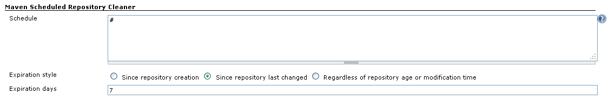
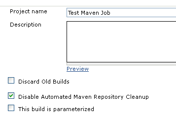

Clean your jobs maven repositories.

## Known issues

## How it works

#### Global configuration

Allows you to schedule a clean up of your local maven repositories.

#### Project configuration

#### 

## History

##### Version 1.1 (Not released yet)

##### Version 1.2 (April 24, 2012)

-   alternative strategy to cleanup the repo for all artifacts not used
    during the build (require last access time support on filesystem)
-   fix NullPointerException saving empty configuration
    ([JENKINS-12978](https://issues.jenkins-ci.org/browse/JENKINS-12978))

##### Version 1.0 (Aug 2,2011)

-   First version
