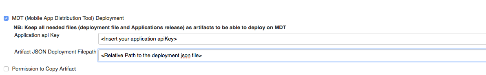
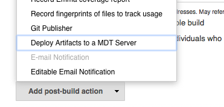
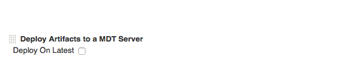
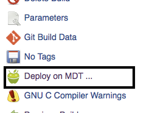
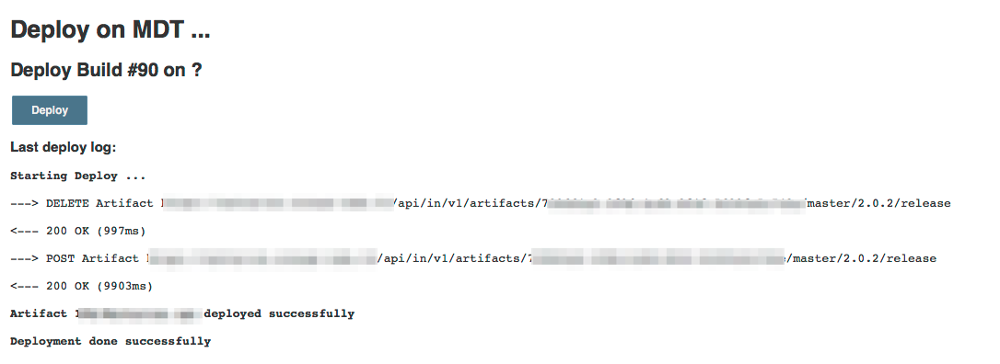

Enables Jenkins to upload Android (APK files)  and iOS (IPA files) apps
to a [Mobile App Distribution
Tool](https://github.com/rgroult/MobDistTool) server

## Features

-   Uploading APK and IPA files to MDT server
    -   Upload can be executed as Post Build Step or as existing build
        Action.

## Requirements

### Jenkins

Jenkins [version
1.596.1](http://jenkins-ci.org/changelog-stable#v1.596.1) with java 1.7
or newer is required.

### Running MDT server

You need your own instance of [MDT
server](https://github.com/rgroult/MobDistTool).

## **Setup**

### **Install plugin**

Install this plugin via the Jenkins plugin manager. Search "MDT
deployment" to find it.

### Server config

You can set global MDT server under Manage Jenkins -\> Configure System

### Per-job config

#### **Mandatory**

**1 - Configure application informations.**

2 - Add "**Archive the artifacts**" as Post-build Actions in order to
use plugin.

**NB:** For  structure of the deploy JSON file see [MDT
Documentation](https://github.com/rgroult/MobDistTool#artifacts-provisionning).

#### **Optional**

If you want to deploy after each successful build, add a Post-build
Action

Next, you can choose to deploy on Latest version or build's version.

### Deploy existing build

You can deploy deploy a existing build with MDT action

## **Version history**

### **Version 1.0.4 (June 01, 2016)**

-   Bug Fixes of version 1.0.2

### **Version 1.0.2 (May 26, 2016) : Do not use it, problem occured between migration on Git from github to jenkins official repo.**

-   Bug Fixes
-   Add Badge Action deployment status

### **Version 1.0.0 (May 24, 2016)**

-   First version
