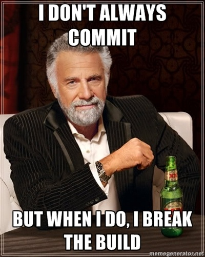

Generate Meme images when a build fails (and returns to stable), and
post them on the project page.

Basically, the plugin will create something like this:

And then put it in the build and project description for everyone to
enjoy. You can even choose your own memes and add custom text, and have
it generate them on a failed build, a return to success or just all the
time! You configure a different set of memes for failed and successful
builds, and a random image is picked each time (well, as random as
Java's Random() will allow).

### Installation

By far the easiest way to install it is to get it from the Jenkins
update center.

However, if you'd prefer to install it manually, download the hpi from
the top of this page. You can then either copy it
to /var/lib/hudson/plugins/ on your Jenkins/Hudson server or upload it
using the advanced tab of the plugin manager - you will need to give
Jenkins a restart to activate the plugin.

### Configuration

Go to the system configuration page (*Manage Jenkins -\> Configure
System*), and scroll down to "Global Meme Settings". There's already a
default meme for a successful build and a failed build, but you can
change the image and text and add multiple memes for each scenario,
which will be selected randomly.

Finally, the meme generator needs to be enabled for each project that
you want them. Go to a project configuration page, scroll down to "Meme
generator" and tick the box. You will then see three options, which will
determine when memes are created:

-   *Generate when a build fails*
-   *Generate when a build succeeds and the previous failed*
-   *Generate for every build (regardless of status)*

As long as there are configured memes and one of the three above options
are selected, a meme will be generated and posted on the project and
build description.

### Meme configuration

On the system configuration page you can manage the Memes that are
generated after both successful and failed builds. This involves
choosing the image and entering the text that will appear at the top and
bottom of the image. You can also use template variables, which look
like **${this}**. The possible variables are:

-   **${project}** - The project display name
-   **${build}** - The build display name (this will be something like
    "\#33")
-   **${user}** - The user(s) string of the people who contributed
    between this build and the previous one
-   **${day}** - The current day (e.g. "Monday")

This means that you can put in a string like "Oh no, you broke
${project}", and this will be filled in with the project name during
generation.

Enjoy, and happy meme-ing!

# Change Log

###    V0.5.0 @ 12-09-2015

-   Replaced memegenerator.net API with apimeme.com
-   Added all memes from apimeme.com, drastically increasing the list of
    supported memes

###    V0.4.3 @ 08-18-2012

-   Added global option that allows you to toggle whether the meme image
    is shown in the build description (that appears on the left on the
    main project page) or not

###    V0.4.2 @ 07-25-2012

-   Fixed bug that caused a build break if it's the first build, Meme
    generation is enabled and it succeeds

###    V0.4.0 @ 05-17-2012

-   Fixed pretty huge bug where meme configurations including template
    variables were being overwritten
-   Removed some extraneous debug to the log

###    V0.3.2 @ 03-23-2012

-   First public release

# Author

Jon Cairns - [http://joncairns.com](http://joncairns.com/)
