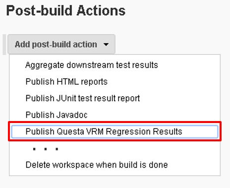
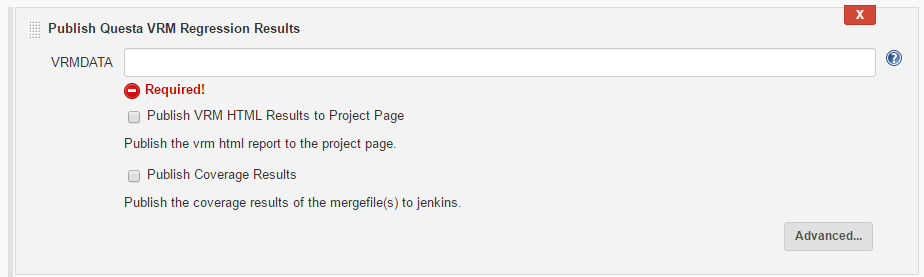
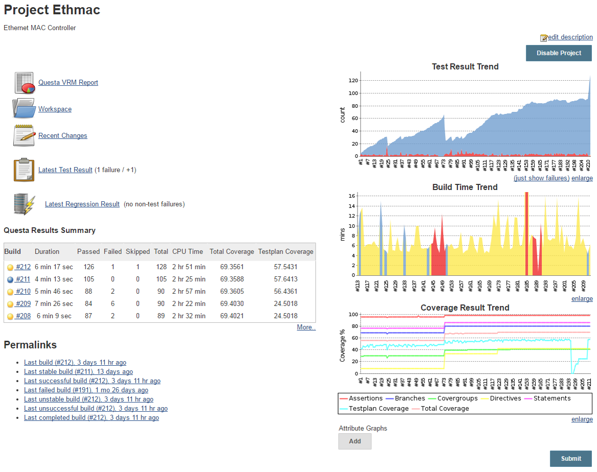
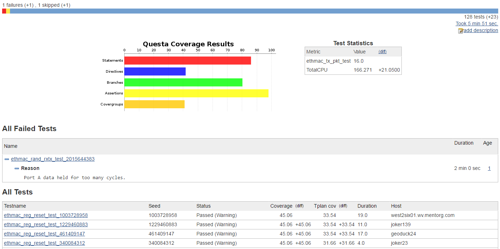
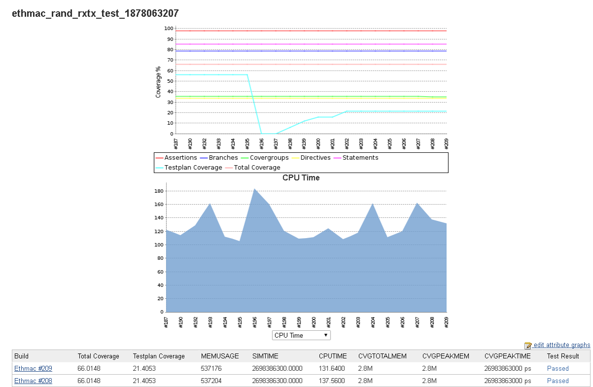
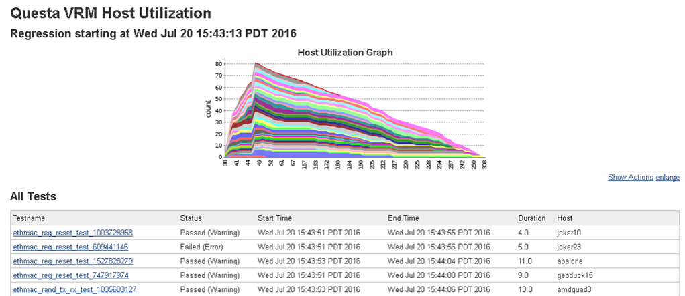
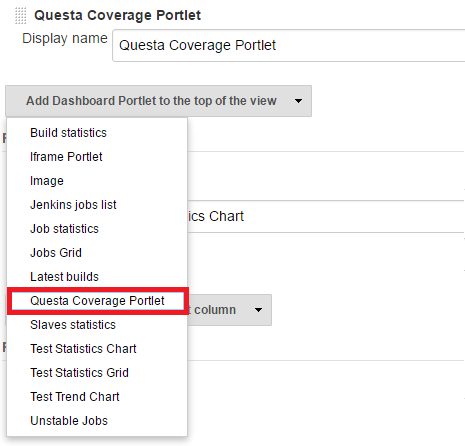
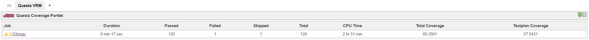

Adds the ability for Jenkins to publish results from Mentor Graphics
Questa Verification Run Manager (VRM).

## Features

-   Adds project page support for:
    -   Test results trend charts
    -   Coverage trend chart
    -   Custom attribute trending for any additional metric
    -   Results summary table of recent regressions
    -   Link to generate VRM and coverage HTML reports
-   Supports integration of [Dashboard
    View](https://wiki.jenkins-ci.org/display/JENKINS/Dashboard+View) plugin
    for viewing pass/fail and coverage results with Questa Coverage
    Portlet.
-   Add Host Utilization chart showing number of tests running at any
    given time on a specific host

## Requirements

Questa VRM 10.5a or newer is required.

## **Setup**

Once the plugin is downloaded and installed, the following configuration
options will be available in the project configuration page.

### Job Configuration

Once installed, the plugin will make a new Post-build action available.

1\.  Select "Publish Questa VRM Regression Results" from the 'Add
post-build action' drop-down: 

{width="200"}

2\.  Configure the plugin by giving the location of your VRMDATA
(required) directory, and selecting whether you want HTML reports
generated, and/or coverage results published to the project page.

## Results

Once enabled, the following results will be available on their
respective pages.

#### Project View

#### Using Build Dates

#### Regression View

{width="1200"}

#### **Test View**

#### Additional

## Dashboard View Portlet

The Questa VRM plugin also has support for the [Dashboard
View](https://wiki.jenkins-ci.org/display/JENKINS/Dashboard+View) plugin,
adding a new **Questa Coverage Portlet** option in the dashboard vie
drop-down list:

{width="300"}  

#### Viewing Multiple Projects

## Version History

#### Version 1.11 (July 24, 2019)

-   Minor bug fixes related to coverage graphs when passing different
    VRMDATA paths for each build.

#### Version 1.10 (February 17, 2019)

-   Minor bug fixes.

#### Version 1.9 (December 4, 2018)

-   Supported the ability to pass a different location for "vcover"
    executable.
-   Fixed an issue with accessing the UCDB file when the build is
    running on a slave node.
-   Added the feature of using a wrapper instead of "vrun" or "vcover"
    executables without having related issues.

#### Version 1.8 (September 19, 2018)

-   No changes (re-upload due to failure in upload process).

#### Version 1.7 (September 19, 2018)

-   Minor bug fixes.

#### Version 1.6 (August 6, 2018)

-   Added ability to view trends with build dates as x-axis.
-   Added ability to choose date format.
-   Performance improvements.

#### Version 1.5 (May 28, 2018)

-   Added support for viewing trend graphs of multiple projects in the
    same view.

#### Version 1.4 (Jan 26, 2017)

-   Compatibility with Jenkins Pipelines. 
-   Minor enhancements and bug fixes.

#### Version 1.2 (August 14, 2016)

-   Reordering trend graphs on the project page.

#### Version 1.1 (August 11, 2016)

-   Initial release.
