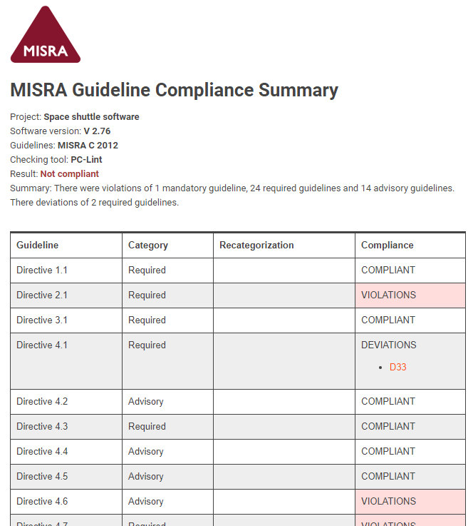
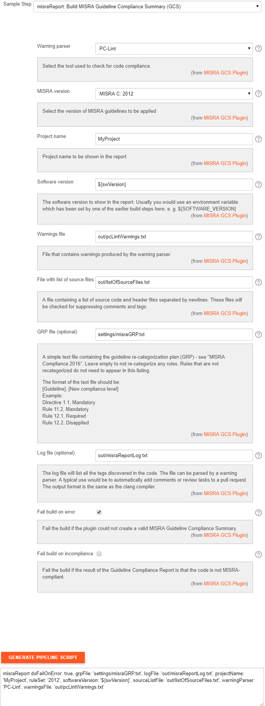

  

The MISRA Compliance Report Plugin generates a kind of report known as a
"Guideline Compliance Summary" (GCS), which is mandatory as evidence of
compliance according to [MISRA Compliance:
2016](https://www.misra.org.uk/LinkClick.aspx?fileticket=w_Syhpkf7xA%3D&tabid=57).
The report also contains your Guideline Re-categorization Plan (GRP),
and provides links to your approved deviations.

The plugin requires two or three input files:

1.  A list of warnings/violations produced by a MISRA checking tool. At
    the moment, the supported tools are PC-Lint and Cppcheck. Please
    create an issue in the [Jenkins issue
    tracker](https://issues.jenkins-ci.org/secure/Dashboard.jspa) referencing
    this plugin if you need support for other tools. You can also add
    support for your tool yourself, using the instructions in
    the  [readme in the github
    repo](https://github.com/jenkinsci/misra-compliance-report-generator-plugin).
2.  [A list of source
    files](http://localhost:8085/display/JENKINS/MISRA+Compliance+Report+Plugin#MISRAComplianceReportPlugin-listofsourcefiles)
    (including header files). The plugin will scan through the files
    looking for "suppression comments" - comments that suppress the
    MISRA checking tool from giving warnings. You can add special tags
    to these comments to tell the plugin how to handle them.
3.  Your Guideline Re-categorization Plan (GRP), if you have one, must
    be provided in [a simple text
    format](http://localhost:8085/display/JENKINS/MISRA+Compliance+Report+Plugin#MISRAComplianceReportPlugin-grp). 

Achieving MISRA compliance is about more than just following the coding
guidelines, and it requires a lot of work even when using tools like
this one. When you are using this tool, much of your work will be done
during code review, where you review MISRA tool suppression comments. 

###### Note

This software is not made by, endorsed by, or in any other way
affiliated with the [Motor Industry Software Reliability Association
(MISRA)](https://www.misra.org.uk/). "MISRA" and "MISRA C" and the
triangle logo are registered trademarks owned by HORIBA MIRA Ltd, held
on behalf of the MISRA Consortium.

## Example report



  

## Supported MISRA guidelines

The three MISRA C guideline versions 1998, 2004 and 2012 as well as the
C++ guidelines from 2008 are supported. Some tools may not support all
versions.   

## Suppression comments

Most static code analysis tools support some form of warning suppression
using specially formatted comments in the code. For example, for PC-lint
these comments use the format

`/*lint -e333 Blah blah blah */`

with some variations. The "-e333" part is the warning code used
internally in PC-lint. The GCS plugin converts each such code to a set
of MISRA guidelines. If no tags are added to this comment, the plugin
will mark all guidelines which are suppressed by the comment as
*violations*.

## Adding tags to suppression comments

Tags consist of certain keywords written in all caps that are added
anywhere within a suppression comment. The following tags are understood
by the plugin:

-   GUIDELINE

-   NON-MISRA

-   FALSE POSITIVE

-   DEVIATION

### Non-MISRA tags

The warning tool you are using may be emitting warnings for possible
problems that are not in violation of any MISRA guidelines. In such
cases you can add the NON-MISRA tag to your suppression comment. The
comment will be ignored by the plugin.

The same tag can be used if there are comments that fit the suppression
pattern that aren't actually suppressing anything - such as other
instructions to the checking tool.

Examples:

`/*lint -e423 Tool complains about this and that, but it's fine and not a MISRA rule. NON-MISRA */`

`//lint -save NON-MISRA (not suppressing anything)`

### False positive tags

Sometimes a tool will emit a warning for some piece of code that the
developer can determine is not actually in violation of the guideline in
question. This is called a false positive. When the tag FALSE POSITIVE
(or FALSE-POSITIVE or FALSEPOSITIVE) is added to the suppression
comment, the suppression is ignored by the plugin. However, unlike the
NON-MISRA tag, the plugin will only accept a FALSE POSITIVE tag when it
can actually find out which guideline(s) is suppressed by the comment.

A suppression comment may suppress warnings for some guidelines that are
actually violated and some that are not. In this case, you can add an
argument to the FALSE POSITIVE tag in the form FALSEPOSITIVE(Rule 3.1).
This tells the tool that rule 3.1 is not violated, but other guidelines
suppressed by this comment are still violated. You can add multiple such
rule-specific tags to a single comment.

Examples:

`/* cppcheck-suppress misra-c2012-5.1; FALSE POSITIVE not actually in breach of the guideline *//`

`/*lint -esym(n, 944) PC-lint gives warnings for directive 1.1, rule 2.3 and rule 5.4, but actually only 5.4 is violated. FALSE POSITIVE(Directive 1.1) FALSE POSITIVE(Rule 2.3) */`

### Guideline tags

The plugin may not always be able to determine which guideline warnings
are being suppressed for a specific comment. In such cases, you *must*
add one or more GUIDELINE(\<guideline name\>) tags to the comment. This
tag tells the plugin which guideline is being suppressed. It can be
combined with other tags.

Example:

`/*lint -e455 Violation of rule 2.4. GUIDELINE(Rule 2.4) */`

### Deviation tags

Deviations are violations that have been documented and formally
approved. You can add a DEVIATION(...) tag to a suppression comment to
show that this violation has been formally permitted. The tag takes one,
two or three arguments: First is the deviation reference, such as the a
document number or deviation number. Second (optional) is a web link to
the deviation record - the link will be shown in the GCS report. Third
is the guideline which is being deviated, if necessary.

**Note**: *The protocol marker "http://" contains a double slash - but
using double slashes within a comment is illegal according to some MISRA
guidelines. You should omit the double slash and replace it by a single
slash or nothing. The ":" by itself is sufficient to show that the part
to the left is the protocol.*

Examples:

`/*lint -e543 We break the rules, but mgmnt says it's ok. DEVIATION(D22) */`

`/* cppcheck-suppress misra-c2012-7.11 This time we have a link too. DEVIATION(D23, https:tinyurl.com/2fcpre6) */`

`/*lint -e32 This comment suppresses more than one violation, but there is a deviation only for one of them, so we need to mark it with the rule number. DEVIATION(D24,  https:tinyurl.com/2fcpre6, Rule 5.1) FALSEPOSITIVE(Rule 1.1) */`

`/*lint -e45 This time we specify the guideline, but we don't have a link, so just leave the second argument empty. DEVIATION(D33,, Rule 5.1) */`

##  Guideline Re-categorization Plan (GRP)

Guidelines come in the three categories "Advisory", "Required" and
"Mandatory", but may be re-categorized on a project-basis by a guideline
re-categorization plan (GRP). The legal re-categorizations are

-   Required -\> Mandatory

-   Advisory -\> Mandatory

-   Advisory -\> Required

-   Advisory -\> Disapplied

If a GRP exists, a pure text version of the GRP must be given as input
to the plugin. Each line of the text file should contain the guideline
name followed by the new category.

Example pure-text GRP file:

``` md-fences
Rule 1.1, Mandatory
Rule 4.1, Required
Rule 5.1, Disapplied
```

##  List of source files

One of the inputs to the plugin is a list of all source files to be
scanned. The list is itself a text file where each line contains the
path to a file, relative to the workspace root. The list should contain
header files as well as source files. A natural approach is to generate
this file using for example a shell script step before the GCS plugin
runs.

## Result

The end result is either compliant or not compliant - the project is
compliant as long as there are no violations of required or mandatory
rules (or rules that have been re-categorized as required or mandatory).
The report will be created even if the code is deemed not compliant. You
can elect to have Jenkins mark the build as failed if the code is not
compliant.

## Tool settings

For each checking tool, the plugin requires a specific output syntax in
order to properly parse the output. The settings required in order to
produce the correct output are given in this section

##### PC-lint

PC-lint should be set to produce output of the same format used for the
warnings plugin. Details can be found
[here](https://wiki.jenkins.io/display/JENKINS/PcLint+options). These
are the essential settings:

``` md-fences
+ffn // force full path names
-width(0) // don't insert line breaks (unlimited output width).
-hf1 // message height one
-"format=%f(%l): %t %n: %m"
```

##### Cppcheck

Cppcheck comes with [a python add-on specifically to check MISRA
guidelines](https://github.com/danmar/cppcheck/blob/master/addons/misra.py).
At the time of writing, only the C 2012 version of the guidelines is
supported. Since suppressions in a separate file are not yet supported,
you will need to use [inline
suppressions](http://cppcheck.sourceforge.net/manual.html#idm479), so
run cppcheck with the option --inline-suppr . Suppressions for the
python add-on are in the format

``` md-fences
/* cppcheck-suppress misra-c2012-4.1 ; your tags here e.g. DEVIATION(D3) */
```

Here 4.1 is the rule number to suppress. Note the semicolon between the
rule identifier and your tags. You do not need a ["MISRA Text
file"](http://cppcheck.sourceforge.net/manual.html#idm429) to use with
cppcheck for this plugin to work, although it helps to clarify the
warnings from the cppcheck addon.

## Log of suppressions

The plugin can generate a text file containing a log of suppressed
violations with file names and line numbers of where they occur. The log
is in the format of warnings from the clang-compiler, so that it can be
parsed automatically by existing tools. Each suppression has a warning
level, either `info`, `warning` or `error`. The `info` level is given to
violations of advisory guidelines, non-MISRA tags, false positive tags
and deviation tags. The info tag indicates that a code reviewer should
verify the tag or violation. The `warning` level is given to suspicious
non-MISRA tags. The `error` level is given to untagged violations of
required and mandatory guidelines.

The log can be used to automatically generate useful info for code
review using for example the *violation comments to bitbucket server*
plugin using the CLANG format settings.

Example log:

``` md-fences
file1.c:20: info: Violation of Rule 1.2 (Advisory)
file2.c:30: info: Deviation of Rule 2.1 (Advisory)
file3.c:5: info: Suppression of Directive 1.1 (Mandatory) tagged as false positive
file4.c:3: info: Tool suppression comment tagged as not MISRA relevant
file5.c:22: warning: Tool suppression comment tagged as not MISRA relevant, but PC-Lint indicates that this comment suppresses Rule 1.1 and Rule 1.2
file6.c:1: error: Violation of Directive 1.1 (Mandatory)
file7.c:2: error: Violation of Rule 2.2 (Required)
```

## Plugin settings

Settings for the plugin in the Jenkins Pipeline Syntax Snippet Generator
is shown below. If you are using a scripted pipeline, note that
variables in groovy strings will be expanded only in strings with double
quotes. So in the example below, you should replace '${swVersion}' by
"${swVersion}" in the actual script.

  


