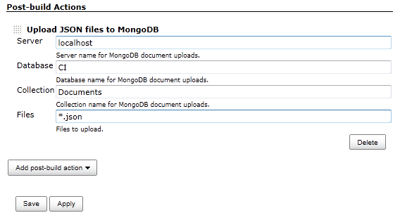

Adds a Post-Build step to upload JSON documents into MongoDb.

## Configuration

You can configure a default MongoDb connection in the system
configuration of Jenkins.

  
You can add a post-build step to upload JSON files that were produced as
part of your build.

The server, database and collection fields are optional and override the
settings from system settings above.

The Files field specifies a semicolon separated list of
[patterns](http://ant.apache.org/manual/dirtasks.html#patterns).

## Change Log

No releases yet.
