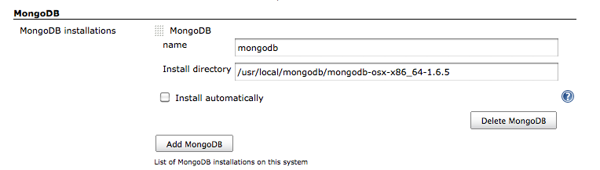
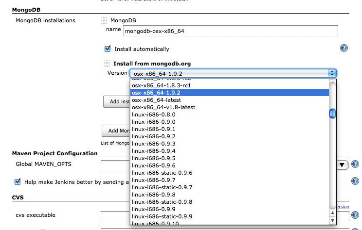
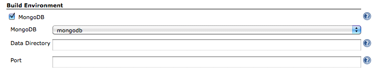

The current version of this plugin may not be safe to use. Please review
the following warnings before use:

-   [CSRF vulnerability and missing permission
    checks](https://www.jenkins.io/security/advisory/2020-09-16/#SECURITY-1904)

This plugin provides [MongoDB](http://www.mongodb.org/) integration
capabilities.

Start mongod before job running, and stop after job finished.

### Setting MongoDB Installation

Using installed MongoDB.  

Or install automatically.  

### Job Settings

-   Data Directory
    -   Directory to store files. (--dbpath option)
    -   Default is ${WORKSPACE}/data/db
    -   Before job starting, this directory will clean.
-   Port
    -   Running mongod with specify a different port. (--port option)

# Version History

### Version 1.3 (Feb 20, 2013)

-   Added support for passing additional startup options and start
    timeout.
-   Fixed java.io.NotSerializableException

### Version 1.2 (Jan 10, 2013)

-   Fixed for
    [JENKINS-16279](https://issues.jenkins-ci.org/browse/JENKINS-16279)

### Version 1.1 (Aug 13, 2011)

-   Fixed running on Windows.

### Version 1.0 (Jun 12, 2011)

-   Initial release
