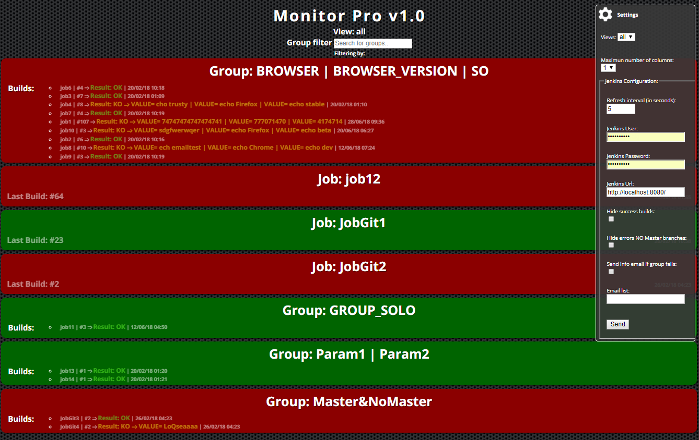
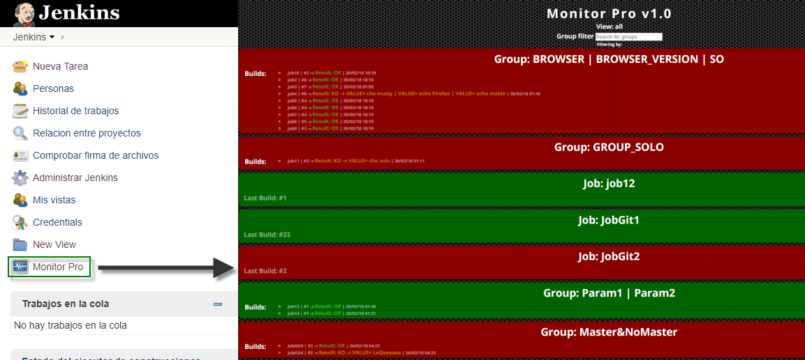
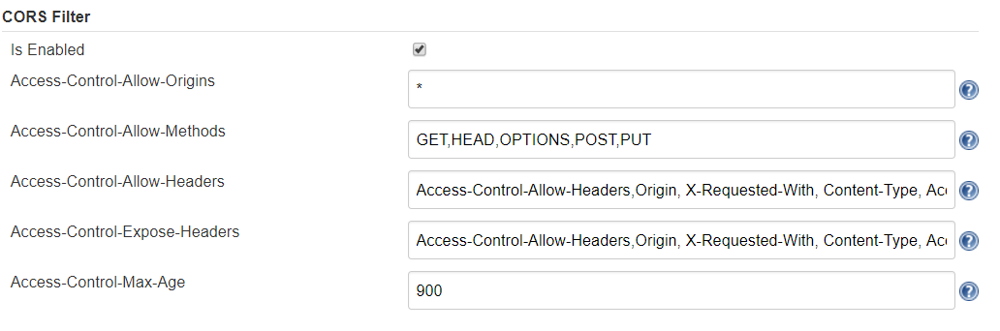
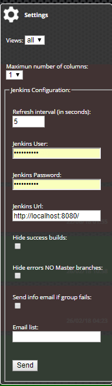
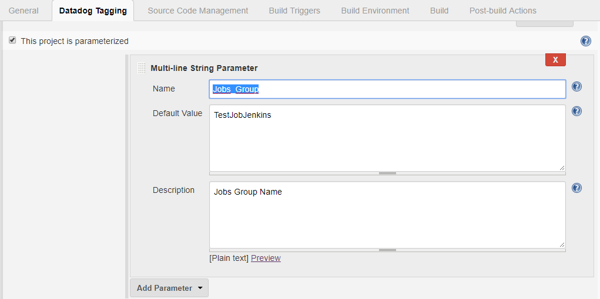

Monitor Pro Plugin, is a plugin to monitoring the status of the Jobs of
a selected view, built as an Angular SPA. It provides to Jenkins
interface of a button at the main screen to access the Monitor Pro
application, wich will open in the same window.

# Features

In this version you can:

-   Select a view.
-   Config the grid maximun number of columns.
-   Set polling interval in seconds.
-   If exist Jobs configured as a group in Jenkins, that jobs will be
    shows as a single element in the grid.
    -   Group by group name, whichever is the parametrized name of the
        group.

-   Config the credentials and URL of the Jenkins Server that you want
    monitorize.
-   Show which parameter caused the error.

-   Group by parameter for easier viewing.

-   Option to hide jobs finished successfully.
-   Option to show as success the jobs run from a branch different to
    Master branch.
-   Filter by Group/Job name.
-   Navigation between folders to show jobs inside them
-   Option to send emails when a job crashes ("Job Direct Mail Plugin"
    is required to be installed) 

# Installation

You can use this application as a plugin of Jenkins or integrated into
any web application. Install application as a plugin there is no
mistery, but if you want to use it into a web app, click on the
link <https://github.com/mmariscalg/jenkins-test-failure-magnifier> to
more information.

# Quick start

Once the plugin's installation has finished, go to the Jenkins main
page. An icon has been added at bottom of the left menu. To access the
monitor plugin you must click on it.

By default, Monitor Pro tries to connect to Jenkins
at <http://localhost:8080/jenkins>, if we have configured Jenkins on
another port or base path, we need to set the correct value in the
configuration menu. Remember that Monitor Pro runs on Jenkis, so it is
not to set any user or password. You only need to fill in these filds if
you run Monitor Pro on another web application or if you want monitoring
another jenkins server.

## Local Mode

By default, Monitor Pro tries to connect to the Jenkins host.  Remember
that Monitor Pro runs on Jenkins,  so it is not to set any user or
password. 

## Remote Mode

If you want to monitoring another Jenkis Server, you need to follow the
next steps:

-   Create an user to Monitor Pro in the Jenkins target.
-   Install, config and enable the CORS plugin.  
      
    {width="754"
    height="250"}  
      
-   Set the credentias created above, in the configuration menu of the
    Monitor Pro.  
      
    

## Create Jobs Groups 

If you need testing your application in many difererents environments or
configurations, you can create a group of Jobs. For this, you have to
add a new text parameter to each Job of the group. 

{width="699"}

 

You can see the result of doing this, in the image below

# Technology

The interface and logic of Monitor Pro, are built entirely with the
Angular Framework and TypeScript. Jelly, Stapler or Java, are only used
to integrate the application as a plugin on jenkins. Monitor Pro obtains
job status information by making requests to the Jenkins REST API.

# Based on

To start building this plugin, we have taken two reference:

-   Jenkins EzWall Plugin
-   Jenkins CI Build Monitor Plugin

# Changelog

### Version 1.0.9 (28/06/2018)

-   Show jobs inside folders
-   Option to send emails 

### Version 1.0.6 (21/03/2018)

-   Filter option. 

### Version 1.0.4 (07/03/2018)

-   Group by group name, whichever is the parametrized name of the
    group. 
-   Show which parameter caused the error.
-   Group by parameter for easier viewing.
-   Option to hide jobs finished successfully.
-   Option to show as success the jobs run from a branch different to
    Master branch.

### Version 1.0.2 (02/07/2017)

-   Modify Jobs Group style.

### Version 1.0.1 (23/06/2017)

-   Fixed some bugs on start up.

### Version 1.0.0 (22/06/2017)

-   Initial version.

 

# Licence

The MIT License (MIT) Copyright (c) 2016 Francisco R Díaz

Permission is hereby granted, free of charge, to any person obtaining a
copy of this software and associated documentation files (the
"Software"), to deal in the Software without restriction, including
without limitation the rights to use, copy, modify, merge, publish,
distribute, sublicense, and/or sell copies of the Software, and to
permit persons to whom the Software is furnished to do so, subject to
the following conditions:

The above copyright notice and this permission notice shall be included
in all copies or substantial portions of the Software.

THE SOFTWARE IS PROVIDED "AS IS", WITHOUT WARRANTY OF ANY KIND, EXPRESS
OR IMPLIED, INCLUDING BUT NOT LIMITED TO THE WARRANTIES OF
MERCHANTABILITY, FITNESS FOR A PARTICULAR PURPOSE AND NONINFRINGEMENT.
IN NO EVENT SHALL THE AUTHORS OR COPYRIGHT HOLDERS BE LIABLE FOR ANY
CLAIM, DAMAGES OR OTHER LIABILITY, WHETHER IN AN ACTION OF CONTRACT,
TORT OR OTHERWISE, ARISING FROM, OUT OF OR IN CONNECTION WITH THE
SOFTWARE OR THE USE OR OTHER DEALINGS IN THE SOFTWARE.
