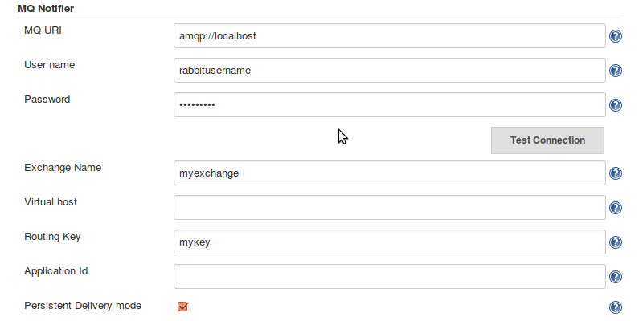

This plugin sends messages to an MQ, e.g. RabbitMQ whenever a build is
started and finished. It also sends a message when a build enters and
leaves the queue.  
By extending this plugin, developers can add events for when to send
messages to MQ.

| Plugin Information                                                                                  |
|-----------------------------------------------------------------------------------------------------|
| View MQ Notifier [on the plugin site](https://plugins.jenkins.io/mq-notifier) for more information. |

Older versions of this plugin may not be safe to use. Please review the
following warnings before using an older version:

-   [CSRF vulnerability and missing permission
    checks](https://jenkins.io/security/advisory/2018-09-25/#SECURITY-972)

### General information

The plugin connects to an MQ, e.g. RabbitMQ and sends messages during
specific events. In its first version, the messages are sent when:

-   A build is added to the queue
-   A build leaves the queue (either to be built or is cancelled)
-   A build starts
-   A build finishes (either when the build is finished or when it is
    aborted)

The basic use case is for other systems to interact with Jenkins. An
example is a system that triggers a build using the rest API of
Jenkins,  
then waits for the build to finish. The system wants to present
information about these builds. The alternative to listening to an MQ is
for the system  
to continuously poll Jenkins for information of the build status.

Other events can be added to the plugin by extending it.

### Message format

##### Entering queue

"state":"QUEUED","url":"http://urltojenkins:port/jenkins/job/myjob/","parameters":"\["parameter1":"parametervalue","parameter2":"otherparametervalue"\]"

##### Leaving queue

"state":"DEQUEUED","DEQUEUE\_REASON":"BUILDING","url":"http://urltojenkins:port/jenkins/job/myjob/","parameters":{"parameter1":"parametervalue","parameter2":"otherparametervalue"}

##### Build started

"state":"STARTED","url":"http://urltojenkins:port/jenkins/job/myjob/buildnumber/","causes":{"UserIdCause",
"Started by user Bunny
McQueen"},"parameters":{"parameter1":"parametervalue","parameter2":"otherparametervalue"}

##### Build finished

"state":"COMPLETED","url":"http://urltojenkins:port/jenkins/job/myjob/buildnumber/","status":"SUCCESS","parameters":{"parameter1":"parametervalue","parameter2":"otherparametervalue"}

### Settings

The settings are all MQ-related. The only required settings are the MQ
URI, for where to find the MQ server and Exchange name,  
for where to send the messages inside the MQ. The other settings are all
optional and related to your MQ setup, you can read more  
about them at e.g. the RabbitMQ site here: [RabbitMQ
docs](https://www.rabbitmq.com/documentation.html)

## Change Log

#### Version 1.2.8 (released Nov 16, 2018)

Pipeline Step to allow publishing of arbitrary messages

#### Version 1.2.7 (released Sep 25, 2018)

[Fix security
issue](https://jenkins.io/security/advisory/2018-09-25/#SECURITY-972)

#### Version 1.2.6 (released Mar 06, 2018)

Refactoring some code to easier allow other plugins to easier send
standalone messages to RabbitMQ.

#### Version 1.2.5 (released Mar 06, 2018)

   
Add an option to disable/enable the plugin (Thanks Huaxing Sun)

**Please note:** After upgrade and initial restart the plugin will not
be enabled. Go to Configure Jenkins -\> Enable Notifier in the 'MQ
Notifier' section.

#### Version 1.2.4 (released Oct 02, 2017)

Add "Build Duration" time to the published AMQP event.

#### Version 1.2.3 (released June 08, 2017)

Added a null check to fix NullPointerExceptions in the CauseProvider

#### Version 1.2.2 (released May 22, 2017)

Collect additional build and host data (project names, jenkins master
fqdn)  
Collect data about time spent in queue and assigned label

#### Version 1.2.1 (released Feb 16, 2017)

Added an extension point for providing data to the notifier

#### Version 1.2.0 (released Dec 22, 2016)

Support for pipeline projects

#### Version 1.1.5 (released Dec 09, 2016)

Added internal queue for when connection to MQ is down.  
Several fixes regarding saving of the configuration.  
Build parameters added to all of the existing messages.

#### Version 1.0 (released May 18, 2016)

Initial release
