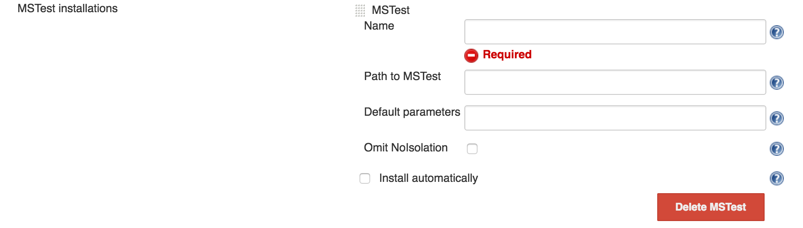
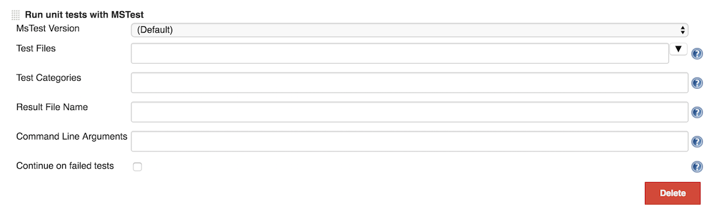

This plugin allow you to execute test using MSTest command line tool.

## Description

This plugin allow you to execute test using MSTest command line tool.

MSTest are test classes for .NET framework which are integrated into
Visual Studio. You should use a plugin to process the result files, I
recommend using [MSTest Jenkins
Plugin](https://wiki.jenkins-ci.org/display/JENKINS/MSTest+Plugin). You
can read my post about [how to setup Jenkins with
MSTest](http://dotdotnet.blogspot.co.il/2011/11/building-net-application-with-jenkins.html)
in my blog.

## Configuration

To configure a MSTest installation, go to *Manage Jenkins -\> Configure
System* (or *Manage Jenkins -\> Global Tool Configuration* in Jenkins
2.8, possibly earlier) and add a MSTest installation. **Name** is
mandatory. If **Path to MSTest** is left blank, the default is
*MSTest.exe*.

{width="680"}

MSTestRunner can be used as a build step. The screenshot below shows the
configuration parameters available where the **Test Files** and the
**Result File Name** are mandatory. The MSTest Version is not mandatory.
If the default is used, the plugin will look for *MSTest.exe*, so
ideally it should be in the path.

{width="680"}

For further configuration tips, see each field's inline help.

## Version History

### Version 1.3.0 (25/05/2016)

-   [JENKINS-34392](https://issues.jenkins-ci.org/browse/JENKINS-34392)
    Upgrade to new plugin parent POM
-   [JENKINS-30457](https://issues.jenkins-ci.org/browse/JENKINS-30457)
    Relative paths to test files with dots failing.
-   [JENKINS-34378](https://issues.jenkins-ci.org/browse/JENKINS-34378)
    Validation for the test result filename field.

### Version 1.2.0 (09/12/2015)

-   [JENKINS-28869](https://issues.jenkins-ci.org/browse/JENKINS-28869)
    - Fixes problem with newline tokennization (thanks to Thomas Blitz)
-   [JENKINS-29389](https://issues.jenkins-ci.org/browse/JENKINS-29389)
    - Quotation marks for /testcategories argument, must beused only
    when multiple category was specifed (thanks to Nikolas Falco)
-   [JENKINS-29391](https://issues.jenkins-ci.org/browse/JENKINS-29391)
    - add support to full path in testFiles (thanks to Nikolas Falco)
-   [JENKINS-30292](https://issues.jenkins-ci.org/browse/JENKINS-30292) -
    Not visible in Conditional BuildStep Plugin (thanks to Ido Ran)

### Version 1.1.0 (06/04/2014)

-   Add Continue On Failed Test checkbox which allows to report success
    even when test have failed
    ([JENKINS-20367](https://issues.jenkins-ci.org/browse/JENKINS-20367))

### Version 1.0.1 (06/06/2013)

-   Use workspace path instead of module path to support multi-module
    build
    ([\#2](https://github.com/jenkinsci/mstestrunner-plugin/pull/2) by [blazee](https://github.com/blazee))

### Version 1.0.0 (31/05/2013)

-   Path to test containers (DLLs) are allowed to have space in them.
-   Test containers can now only be separated with new lines because
    they are allowed to have space in them.
-   The license of this plugin is now MIT.

### Version 0.2.1 (09/14/2012)

-   Fix the bug in which the flag /noisolation was not added by default.
-   Add new option in MSTest config (Manage Jenkins -\> Configure System
    -\> MSTest) name Omit Noisolation. Checking this option will omit
    the /noisolation flag from the call to MSTest.

### Version 0.2 (09/02/2012)

-   Add parameter for running MSTest with or without isolation (thanks
    to [roicp](https://github.com/roicp) [\#1](https://github.com/jenkinsci/mstestrunner-plugin/pull/1))

Notice  
Due to update in version 0.2 the plugin do not add /noisolation flag by
default which break MSTest on some systems.

To work around this problem until then either downgrade to 0.1 or add
/noisolation flag in Manage Jenkins -\> Configure System -\> MSTest -\>
Default Paramters.

You can upgrade to version 0.2.1 which fix the problem.

### Version 0.1 (01/15/2012)

-   Initial release 
