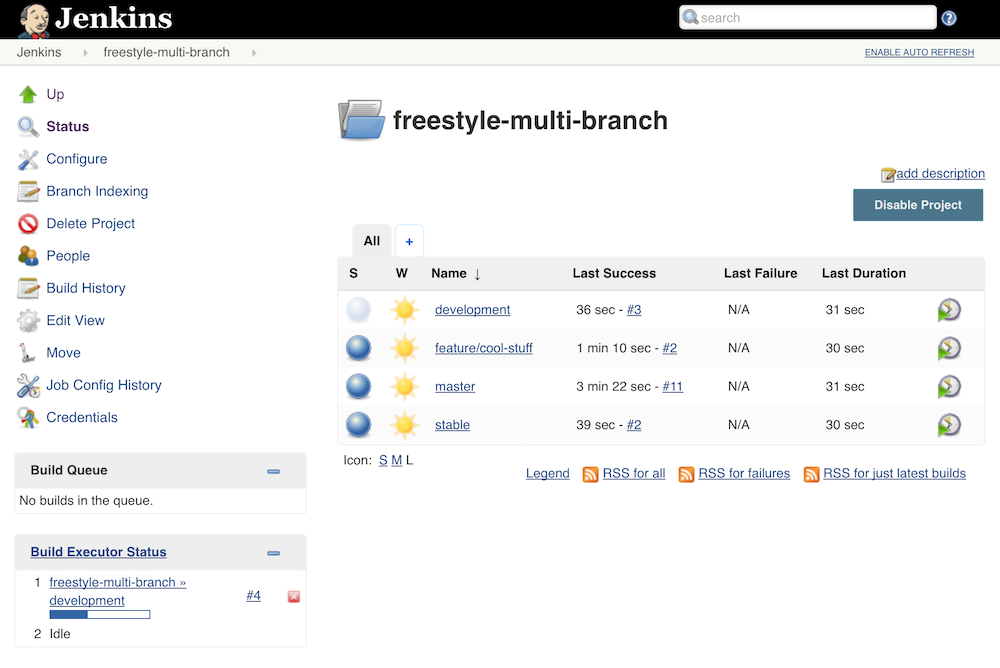

# **DEPRECATED**

**This plugin is deprecated. Please move to the** **[Multibranch
Pipeline](http://localhost:8085/display/JENKINS/Pipeline+Multibranch+Plugin)**
**job type.**

This plugin adds additional project types that create sub-projects for
each branch using a shared configuration.

# **DEPRECATED**

**This plugin is deprecated. Please move to the** **[Multibranch
Pipeline](http://localhost:8085/display/JENKINS/Pipeline+Multibranch+Plugin)**
**job type.**

#### Table of Contents

-   [Background](http://localhost:8085/display/JENKINS/Multi-Branch+Project+Plugin#Multi-BranchProjectPlugin-Background)
    -   [Screenshot - Project
        Page](http://localhost:8085/display/JENKINS/Multi-Branch+Project+Plugin#Multi-BranchProjectPlugin-Screenshot-ProjectPage)
-   [Notes](http://localhost:8085/display/JENKINS/Multi-Branch+Project+Plugin#Multi-BranchProjectPlugin-Notes)
    -   [Available
        SCMs](http://localhost:8085/display/JENKINS/Multi-Branch+Project+Plugin#Multi-BranchProjectPlugin-AvailableSCMs)
    -   [Usage](http://localhost:8085/display/JENKINS/Multi-Branch+Project+Plugin#Multi-BranchProjectPlugin-Usage)
    -   [Gotchas](http://localhost:8085/display/JENKINS/Multi-Branch+Project+Plugin#Multi-BranchProjectPlugin-Gotchas)
-   [Change
    Log](http://localhost:8085/display/JENKINS/Multi-Branch+Project+Plugin#Multi-BranchProjectPlugin-ChangeLog)
    -   [Version 0.7 (Apr
        7, 2017)](http://localhost:8085/display/JENKINS/Multi-Branch+Project+Plugin#Multi-BranchProjectPlugin-Version0.7(Apr7,2017))
    -   [Version 0.6 (Feb
        22, 2017)](http://localhost:8085/display/JENKINS/Multi-Branch+Project+Plugin#Multi-BranchProjectPlugin-Version0.6(Feb22,2017))
    -   [Version 0.5.1 (Jul
        8, 2016)](http://localhost:8085/display/JENKINS/Multi-Branch+Project+Plugin#Multi-BranchProjectPlugin-Version0.5.1(Jul8,2016))
    -   [Version 0.5 (Jul
        1, 2016)](http://localhost:8085/display/JENKINS/Multi-Branch+Project+Plugin#Multi-BranchProjectPlugin-Version0.5(Jul1,2016))
    -   [Version 0.4.2 (Apr
        16, 2016)](http://localhost:8085/display/JENKINS/Multi-Branch+Project+Plugin#Multi-BranchProjectPlugin-Version0.4.2(Apr16,2016))
    -   [Version 0.4.1 (Dec
        11, 2015)](http://localhost:8085/display/JENKINS/Multi-Branch+Project+Plugin#Multi-BranchProjectPlugin-Version0.4.1(Dec11,2015))
    -   [Version 0.4 (Dec
        2, 2015)](http://localhost:8085/display/JENKINS/Multi-Branch+Project+Plugin#Multi-BranchProjectPlugin-Version0.4(Dec2,2015))
    -   [Version 0.3 (Aug
        30, 2015)](http://localhost:8085/display/JENKINS/Multi-Branch+Project+Plugin#Multi-BranchProjectPlugin-Version0.3(Aug30,2015))
    -   [Version 0.2.4 (Aug
        5, 2015)](http://localhost:8085/display/JENKINS/Multi-Branch+Project+Plugin#Multi-BranchProjectPlugin-Version0.2.4(Aug5,2015))
    -   [Version 0.2.3 (Jul
        7, 2015)](http://localhost:8085/display/JENKINS/Multi-Branch+Project+Plugin#Multi-BranchProjectPlugin-Version0.2.3(Jul7,2015))
    -   [Version 0.2.2 (Apr
        14, 2015)](http://localhost:8085/display/JENKINS/Multi-Branch+Project+Plugin#Multi-BranchProjectPlugin-Version0.2.2(Apr14,2015))
    -   [Version 0.2.1 (Apr
        13, 2015)](http://localhost:8085/display/JENKINS/Multi-Branch+Project+Plugin#Multi-BranchProjectPlugin-Version0.2.1(Apr13,2015))
    -   [Version 0.2 (Apr
        13, 2015)](http://localhost:8085/display/JENKINS/Multi-Branch+Project+Plugin#Multi-BranchProjectPlugin-Version0.2(Apr13,2015))
    -   [Version 0.1.3 (Oct
        30, 2014)](http://localhost:8085/display/JENKINS/Multi-Branch+Project+Plugin#Multi-BranchProjectPlugin-Version0.1.3(Oct30,2014))
    -   [Version 0.1.2 (Aug
        29, 2014)](http://localhost:8085/display/JENKINS/Multi-Branch+Project+Plugin#Multi-BranchProjectPlugin-Version0.1.2(Aug29,2014))
    -   [Version 0.1.1 (Aug
        13, 2014)](http://localhost:8085/display/JENKINS/Multi-Branch+Project+Plugin#Multi-BranchProjectPlugin-Version0.1.1(Aug13,2014))
    -   [Version 0.1 (Aug
        12, 2014)](http://localhost:8085/display/JENKINS/Multi-Branch+Project+Plugin#Multi-BranchProjectPlugin-Version0.1(Aug12,2014))
-   [Upgrade
    Notes](http://localhost:8085/display/JENKINS/Multi-Branch+Project+Plugin#Multi-BranchProjectPlugin-UpgradeNotes)
    -   [Version
        0.7.x](http://localhost:8085/display/JENKINS/Multi-Branch+Project+Plugin#Multi-BranchProjectPlugin-Version0.7.x)
    -   [Version
        0.6.x](http://localhost:8085/display/JENKINS/Multi-Branch+Project+Plugin#Multi-BranchProjectPlugin-Version0.6.x)
    -   [Version
        0.5.x](http://localhost:8085/display/JENKINS/Multi-Branch+Project+Plugin#Multi-BranchProjectPlugin-Version0.5.x)
    -   [Version
        0.4.x](http://localhost:8085/display/JENKINS/Multi-Branch+Project+Plugin#Multi-BranchProjectPlugin-Version0.4.x)
    -   [Version
        0.3.x](http://localhost:8085/display/JENKINS/Multi-Branch+Project+Plugin#Multi-BranchProjectPlugin-Version0.3.x)
    -   [Version
        0.2.x](http://localhost:8085/display/JENKINS/Multi-Branch+Project+Plugin#Multi-BranchProjectPlugin-Version0.2.x)

# Background

This plugin has evolved over the course of several releases, originally
depending only on the SCM API Plugin, but has since adopted other APIs
as they've become stable. The original goal was to provide a single new
project type whose configuration mimics that of a standard free-style
project. The only difference was that the SCM configuration section
utilizes the [SCM API
Plugin](http://localhost:8085/display/JENKINS/SCM+API+Plugin) (and so
the options may seem somewhat limited compared to the usual SCM
options). The project will use this SCM to automatically poll for a list
of current branches and sync all the configuration to sub-projects. Each
branch has its own sub-project. Sub-projects are just like normal
projects, except they are automatically configured by the main (parent)
project's page.

### Screenshot - Project Page



# Notes

### Available SCMs

Any SCM plugin that has an implementation that extends the below class
from the [SCM API
Plugin](http://localhost:8085/display/JENKINS/SCM+API+Plugin) will be
available:

``` syntaxhighlighter-pre
jenkins.scm.api.SCMSource
```

Known implementations:

-   [Bitbucket Branch Source
    Plugin](http://localhost:8085/display/JENKINS/Bitbucket+Branch+Source+Plugin)
-   [GitHub Branch Source
    Plugin](http://localhost:8085/display/JENKINS/GitHub+Branch+Source+Plugin)
-   [Git Plugin](http://localhost:8085/display/JENKINS/Git+Plugin)
-   [Mercurial
    Plugin](http://localhost:8085/display/JENKINS/Mercurial+Plugin)
-   [Subversion
    Plugin](http://localhost:8085/display/JENKINS/Subversion+Plugin)

### Usage

The environment variable BRANCH\_NAME can be used to obtain – you
guessed it – the branch name. It can be used in your scripts or in form
fields that support variable expansion.

Examples:

``` syntaxhighlighter-pre
${BRANCH_NAME}
${env.BRANCH_NAME}
```

### Gotchas

-   Branch names get encoded (i.e. a forward slash '/' becomes '%2F'),
    so some things may not work without additional configuration. The
    real branch names are stored in the sub-project's display name. Make
    sure both your container running Jenkins (ex: Tomcat, Glassfish,
    etc.) and any HTTP server acting as a remote proxy (ex: Apache,
    Nginx) are configured to support encoded slashes in the URL. The
    embedded Jetty container in jenkins.war can handle this by default.
-   Depending on the SCM implementation you're using, configuration
    options can be limited.
-   This project type should be compatible with plugins that you'd see
    in normal free-style projects, but compatibility can't be
    guaranteed.  Feel free to open an issue with your list of installed
    plugins, your configuration, and any relevant errors or logs.
-   Sub-projects appear to be configurable, but they will be overwritten
    by branch indexing if you manually modify them.  There is no clear
    way to remove or hide the configuration option on sub-projects
    (except maybe with project-based matrix authorization??), though
    version 0.1.x of this plugin accomplished that via some trickery
    that is not possible in newer versions.

# Change Log

### Version 0.7 (Apr 7, 2017)

-   Deprecated plugin
-   Removed migration-related code

### Version 0.6 (Feb 22, 2017)

-   \[[JENKINS-41371](https://issues.jenkins-ci.org/browse/JENKINS-41371)\]\[[JENKINS-41867](https://issues.jenkins-ci.org/browse/JENKINS-41867)\]\[[JENKINS-41948](https://issues.jenkins-ci.org/browse/JENKINS-41948)\]
    Fix compatibility issues with Branch API Plugin 2.0.x
    -   Update core dependency to 1.642.3 (highest common denominator,
        matches Branch API Plugin)
-   \[[JENKINS-36896](https://issues.jenkins-ci.org/browse/JENKINS-36896)\]
    Fix symlink path unsupported for Windows in migration code

### Version 0.5.1 (Jul 8, 2016)

-   \[[JENKINS-36512](https://issues.jenkins-ci.org/browse/JENKINS-36512)\]
    Fix case where config didn't apply to sub-project when user
    configured that sub-project directly
-   \[[JENKINS-36511](https://issues.jenkins-ci.org/browse/JENKINS-36511)\]
    Fix config options for Matrix multi-branch (missing custom workspace
    and custom child workspace, extraneous JDK dropdown)
-   Add new item icons for Jenkins 2.x
-   Update new item descriptions
-   Also exclude workspaces from search for config.xml files during
    migration at startup
-   Further reduce unnecessary footprint for Job Configuration History

### Version 0.5 (Jul 1, 2016)

-   \[[JENKINS-32234](https://issues.jenkins-ci.org/browse/JENKINS-32234)\]
    Refactor to use MultiBranchProject API
    -   Add Branch API Plugin as a dependency
    -   Update core dependency to 1.625.1 (highest common denominator,
        matches Branch API Plugin)
    -   Remove "Allow anonymous trigger of branch sync" setting
    -   Remove "Suppress automatic build trigger after discovering new
        branches" setting
    -   \[[JENKINS-32244](https://issues.jenkins-ci.org/browse/JENKINS-32244)\]
        Provide environment variable for branch name
    -   \[[JENKINS-32440](https://issues.jenkins-ci.org/browse/JENKINS-32440)\]
        Fix issue with polling not being triggered (branch indexing now
        handles polling)
-   \[[JENKINS-36043](https://issues.jenkins-ci.org/browse/JENKINS-36043)\]
    Fix NPE when saving configuration in Jenkins 2.9-2.11
-   \[[JENKINS-30089](https://issues.jenkins-ci.org/browse/JENKINS-30089)\]
    Use BulkChange when updating sub-projects to prevent creating
    unnecessary job configuration history entries
-   \[[JENKINS-32255](https://issues.jenkins-ci.org/browse/JENKINS-32255)\]
    Add Multi-configuration multi-branch project type (thanks to
    Alastair D'Silva)
-   Add Ivy multi-branch project type (thanks to Florian Bühlmann)
-   \[[JENKINS-33906](https://issues.jenkins-ci.org/browse/JENKINS-33906)\]
    Add new icon to aggregate status of select jobs
-   \[[JENKINS-32322](https://issues.jenkins-ci.org/browse/JENKINS-32322)\]
    Improve startup delay on large instances by ignoring 'archive' and
    'builds' directories in migration code (thanks to Alastair D'Silva)
-   \[[JENKINS-34078](https://issues.jenkins-ci.org/browse/JENKINS-34078)\]
    Remove use of deprecated JSR-305 annotations

### Version 0.4.2 (Apr 16, 2016)

-   Move to Jenkins infrastructure
-   \[[JENKINS-34076](https://issues.jenkins-ci.org/browse/JENKINS-34076)\]
    Fix broken branch syncing with Folders Plugin 5.5+
-   Revise BallColorFolderIcon to work with all Folder types

### Version 0.4.1 (Dec 11, 2015)

-   Fix \#128 (regression): Re-add ability to keep sub-projects disabled

### Version 0.4 (Dec 2, 2015)

-   Fix \#37: Add a option for triggering build for new branches (thanks
    to Hiroyuki Wada)
-   Update SCM API Plugin dependency to 1.0
-   Remove 0.1.x -\> 0.2+ branch project migration code
-   Update Maven Plugin dependency to 2.12.1 (thanks to Robin Müller)
-   Use encoded branch names for both filesystem name and project name
    (real branch name set in display name)
    -   Fix \#23: View column links are broken for branch names with
        slashes
    -   Fix \#50: Using jenkins.model.Jenkins\#getItemByFullName API
        with slashes in name does not work
    -   Fix \#76: Branches with slashes causing broken links in
        conjunction with other plugins
    -   Fix \#114: Unable to trigger downstream multi-branch jobs with
        slash in name
-   Refactor to use ComputedFolder API
    -   Add Folders Plugin as a dependency
    -   Update core dependency to 1.609.1 (highest common denominator,
        matches Folders Plugin)
    -   Fix \#44 (part 1): Unable to rename multi-branch projects
    -   Fix \#61: Jenkins GUI gets incredibly slow when saving a
        multi-branch project with many branches
    -   Fix \#94: Enable a project after restart not working
-   Fix \#44 (part 2): Clone/copy template project when parent is copied

### Version 0.3 (Aug 30, 2015)

-   Refactored AbstractMultiBranchProject to inherit from AbstractItem
    -   Fix \#85: Sync branches not working in Jenkins 1.621+
    -   Fix \#53: NPE with EmailExt plugin
-   Fix \#89: Add new Maven Multi-Branch Project type
-   Fix \#87: "Could not access hudson.model.JDK.DEFAULT\_NAME"
    JellyTagException
-   Fix \#54: Bubble build status up to host project view

### Version 0.2.4 (Aug 5, 2015)

-   Fix JellyTagException on sync branches log in Jenkins 1.621+

### Version 0.2.3 (Jul 7, 2015)

-   Fix issue with custom workspace configuration field in newer
    versions of Jenkins
-   Fix deadlocks (thanks to Greg Opaczewski)
-   Add some Japanese localization (thanks to mallowlabs)

### Version 0.2.2 (Apr 14, 2015)

-   Fix exception on configuration page (No page found
    'configure-branch-entries.jelly')

### Version 0.2.1 (Apr 13, 2015)

-   Fix regression with ${JOB\_URL}/syncBranches

### Version 0.2 (Apr 13, 2015)

-   Heavy refactoring that abstracts much of the multi-branch
    functionality.
    -   Set custom workspace now available
    -   Template for sub-projects can now be configured via API at
        ${JOB\_UR\\L}/template/config.xml
-   Display warning on configuration page when no compatible SCMs are
    available.
-   Fixes exception java.lang.NoSuchMethodException:
    hudson.model.AbstractProject.convertUpstreamBuildTrigger(java.util.Set)

### Version 0.1.3 (Oct 30, 2014)

-   Add ability to trigger branch sync via URL with option to allow it
    anonymously (thanks to Manuel Durán Aguete for the initial commit).

### Version 0.1.2 (Aug 29, 2014)

-   Fix project-level permissions when using the "Project-based Matrix
    Authorization Strategy" security option.

### Version 0.1.1 (Aug 13, 2014)

-   Fix configuration issue when restricting project runs to master.

### Version 0.1 (Aug 12, 2014)

-   Initial Release

# Upgrade Notes

### Version 0.7.x

Removed migration-related code.

**Upgrading from versions 0.1.x, 0.2.x, 0.3.x, or 0.4.x is not
supported.**

### Version 0.6.x

See notes for version 0.5.x.

### Version 0.5.x

Refactoring to depend on the Branch API Plugin required migration of
config.xml in multi-branch projects and sub-projects for SCM settings
and log rotator settings.

**Upgrading from version 0.1.x or 0.2.x is not supported.** Upgrade to
[version
0.3](http://repo.jenkins-ci.org/releases/com/github/mjdetullio/jenkins/plugins/multi-branch-project-plugin/0.3/multi-branch-project-plugin-0.3.hpi)
and restart Jenkins before upgrading to the latest version.

Downgrading to version 0.1.x, 0.2.x, 0.3.x, or 0.4.x after upgrading is
not supported.

### Version 0.4.x

Refactoring to depend on the Folders Plugin required migration of
config.xml in multi-branch projects for tracked disabled sub-projects,
trigger spec for syncing branches, and project-based matrix
authorization settings; and migration of config.xml in sub-projects for
display name. Some migration required direct manipulation of config.xml
in multi-branch projects.

**Upgrading from version 0.1.x or 0.2.x is not supported.** Upgrade to
[version
0.3](http://repo.jenkins-ci.org/releases/com/github/mjdetullio/jenkins/plugins/multi-branch-project-plugin/0.3/multi-branch-project-plugin-0.3.hpi)
and restart Jenkins before upgrading to the latest version.

Downgrading to version 0.1.x, 0.2.x, or 0.3.x after upgrading is not
supported.

### Version 0.3.x

Significant refactoring in this version required migration of config.xml
in multi-branch projects for the trigger spec for syncing branches.

Downgrading to version 0.1.x or 0.2.x after upgrading is not supported.

### Version 0.2.x

Significant refactoring in this version required migration of config.xml
in sub-projects and build.xml for each build in each sub-project.
Migration required direct manipulation of these files.

Downgrading to version 0.1.x after upgrading is not supported.
