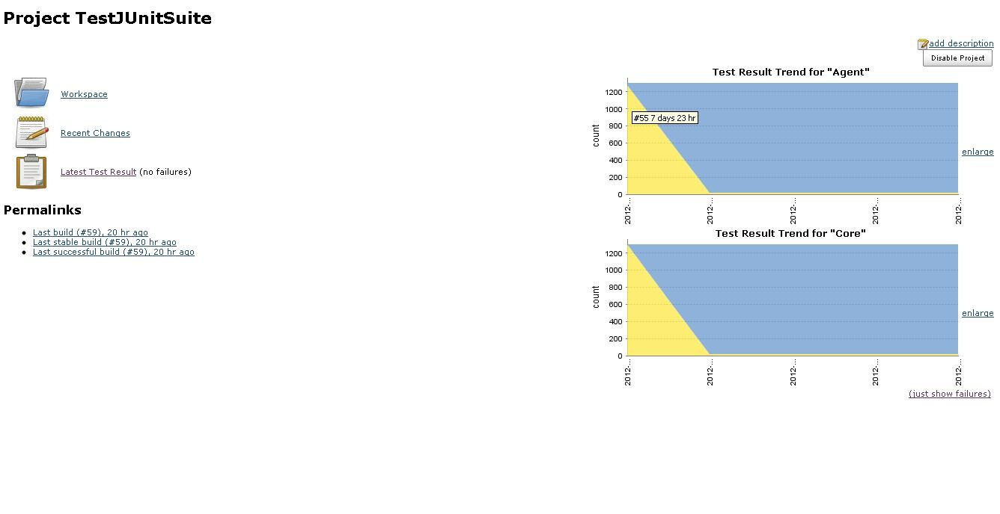
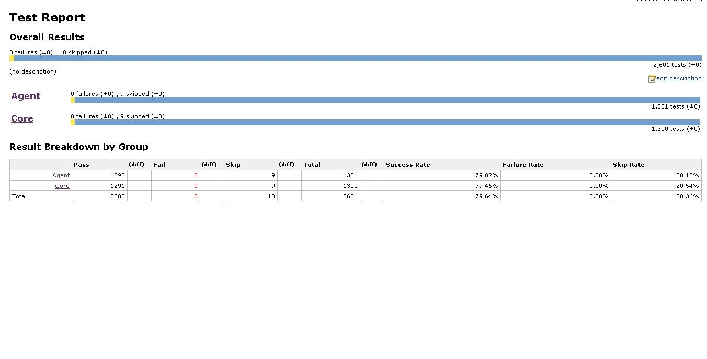
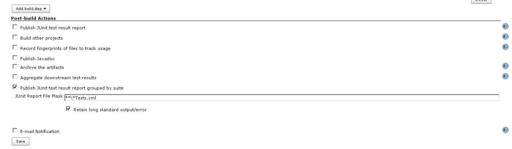

This plugin stores junit results into an embedded derby database and
groups testcases by module,package,class and case

This plugin can be used as a replacement for the built-in junit plugin.

This plugin allows junit tests to be grouped by suites in addition to
the being grouped by package, class and case.

It persists the test into a derby database that runs in embedded mode.
This is done so that reports can be generated easily using sql queries.
This also reduces the memory required to display reports and history

The trend graph for each suite is displayed on the project home
page. Three new columns, Success Rate, Failure Rate and Skip Rate are
available that displays the percentage rate of success, failure and skip
at the project level, suite level, package level, test class level and
case level

The screenshot of the configuration page is shown below

