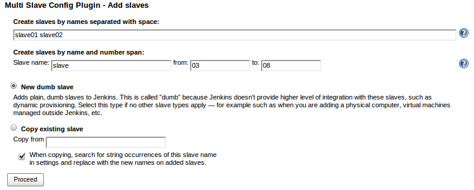
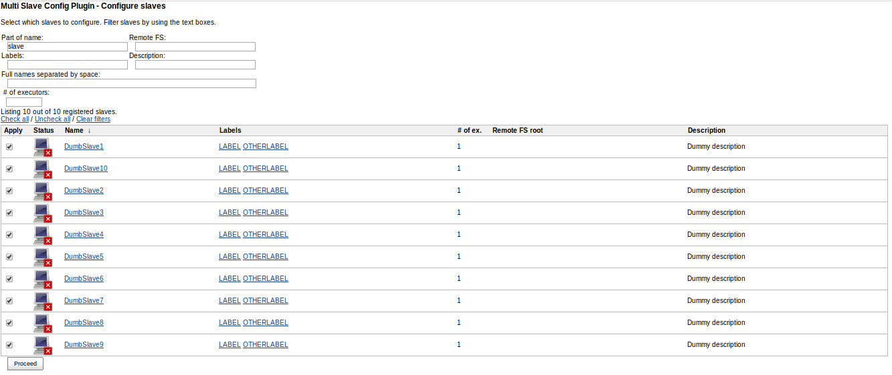
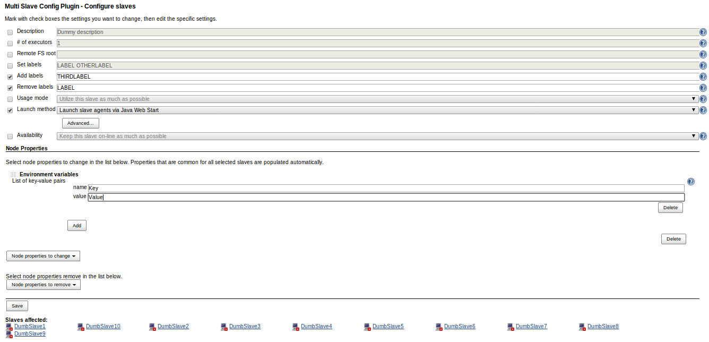
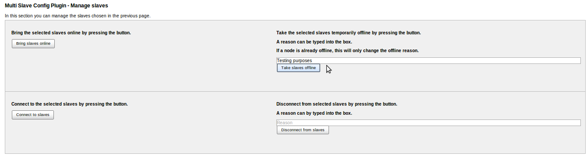

This plugin allows administrators to configure, add and delete several
dumb slaves at the same time.  

## Usage modes

### Add slaves

When adding slaves, new names can be separated with space or be added as
a number span. You can choose to create new "clean" slaves, or copy the
settings from an existing slave. See picture below.

### Configure slaves

The first step when configuring existing slaves is to mark which slaves
to edit. This can be done by using several filters, or by just selecting
slaves manually. See picture below.

The second step is to choose which settings to change by using the check
boxes, edit them and apply. See picture below.

#### Node properties

Node properties can also be edited on several slaves at the same time
since version 1.1.0. This is useful for editing any node specific
settings that other plugins might contribute. 

Properties that all selected slaves have in common will appear in the
hetero-list from the beginning. The remove these properties, simply
press delete and they will be moved to the Remove hetero-list.

To add more properties, just add them to the hetero-list. 

To remove properties that not all selected slaves have, just select them
in the remove properties hetero-list.

### Manage slaves

This page is new since version 1.1.0 and lets you take slaves online /
offline and also connect / disconnect them.

#### 

### Delete slaves

Deleting slaves can be done by selecting which slaves to delete in the
same way as when choosing to configure slaves.

## Other features

### Environment variables

If the slave name is needed as any setting, it's possible to use "$NAME"
to get it expanded for each slave. For example, you could set the launch
command to "launch /root/launch\_slave $NAME.domain.com" on a slave
called "slave1" and it would be saved as "launch /root/launch\_slave
slave1.domain.com".

## Requirements

-   Javascript activated

## Change Log

#### Version 1.2.0 (released Aug 15 2014)

-   Added button for taking offline leniently *(if lenient shutdown
    plugin is installed)*
-   Fixed removing NodeProperties when cloning slaves
-   Changed help text when adding slaves

#### Version 1.1.1 (released Jul 22 2014)

-   Fixed incorrect dependency to Windows Slaves Plugin

#### Version 1.1.0 (released Jul 11 2014)

-   Multiple slaves online/offline and connect/disconnect
-   Edit Node properties
-   Search for full names separated by space
-   Disabling delete buttons after the user starts deleting slaves
-   Added links to the slaves affected

#### Version 1.0.0

Initial release.
