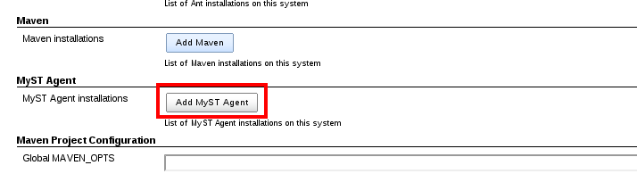
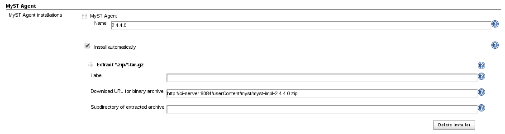
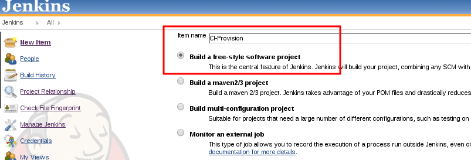
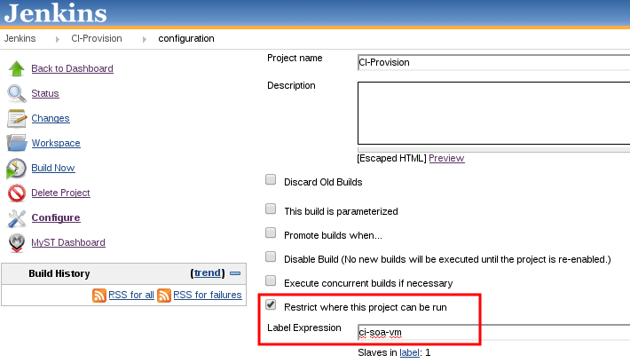
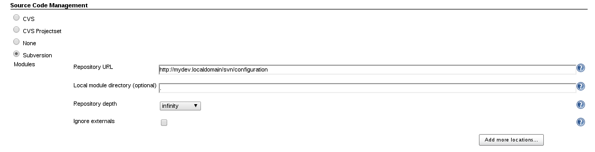
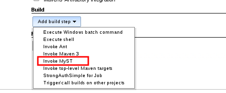
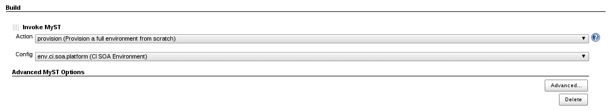
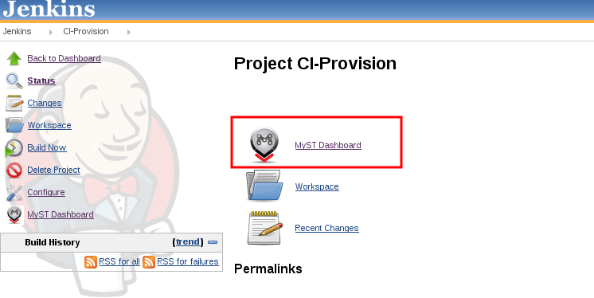
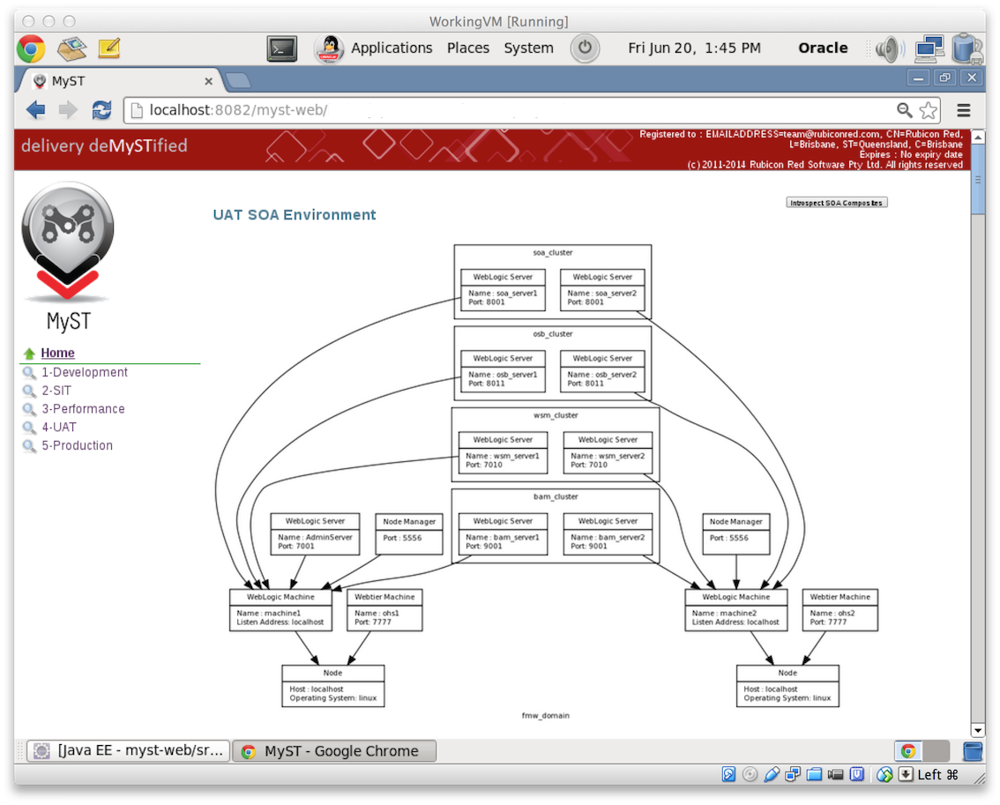

# Plugin Features

-   Provides Integration with MyST Agents
-   Provides Integration with MyST Web Console
-   Enables seamless Agent installation and upgrades in your Jenkins
    environment
-   Provides Actions and Environment discovery at the Job Level

# About MyST

Rubicon Red MyST provides an automated process for the installation,
configuration, patching and deployment of Oracle Fusion Middleware and
Applications.

The automated installation is driven by simple models (or metadata),
which defines the environment specific properties, which are captured
during the initial platform design.

MyST provides a number of key capabilities, including:

-   Ability to define Fusion Middleware environment templates, from
    which we can provision new environments on demand.
-   Easily automates the build and deployment of FMW solutions, and
    configurations into development, test, and production environments. 

Oracle products supported by MyST, include:

-   Oracle Weblogic Server
-   Oracle SOA Suite
-   Oracle Service Bus (OSB)
-   Oracle Business Process Manager (BPM)
-   Oracle Business Activity Monitoring (BAM)
-   Oracle Identity and Access Management 
-   Oracle Unified Directory (OUD)
-   Oracle Policy Automation (OPA)
-   Oracle OAM Webgate
-   Oracle Enterprise Manager (OEM)
-   Oracle HTTP Server (OHS)
-   Oracle AIA Foundation Pack
-   Oracle AIA Process Integration Pack
-   Oracle Data Integrator (ODI)
-   Oracle WebCenter Portal and Content

For more information, visit the website: [Rubicon Red -
MyST](http://www.rubiconred.com/myst)

# Plugin Configuration

If you are using Jenkins 2.3+, you must specify the following parameter
in the Jenkins startup:
-Dhudson.model.ParametersAction.safeParameters=MYST\_HOME

This is related
to: <https://wiki.jenkins-ci.org/display/SECURITY/Jenkins+Security+Advisory+2016-05-11>

### System Configuration

**a) Configuring the MyST Agent**

-   Copy the MyST Agent ZIP file under the following directory in
    Jenkins: \<JENKINS\_HOME\>/userContent/myst (make sure the file has
    the correct file permission)
-   In the Jenkins web console, select: "Jenkins" \> "Manage Jenkins" \>
    "Configuration"

 

-   Click on the "Add MyST Agent" button
-   Configure the MyST agent: 
    -   Name this MyST agent installation as the MyST version number. In
        this example, the version is 2.4.4.0. 
    -   Select the "Install automatically" checkbox and Select "Add
        Installer", as follows. Leave the MYST\_HOME field empty. 
    -   Set the Download URL for binary archive, which will point to the
        MyST ZIP file copied previously. You must configure the
        following URL:
        http://\<JENKINS\_MASTER\_HOST:PORT\>/userContent/myst/\<MYST\_AGENT\_ZIP\_FILE\>.
        e.g: <http://ci-server:8084/userContent/myst/myst-impl-2.4.4.0.zip>

   

-   Click on the "Save" button

**b) Configuring MyST**

-   In the Jenkins web console, select: "Jenkins" \> "Manage Jenkins" \>
    "Configuration"
-   Enable the "MyST Console Integration" checkbox, in order to
    integrate Jenkins jobs with the MyST Web console

 

-   Enter the "MyST Console URL". http://\<HOST\>:8082/myst-web
-   Click on the "Save" button

### Job Configuration

**a) Creating a new MyST Job**

-   On the Jenkins web console, click on the "New Item" link on the left
    hand side
-   For the purpose of this documentation, we are creating a Job called
    "CI-Provision", which will be responsible for provisioning (install,
    create a domain and configure) an Oracle Fusion Middleware SOA
    environment. Select the option "Build a free-style software
    project", and click on the "OK" button.

-   A new scree will be opened with the job configuration details
-   It's recommended to run this job on the same machine where the
    Weblogic Admin Server will be running. To do this, you will have to
    pre-configure the Jenkins Nodes (slaves), which is not covered by
    this documentation. In the job configuration, you will have to
    select the checkbox "Restrict where this job can be run", and type
    the name of the node label, as follows. In this case, we defined a
    label called "ci-soa-vm".

-   Select the source control provider and the location where your MyST
    workspace is located in source control. In the following example, we
    are checking out the MyST workspace from SVN. Note that you must
    checkout the MyST workspace, which has an immediate directory child
    called "conf"

  

-   Under the "Build" section, select the "Invoke MyST" option, as
    follows:

-   At this point, Jenkins will communicate with the MyST Web Console,
    and will retrieve the available configurations and available MyST
    actions. We will select the **provision** action against the
    environment called "env.ci.soa.platform (CI SOA Environment)", as
    follows:

-   Click on the "Save" button at the bottom of the page in the Jenkins
    Web console.

# Provisioning an environment

-   Select the Jenkins job called "CI-Provision"
-   You will notice that the Jenkins job has the MyST logo and a "MyST
    Dashboard" link, as follows:

-   If you click on the MyST Dashboard link, you will be redirected to
    the MyST Web Console Environment Definition, which has the detailed
    environment topology, as follows: 
    

&nbsp;

-   Going back to Jenkins web console, under the "CI-Provision" Jenkins
    job, click on the "Build Now" icon, in order to Provision the CI
    environment.

# Requirements

-   You have a MyST license
-   You have downloaded the MyST installer
-   MyST Web Console is installed, and up and running
-   Source Control is strongly recommended, which will store the MyST
    workspace
-   Jenkins 1.530+ is installed
-   There is a job checking out MyST workspace to the following
    directory: /u01/app/oracle/admin/myst-workspace
-   Jenkins Slaves are configured to connect to the OFMW machines
    (recommended)

# FAQ

This plugin integrates Jenkins with
[MyST](http://www.rubiconred.com/myst), in order to automate the
installation, configuration, patching and deployment of Oracle Fusion
Middleware and Applications, such as: Oracle Weblogic Server; Oracle SOA
Suite; Oracle Service Bus (OSB); Oracle Business Process Manager
(BPM); Oracle Business Activity Monitoring (BAM); Oracle Identity and
Access Management; Oracle Unified Directory (OUD); Oracle Policy
Automation (OPA); Oracle OAM Webgate; Oracle Enterprise Manager
(OEM); Oracle HTTP Server (OHS); Oracle AIA Foundation Pack; Oracle AIA
Process Integration Pack; Oracle Data Integrator (ODI); Oracle WebCenter
Portal and Content

**Note:**  MyST is a commercial product.
