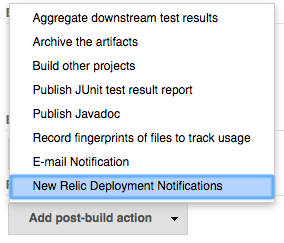
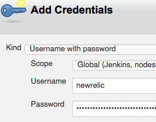
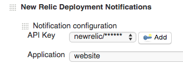
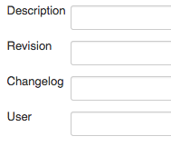
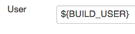

Jenkins plugin to notify New Relic about
[deployments](https://docs.newrelic.com/docs/apm/applications-menu/events/deployments-dashboard).

## Requirements

-   An account at [New Relic](http://newrelic.com/)
-   API access enabled by creating an [API
    key](https://docs.newrelic.com/docs/apm/apis/requirements/api-key)
-   Jenkins 1.580.1 or newer

## Usage

Use the New Relic Deployment Notifier by adding it as a *Post Step* in
you Jenkins build job configuration.

1.  In your Jenkins job configuration go to the **Post-build Actions**
    section, click on **Add post-build action** and select **New Relic
    Deployment Notifications**  
    
2.  Create an username/password credential for the API key. Enter the
    key as the password.  
    
3.  Select an application in the dropdown list.  
    
4.  Add any of the optional values: *description*, *revision*,
    *changelog* or *user*  
    

If you have configured everything correctly, Jenkins will notify you New
Relic account of subsequent deployments.

It is possible to configure several applications to be notified.  

### Getting user as an environment variable

Install the [Build User Vars
Plugin](http://localhost:8085/display/JENKINS/Build+User+Vars+Plugin)
and use any of the supported environment variables.  

## [Changelog](https://github.com/jenkinsci/newrelic-deployment-notifier-plugin/blob/master/CHANGELOG.md)
