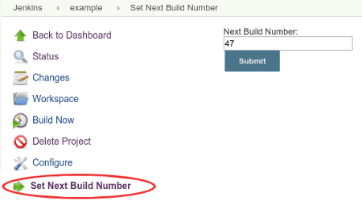

This is a simple plugin that changes the next build number Jenkins will
use for a job.  
This plugin is typically useful if you are using the build number as
part of a version string, and:

-   You do a build outside of Jenkins and you want to skip that number
    for the next build to avoid duplicate version numbers or failures.
-   You created a new job to handle an existing process and want it to
    continue from where the old one left off.

Jenkins requires that **build numbers are always increasing**. When you
click on the link installed by this plugin, a text field will be shown
that contains the next build number to be used. You can change this
number to be anything larger than the value for the previous build.
**Changing this to a smaller number will do nothing**.

The value can be changed:

-   Graphically by using the Set Next Build Number **link** for each job
    (see screenshot)
-   Via the CLI using the `set-next-build-number` command (Requires \>=
    v1.1)
-   Programmatically via the **Job DSL** plugin
    (see [usage](http://localhost:8085/display/JENKINS/Next+Build+Number+Plugin#NextBuildNumberPlugin-JobDSL)).
    (Requires \>= v1.3 of this plugin and Job DSL \>= 1.41)

Manual Usage:



**Note**: Not all job types are supported.  If support is missing for
your job type, feel free to make a Pull Request!

## Job DSL

The build number can be changed as part of a Job DSL script.

``` syntaxhighlighter-pre
job('example') {
  properties {
    nextBuildNumber(47)
  }
}
```

## Changelog

### Version 1.6

 Support
more job types (Organization Folders)
(Thanks [res0nance](https://github.com/jenkinsci/next-build-number-plugin/pull/7)!)

### Version 1.5

 Support
more job types (individual jobs from Multibranch Pipelines)
(Thanks [rjohnst](https://github.com/jenkinsci/next-build-number-plugin/pull/6)!)

### Version 1.4

 Support
more job types (eg Pipeline)
(Thanks [kad](https://github.com/jenkinsci/next-build-number-plugin/pull/5)!)

### Version 1.3

 Add
Job DSL extension point to allow specifying the nextBuildNumber at job
creation time
(Thanks [daspilker](https://github.com/jenkinsci/next-build-number-plugin/pull/4)!)

### Version 1.1

 Add
CLI command
([JENKINS-14406](https://issues.jenkins-ci.org/browse/JENKINS-14406))
