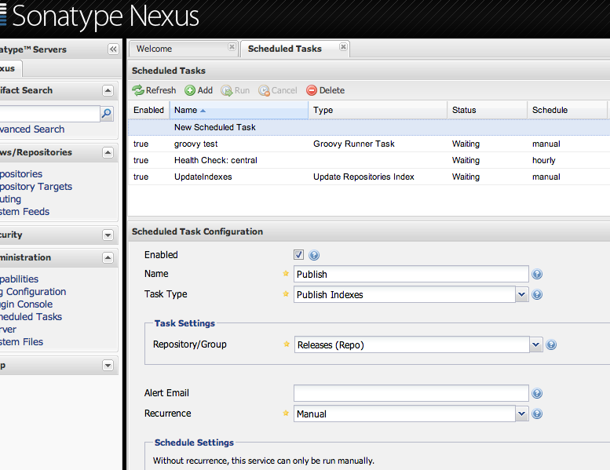
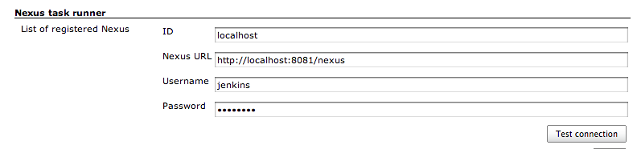

This plugin executes Sonatype Nexus scheduled tasks after your build.

For example, if you want to refresh your Nexus's repositories index
after building your project,  
you can use execute a Nexus task whose type is "Publish index" using
this plugin.

## How to use

1.  Register task you want to execute to your Nexus.
    -   You have to select the value 'Manual' at 'Recurrence'
        property.  
        
2.  Register your Nexus to Jenkins.
    -   Go to Jenkins system configuration
        page(<http://jenkins.yourcompany/configure>).
    -   The user have to be given Nexus permission 'UI:Scheduled Task
        Administration'.  
        
3.  Configure your build.
    -   In 'Post-build Actions', you select 'Run Nexus's task'.
    -   Input Nexus scheduled task name (e.g. 'Publish')
4.  Run your build.

## Version History

#### Version 0.9.1 (Nov 4, 2012)

#### Version 0.9.2 (Nov 6, 2012)
