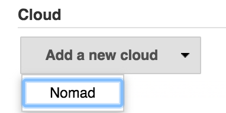
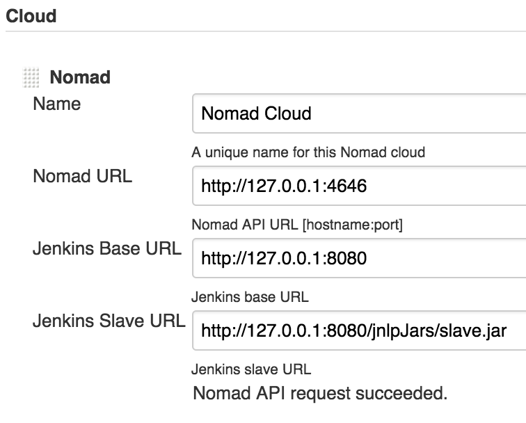
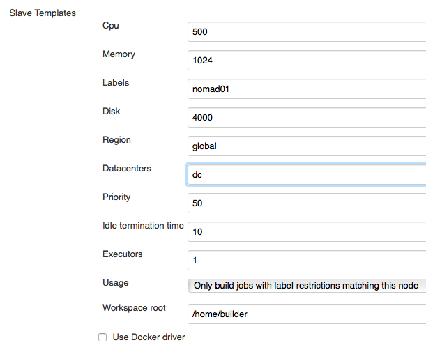
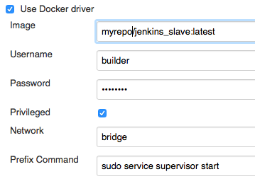
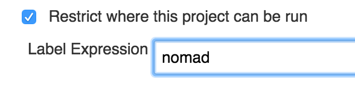

  
The Nomad Jenkins plugin allows Jenkins to dynamically launch build
slaves on a Nomad cluster depending on the workload.

## PREREQUISITES

Nomad version \>= 0.3.2 is required for the plugin to function properly.

## USAGE

#### Create a cloud

Go to "Manage Jenkins" -\> "Configure System" and add a new Nomad cloud
at the bottom of the page:

{width="200"}

#### Configure General settings

Configure the global plugin settings. The Jenkins Slave URL is usually
the 'Jenkins Base Url' with '/jnlpJars/slave.jar' added.

{width="400"}

Test the connection to Nomad with the test button to make sure that the
plugin can reach the Nomad agent.

#### Configure Slave Templates

You can define multiple slave templates that Jenkins will use to start
new build slaves on the Nomad cluster. Labels can be used to restrict
jobs to only run on a certain kind of slave.

Nomad uses the slave template settings to configure the slave job.

The Nomad plugin will use the Java driver by default to start a new
slave in an isolated context (chroot). You can choose to use the Docker
driver instead and specify a build image to use.

To pull images from a private docker registry - you can specify
authentication details in username and pasword fields.

If you need to run additional command before the container runs
slave.jar to connect to Jenkins master - use the **Prefix Command**
option.

The actual command will be "/bin/bash -c \<your\_command\>; java -jar
slave.jar .."

If more than one command is needed - separate with semicolons.

#### Configure Jobs

In order to use a Nomad slave you will have to restrict the job to only
use a specific label.

{width="300"}

## CHANGELOG

### 0.3.1 (September 25th 2016)

-   Fixed slave path for Java driver
-   Make sure that Jenkins base url ends with a forward slash when
    creating the secret url

### 0.3 (August 25th 2016)

-   Add an ASAP provisioning strategy for faster slave bringup
-   Allow restricting node usage to jobs with label restriction
-   Allow specification of number of executors per slave.
-   Allow adding a prefix command to execute before running the
    slave.jar

### 0.2 (July 28th 2016)

-   Bug fixes
-   Add privileged and network mode options to Docker driver
-   Add docker private registry authentication support
-   Add datacenter parameters and pass region as GET parameter
-   Added support for Jenkins security/auth

### 0.1 (April 28th 2016)

-   Initial release
