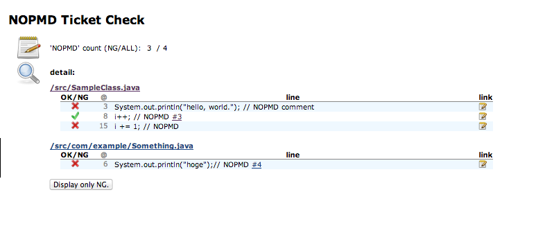

When you use Trac to tracking issues, this plugin makes a report about
whether 'NOPMD' in your codes are right.

## How to use this plugin ?

1.  You should install XML-RPC to your Trac, see
    <http://trac-hacks.org/wiki/XmlRpcPlugin>.
2.  A member in your project should write Trac's ticket-id at the same
    line including 'NOPMD'.
    **Foo.java**

    ``` syntaxhighlighter-pre
    public void hoge(){
        something.wrongMethod(); //NOPMD #251
    }
    ```

3.  And he or she writes "why using 'NOPMD' " into this ticket(i.e. 251
    in the above example).
4.  This plugin scans him or her code. And it connects to Tracand checks
    that the ticket is closed. If this plugin finds 'NOPMD' without
    ticket-id or finds ticket-id but this ticket isn't closed, this
    plugin report that this 'NOPMD' is illegal.

### Screen Shot



## Version History

#### Version 0.9 (Oct 26, 2012)
