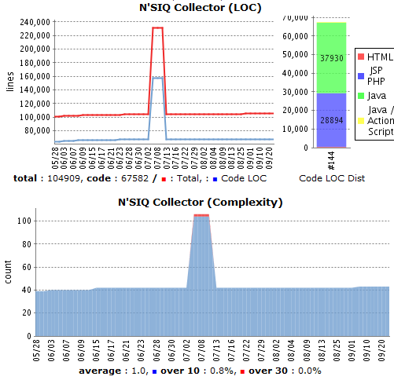
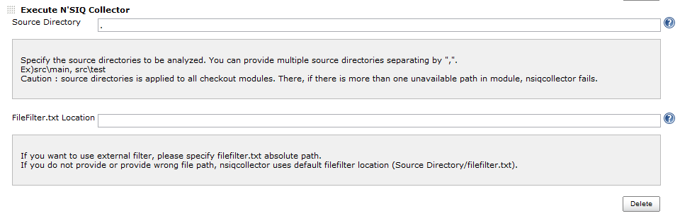
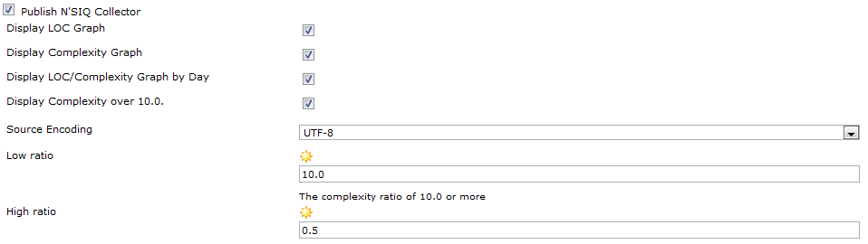

This plugin shows the lines of code and cyclomatic complexity from from
external metric tools named [N'SIQ
Collector](http://dev.naver.com/projects/nsiqcollector).

# Introduction

-   N'SIQ Collector Plugin shows lines of code and cyclomatic complexity
    from extenal metric tools named N'SIQ
    Collector(<http://dev.naver.com/projects/nsiqcollector>)
    -   N'SIQ Collector collects LOC and complexity from the designated
        folder without any complex options. If you run N'SIQ Collector
        on the some folder like following, It will scan files in the
        folder and generate two files(loc\_result.html,
        complexity\_result.html) on the folder.

        > nsiqcollector folder\_to\_be\_analyzed

    -   You can easily filter files in the folder by configuring
        "filefilter.txt" file on the folder. You can see how to set up
        it in following URL.
        <http://dev.naver.com/projects/nsiqcollector/wiki/%EB%B9%A8%EB%A6%AC%EC%8B%9C%EC%9E%91%ED%95%98%EA%B8%B0>
        -   filefilter.txt file is automatically generated in the target
            folder when you run nsiqcollector on the folder.

# How to set up

-   Install N'SIQ Collector on the Hudson
    server.(<http://dev.naver.com/projects/nsiqcollector/download>)
-   Install N'SIQ Collector Hudson Plugin through the official Hudson
    updatecenter.
-   Restart Hudson

&nbsp;

-   Go to Hudson Configure ==\> Assign N'SIQ Collector executable.  
    

&nbsp;

-   Go to Hudson Project Configure ==\> Add "Execute N'SIQ Collector"
    BuildStep and assign folders to be analyzed.  
    
    -   If you want to use external filefilter.txt which is not in the
        assigned folders, assign it the FileFilter.txt location field.

&nbsp;

-   Go to "Post Build Actions" and Click the "Publish the N'SIQ
    Collector" checkbox.  
    
    -   Check the options you want.

&nbsp;

-   Build it!

# Developers

-   Young-eun Oh, Currently working for NHN corp
    ([http://nhncorp.com](http://nhncorp.com/))
-   JunHo Yoon. Currently working for NHN corp
    ([http://nhncorp.com](http://nhncorp.com/))

# Changelog

### 1.3.3 (Aug 6, 2011)

-   Add log output on error
-   Update uses of deprecated APIs

### 1.3.2 (Oct 21, 2010)

### 1.3.0

-   Official Release
