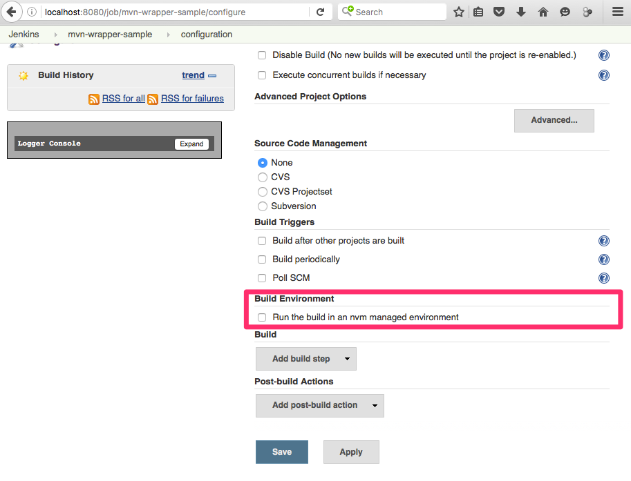
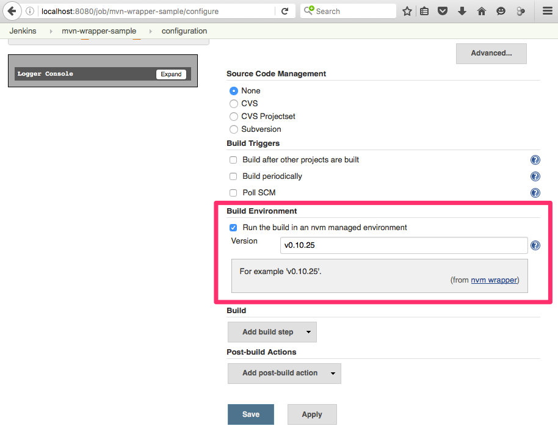
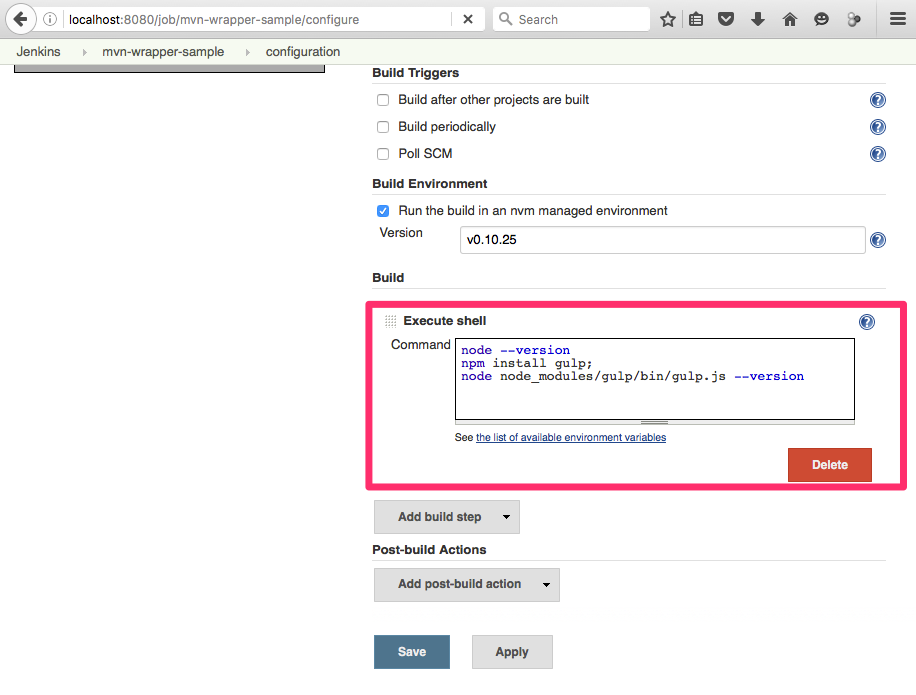
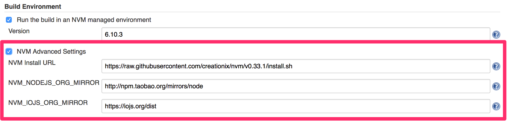

Allows you to easily install, manage, and work with multiple Node.js
environments

## Features

-   Installs nvm.sh
-   Installs node version configured for a job.
-   Amends build environment to use configured node version.

### Potential upcoming features

-   Use the .nvmrc-file
-   Make code compatible with Java 7

    

## Requirements

-    nvm-wrapper doesn't support windows
    [nvm-windows](https://github.com/coreybutler/nvm-windows) 
-    [nvm
    readme](https://github.com/creationix/nvm/blob/master/README.markdown)
-    Java 8

## Setup

### Install plugin

Install this plugin via the Jenkins plugin manager.

### Per-job config

1.  Enable build to run in nvm environment  
    
2.  Configure the node version   
    
3.  Add a shell command. There is not need to install modules globally 
      
     

## Version history

### Version 0.1.7 (Abril 2019)

-   Fix [ JENKINS-49720](https://issues.jenkins.io/browse/JENKINS-49720)
    - Getting issue details... STATUS

### Version 0.1.6 (Aug 2018)

-   Provide a way to customize NVM installation settings.

&nbsp;

-   Fix  [
    JENKINS-49720](https://issues.jenkins.io/browse/JENKINS-49720) -
    Getting issue details... STATUS
-   Fix  [
    JENKINS-46585](https://issues.jenkins.io/browse/JENKINS-46585) -
    Getting issue details... STATUS
-   Fix  [
    JENKINS-49445](https://issues.jenkins.io/browse/JENKINS-49445) -
    Getting issue details... STATUS

### Version 0.1.5 (Feb 2018)

-   Fix  [
    JENKINS-45742](https://issues.jenkins.io/browse/JENKINS-45742) -
    Getting issue details... STATUS
-   [Make arguments other than version
    optional](https://github.com/jenkinsci/nvm-wrapper-plugin/pull/11)

### Version 0.1.4 (Jul 2017)

-   Fix  [
    JENKINS-45784](https://issues.jenkins.io/browse/JENKINS-45784) -
    Getting issue details... STATUS

### Version 0.1.3 (Jun, 2017)

-   Add pipeline support  
    {height="250"}

  

{height="250"}

-   Fix  [
    JENKINS-45079](https://issues.jenkins.io/browse/JENKINS-45079) -
    Getting issue details... STATUS

  

### Version 0.1.2 (May, 2017)

-   Add support to advanced options  
    {width="500"}
-   Fix <https://github.com/jenkinsci/nvm-wrapper-plugin/pull/3>

  

### Version 0.1.0 (Aug, 2016)

-   Initial release

### [Github Repo](https://github.com/jenkinsci/nvm-wrapper-plugin)
