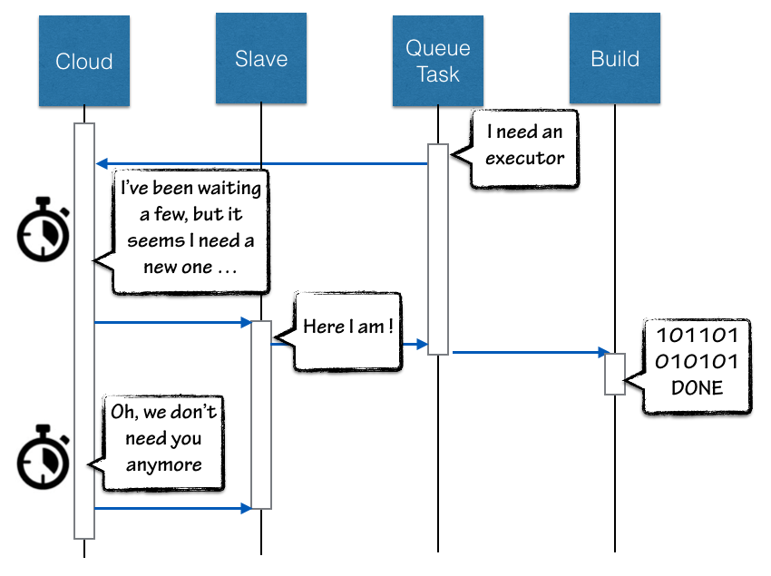
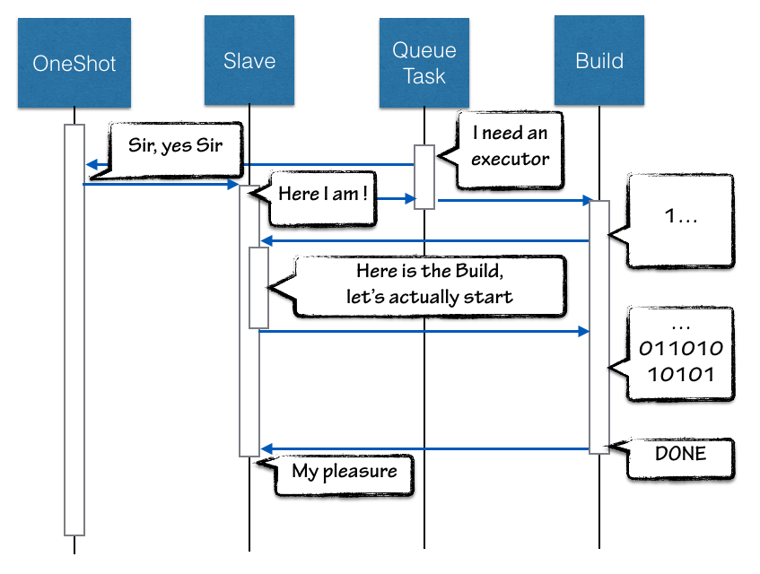

One-Shot Executor is an alternate paradigm for Jenkins Slave.

## TLDR;

A One-Shot Executor is a Slave created for a specific Build in Jenkins
Queue. It is launched as the Build start, and destroyed as the Build
Complete. Think as a 1:1 lifecycle between your Build and the Slave to
run it.

This plugin doesn't provide anything by itself, it is designed for being
used by other plugin that require this new paradigm, typically relying
on container technology.

## Why ?

A classic (or Cloud) Jenkins slave has it standalone lifecycle and do
accept task from the build queue. Especially, even when using a Cloud
slave, which can create a fresh new slave for a Build, Slave will still
precede the Build, and survive it. Cloud API can be tweaked to ensure
slave will be created asap and destroyed after use for a Build, but

1\. Cloud API do introduce some delays. Can be tweaked to limit them to a
strict minimum, but still exists

2\. The relation between a Build and a Slave is "Slave host a Build" as a
special case for "Salve do host Builds" .

**So the Slave precede the Build, what's wrong ?**

When relying on Docker containers, and the actual container image to
host the build is defined by the Job or Build parameters, the slave
launch can fail. A Cloud Slave would try to provision a slave repeatedly
as an infinite loop to match the Queue Task executor request,
until someone wonder why the build never started, investigate, and find
a typo in job configuration.

## So, what about One-Shot ?

A OneShot executor is an executor dedicated to a Builld.

We don't need the Cloud API and it's provisioning logic to estimate the
load and determine when a new slave has to be created, we ***KNOW*** a
new slave is required. So One-Shot just bypass the Cloud logic and
immediately create a Slave. The fresh new slave claim to be ready so the
task is assigned, and a Build is started. As the Build start to execute,
the Slave actually starts as well.

This lazy-bootstrap let us create a tight coupling between a Build and
it's Slave, and actually reverse the relation to "a Build has a Slave".

Reversing the Slave/Build relation and forwarding Slave's log into build
log, we can report the container bootstrap process. User will see in log
the image is pulled from registry, container is started, may fail and
report errors. In such circumstances, this is not Jenkins fault, but an
actual failure caused by the Build's configuration. So getting this in
the Build log, and reporting to the user by build failure notification
will let him know something is wrong without delay.

## How ?

One-Shot Executor is an infrastructure plugin, it does not provide new
Slaves by itself, but just the API for a Slave provider to implement
this new approach and only focus on running a Slave according to the Job
configuration / Build parameters.

Implementation require Jenkins 2.9 or later as we had to introduce some
dedicated hooks to allow the Build:Executor inverse relation.

## History

This plugin has been extracted
from [docker-slaves](http://localhost:8085/display/JENKINS/Docker+Slaves+Plugin),
we created for Docker Hack Day 2015 (we won the 3rd prize!), and which
is an experiment sandbox for us. So this specific piece of code was
created by extracting stable components to let them become mature and
usable by others.
