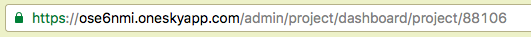
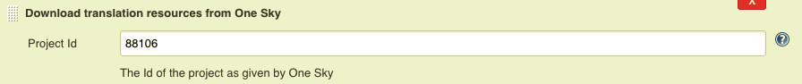
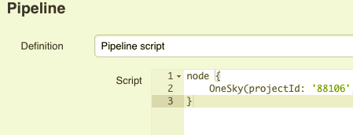
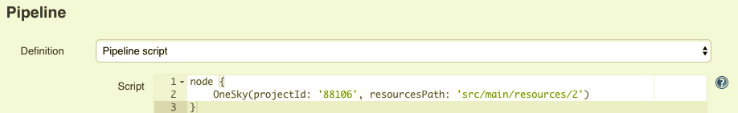
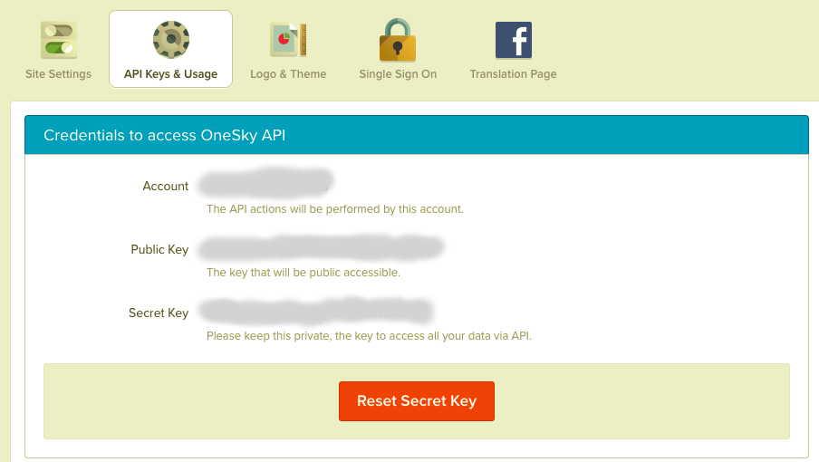
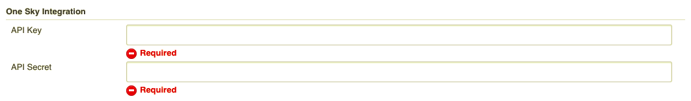

Maintain the localization process in sync with OneSky

# Features

-   Downloading of 'ready to be published' translation files from one
    sky
-   Creation of the downloaded files over in your workspace
-   Pipeline support

# Usage

To use this plugin 4 things need to be configured:  
 

1.  The target translation project Id as found on the url of the onesky
    app
2.  Secret key - This is where equivalent to a password for accessing
    the api
3.  Public Key - This is the equivalent to a username for accessing the
    api
4.  Resources Path - This is the relative path, inside your workspace,
    where your translation files will be output to 

# Configuration

To retrieve the **project Id** head over to the project definitions in
your onesky app and copy and pate the ending of your URL:

  
(88106 this example)

To the settings in your job: 

Or your pipeline:

The **Resources Path** will be configured in the same place:

on your job:  

and on your pipeline:

Finally, both the **API Secret** and **API key** should be taken from
the onesky app settings page:

and saved in the global jenkins configuration:

