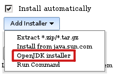
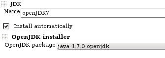

This plugin adds auto installer for OpenJDK from native RPM packages and
provides switching between OpenJDK vesrions using Linux alternatives

# Configuration

Add Java installation, select "Install automatically" and choose OpenJDK
installer

  


Select RPM package, which you want to install

  
  
   
Alternatives and yum are run via sudo, therefore appropriate sudoers
setup is requited (including switching off tty requirement which is
turned on by default or run pseudo-tty e.g. by including -t param in ssh
command).  
Example setup:  

**/etc/sudoers.d/jenkins**

``` syntaxhighlighter-pre
#Defaults    requiretty
User_Alias JENKINS = test_user
Cmnd_Alias OPENJDK_INSTALL = /usr/sbin/alternatives, /usr/bin/yum
JENKINS ALL = NOPASSWD: OPENJDK_INSTALL
```

# Changelog

### Upcoming changes 

### Release 1.1 (2015-01-16)

-   Added OpenJDK8
    ([JENKINS-26434](https://issues.jenkins-ci.org/browse/JENKINS-26434))

### Release 1.0 (2012-03-01)

-   Initial release
