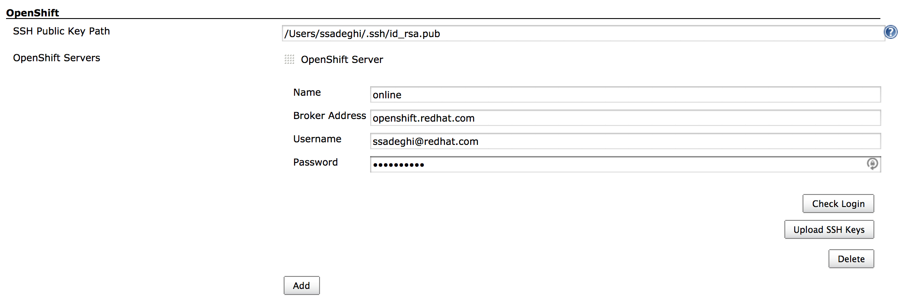
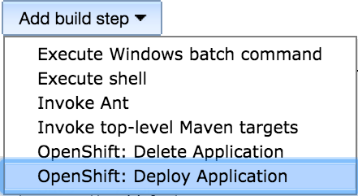
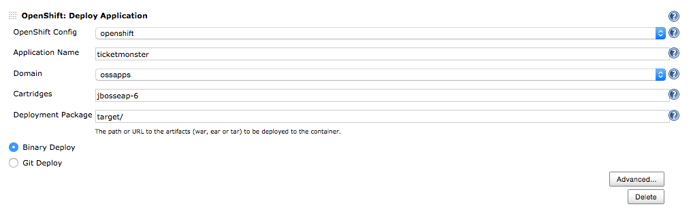
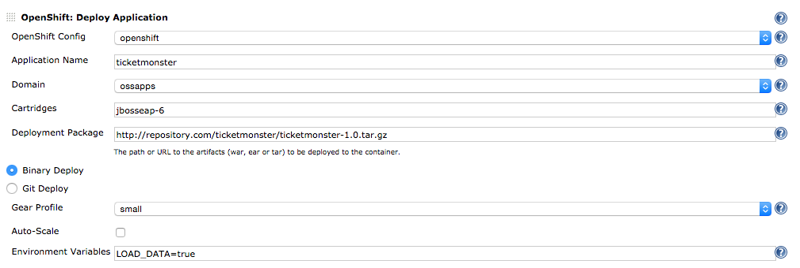

The current version of this plugin may not be safe to use. Please review
the following warnings before use:

-   [CSRF vulnerability and missing permission
    check](https://jenkins.io/security/advisory/2019-04-03/#SECURITY-981)
-   [Credentials transmitted in plain
    text](https://jenkins.io/security/advisory/2020-03-09/#SECURITY-1518)

# OpenShift Deployer Plugin 

This plugin add the ability to create gears and deploy applications to
[OpenShift](https://www.openshift.com/).

## Insallation

This plugin is available in the Jenkins plugin manager.  
To install in Jenkins, go to Manage Jenkins \| Manage Plugins \|
Available \| OpenShift Deployer Plugin \| Install.

You must restart Jenkins to complete the installation.

## Plugin Configuration

SSH keys are essential when working with OpenShift. If no SSH keys exist
on the Jenkins server, follow these instructions to generate a pair:

``` syntaxhighlighter-pre
su jenkins -s /bin/sh
ssh-keygen -t rsa
```

In order to configure the OpenShift Deployer plugin, go to Manage
Jenkins \| Configure System \| OpenShift. Enter the path to the public
key (defaults to /var/lib/jenkins/.ssh/id\_rsa.pub').

{width="1000"}

Add an OpenShift Server block for each OpenShift server you want to
deploy to by specifying an arbitrary name, broker address, username and
password. Click on *Check Login* to test the authentication. If
successful, you can upload your SSH Public Key to the OpenShift server
by clicking on *Upload SSH Keys*. The broker address is by default
openshift.redhat.com which is the address of broker for
[http://www.openshift.com](http://www.openshift.com/).

## Job Configuration

When building the WAR/EAR file by Maven, make sure your build is
successful creating a deployable file. The *mvn package* command creates
the WAR/EAR file into its *target* directory. Otherwise create the
WAR/EAR in whatever way that is appropriate for you project. The can
also create a TAR archive containing the deployment packages, markers,
scripts, etc and use the BINARY deployment method. Check out this [blog
post](https://blog.openshift.com/using-openshift-without-git/) for
further details on BINARY deployment.

In order to deploy an application to OpenShift during a build job, click
on *Add post-build step* in the job configuration and choose *OpenShift:
Deploy Application*.

{width="260"}

The *Deploy Application* build-step creates an application on OpenShift
and deploys the WAR/EAR/TAR file generated by your build to the created
application. It also supports giving a URL (e.g. to Nexus or
Artifactory) for the WAR, EAR or TAR deployment which will be fetched
and deployed to OpenShift. 

{width="1000"}

In order to enable auto-scale, set environment variables and choose gear
profile, click on the "Advanced" button.

{width="1000"}

When the build-step runs, if the specified application does not exist on
OpenShift it is created first and then the WAR/EAR/TAR file is deployed
to it. If it already exists, the packages will be deployed to the
existing application.

The *Delete Application* build-step removes an existing application from
OpenShift.

## Release Notes

##### Version 1.2.0

-   Support for providing .openshift content in GIT deployments
-   Support for running on Slave nodes
-   OpenShift password encryption in Jenkins configurations

##### Version 1.1.1

-   Path to deployment package can be specified both as directory and
    file paths e.g. target/app.war

##### Version 1.1.0

-   Binary deployment support added
-   Plugin can create auto-scaled gears
-   Environment variables can be set on the gear

##### Version 1.0.4

-   Build-step added for removing applications on OpenShift
-   Empty domain accepted if only one domain exists on the user account

##### Version 1.0.3

-   Support for token macro expressions added for the deployment package
    URL

##### Version 1.0.2

-   Bug fixes to skip creating application if no deployment package
    exists.

##### Version 1.0.1

-   Support for deploying multiple deployments at once
-   Support for using URLs to fetch the deployment packages

##### Version 1.0.0

-   Initial release
