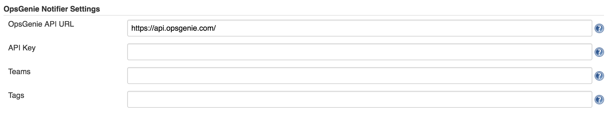
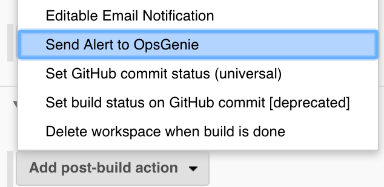
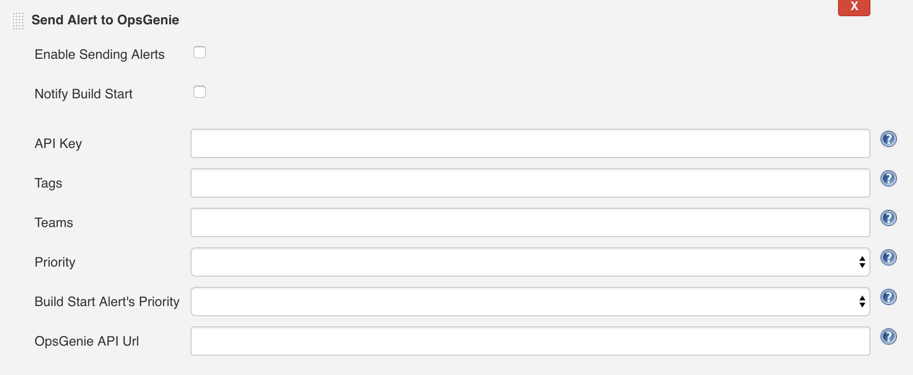

This plugin allows posting build related alerts to
[OpsGenie](https://www.opsgenie.com/) that notify who is on call.

# Documentation

 

This documentation only contains some part of the documentation, if you
want to get more information you can check our [OpsGenie Jenkins Plugin
GitHub](https://github.com/opsgenie/opsgenie-jenkins-plugin) and
[OpsGenie Jenkins Integration
Documentation](https://docs.opsgenie.com/docs/integrations/jenkins-integration).

  

 

The OpsGenie Plugin allows sending build messages to OpsGenie which
filters them and creates alerts.

 

## Global Configuration

 

1.  Configure the Global Jenkins settings for OpsGenie plugin by
    following "Manage Jenkins" -\> "Configure System" -\> "OpsGenie
    Notifier Settings".
2.  Enter the API Url and API Key that's given from OpsGenie Jenkins
    Integration. API Url set to a default value but also can be
    configured. 
3.  Enter the Teams that you want to notify and alert Tags.
4.  These fields can be used as default settings, also can be overridden
    for specific jobs.

{height="150"}

## Post-Build Action

1.  Activate OpsGenie Plugin for the Jenkins Job by following \<Job\>
    -\> "Configure".
2.  Scroll to the "Post-Build Actions" section of the project
    configuration.
3.  Click on the "Add post-build action" button.
4.  Select the "Send Alert to OpsGenie" entry from the list displayed.
     The "Send Alert to OpsGenie" section will appear in the window.
5.  Click on the "Save" button to retain these changes.

{height="250"}

## Job Configuration

1.  Configure the Jenkins Job settings for OpsGenie plugin by following
    \<Job\> -\> "Configure" -\> "Send Alert to OpsGenie".
2.  Check "Enable Sending Alerts" to send an alert to OpsGenie.
3.  Check "Notify Build Start" to send an alert to OpsGenie that
    notifies on build start.
4.  Enter the API URL and API Key that's given from OpsGenie Jenkins
    Integration. If you fill these fields global settings will be
    overridden. 
5.  Enter the Teams that you want to notify and alert Tags. If you fill
    these fields global settings will be overridden.
6.  Select the priority of the build status alert from "Priority" field.
7.  Select the priority of the build start status alert from "Build
    Start Alert's Priority" field.

## {height="400"}

# Version history

### Version 1.2 (Aug 9, 2017)

-      Initial
    release

  
