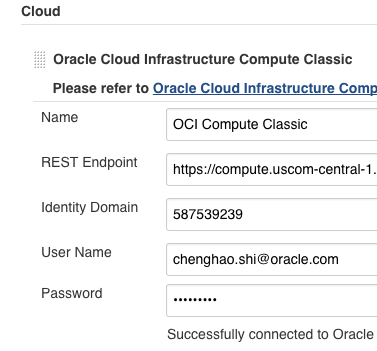
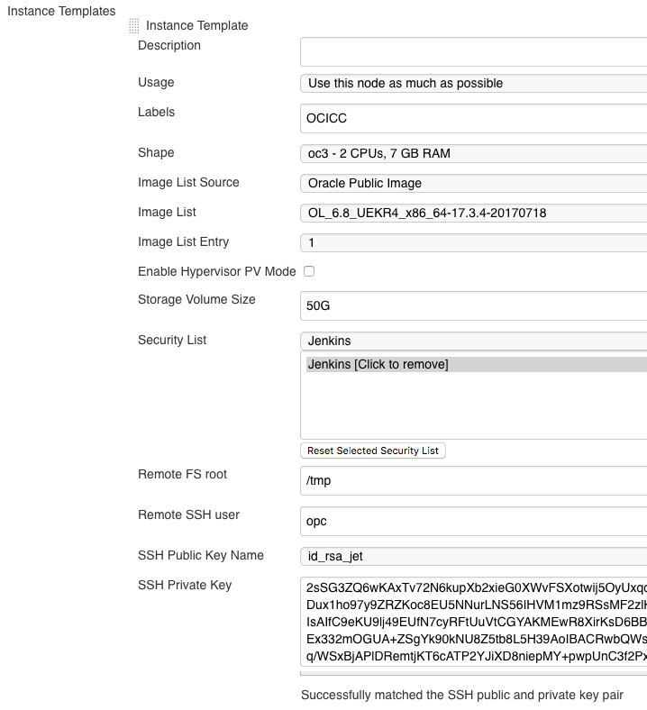
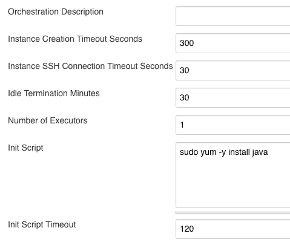

A Jenkins Plugin to create compute instances on Oracle Cloud
Infrastructure (OCI) Compute Classic and start agents on them
dynamically.

  

##  

## License

Oracle Cloud Infrastructure Compute Classic Plugin is dual-licensed to
you under the Universal Permissive License (UPL) and Apache License 2.0.
Refer <https://github.com/jenkinsci/oracle-cloud-infrastructure-compute-classic-plugin/blob/master/LICENSE.txt> for
License terms

  

 

## Prerequisites

 

1.  You need to have a oracle cloud account, to sign up, try [Oracle
    Cloud](https://cloud.oracle.com/en_US/tryit)
2.  Your Jenkins server must be installed with JDK7 or higher

 

## Compatibility

1.  The plugin is tested on minimum Jenkins version 1.625.3, they may
    not work with versions early than 1.554.
2.  For Jenkins versions between 1.554 and 1.625, please make sure
    plugin 'bouncycastle API Plugin' has been pre-installed. This could
    be checked at 'Manage Jenkins' -\> 'Manage Plugins' -\> 'Installed'
    list, and could be found and installed from 'Available' list.

 

## Installation

You can install or update the plugin through Jenkins update center or
manually. To install or update the plugin through Jenkins update center:
Go to your Jenkins console, click "Manage Jenkins" -\> "Manage Plugins",
then search Oracle Cloud Infrastructure Compute Classic Plugin.

To manually install the plugin:

1.  Git clone the project and build with:

        mvn package

2.  Go to your Jenkins console, click "Manage Jenkins" -\> "Manage
    Plugins" -\> "Advanced" -\> "Upload Plugin" -\> Select
    oracle-cloud-infrastructure-compute-classic.hpi file in target
    folder under your project -\> click "Upload"

 

## Configuration

### Add New Cloud

1.  From Jenkins server console, click "Manage Jenkins" -\> "Configure
    System"
2.  Click "Add a new cloud" and select "Oracle Cloud Infrastructure
    Compute Classic"
3.  Enter credentials for Oracle Cloud Infrastructure Compute Classic
    account (Note you can repeat step 3 multiple times to add multiple
    Oracle Cloud Infrastructure Compute Classic accounts)
    -   Name: an identifier from Jenkins' perspective on this account,
        enter anything you want
    -   REST Endpoint and Identity Domain: can be obtained from your
        Oracle Cloud Infrastructure Compute Classic Service console
4.  Click "Test Connection" to verify that Jenkins can successfully talk
    to Oracle Cloud Infrastructure Compute Classic with the
    account/credential you entered  
    {height="250"}
5.  Click "Advanced" and fill the number in "Instance Cap" field to
    limit the maximum number of compute instances that are allowed to be
    created using above account

 

### Add New Template

1.  Click "Add" in "Instance Templates" section to add one resource
    configuration set for desired compute instances, you can click "Add"
    multiple times if you need different compute instance
    configurations.

2.  Input or select values in the 'Instance Template' section:

    -   Description: help other users/colleagues understand what this
        template is used for
    -   Usage: it's recommended that you select "Only build jobs with
        label expressions matching this node" for now
    -   Labels: unique identifier which allows Jenkins to pick the right
        compute instance template to start
    -   Image List Source: allow user to select customized image besides
        image provided in /oracle/public/ container by selecting
        "Private Image"
    -   Shape, Image List Source, Image List, Image List Entry, Storage
        Volume Size: specify desired requirement on CPU, RAM, Image,
        Storage size *\[Important : Make sure Java is installed in
        selected image or refer "Init Script" in Step 3 to install Java
        on the newly launched compute instances\]*
    -   Security List: make sure you have enabled security rule through
        Oracle Cloud Infrastructure Compute Classic Service console to
        allow SSH access
    -   Remote FS root, Remote SSH user: dedicated directory for Jenkins
        agent in slave node and the ssh user used for Jenkins master to
        access Jenkins slave, make sure the SSH user has written
        permission on Remote FS root directory
    -   SSH Public Key Name: user can select the ssh public key they
        already uploaded to Oracle Cloud Compute Service
    -   SSH Private Key: user needs to put in corresponding private key
        that allows jenkins connect to the compute instances provisioned
        using above public key.

3.  Click "Verify SSH Key Pair" to verify the public key and private key
    are matched or not as below.  
    {height="250"}

4.  Click "Advanced" for more configuration options:

    -   Orchestration Description:description for oplan orchestration of
        each compute cloud instance. If unspecified, default value
        "Jenkins agent" will be used. Refer Orchestrations v1 Templates
        for details info.
    -   Start Timeout Seconds: number of seconds to wait for new Oracle
        Cloud Infrastructure Compute Classic instance to reach state
        "ready", default value is 300. Refer Orchestrations v1 Life
        Cycle for details info.
    -   SSH Connection Timeout Seconds: number of seconds to wait for
        new Oracle Cloud Infrastructure Compute Classic instance from
        state "ready" to be SSH connectable from Jenkins master, default
        value is 60.
    -   Idle Termination Minutes:number of minutes for Jenkins to wait
        before deleting an idle slave, which means completely removal of
        the created Oracle Cloud Infrastructure Compute Classic
        instance. A value of 0 (or an empty string) indicates that idle
        slaves should never be stopped/deleted. As an example, let's say
        a slave was started at 11:00 and Idle Termination Minutes was
        set 5. The slave executed several Jenkins jobs from 11:00 to
        11:20, and has been idle since then. At 11:25 Jenkins finds the
        idle timeout of above slave has reached and the slave will be
        deleted.
    -   Number of Executors: this controls the number of concurrent
        builds that Jenkins can perform. So the value affects the
        overall system load Jenkins may incur. A good value to start
        with would be the number of processors on your system.
    -   Increasing this value beyond that would cause each build to take
        longer, but it could increase the overall throughput, because it
        allows CPU to build one project while another build is waiting
        for I/O.
    -   When using Jenkins in the master/slave mode, setting this value
        to 0 would prevent the master from doing any building on its
        own. Slaves may not have zero executors, but may be temporarily
        disabled using the button on the slave's status page.
    -   Init Script: Corresponds to "opc-init", user can define several
        lines of shell based commands to configure the provisioned
        compute instances (One-time) before the first Jenkins job starts
        to build; for example, if the image user selected does not have
        Java pre-installed, user can input Java installation command
        like "sudo yum -y install java"
    -   Init Script Timeout: Number of seconds to wait for the
        completion of Init Script. Default value is 120 seconds.  
        {height="250"}

5.  Click "Save" or "Apply"

 

 

### Job configuration

We have added an instance template with a specific label string, to
restrict projects can be run with this kind of template, user can simply
input the same label string in "Label Expression" field of the Jenkins
job configuration page.

 

## Changelog
