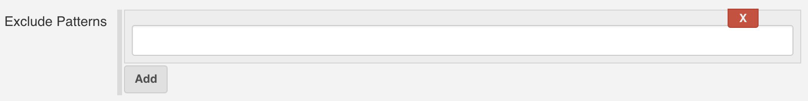
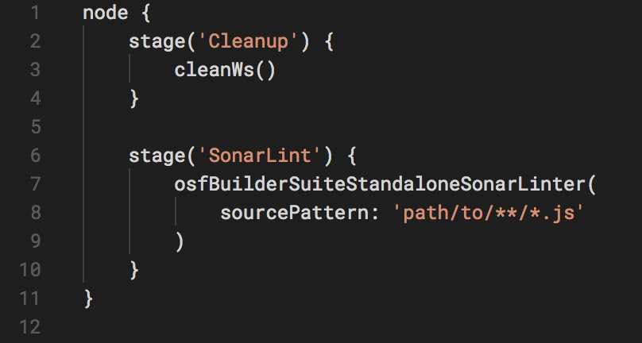
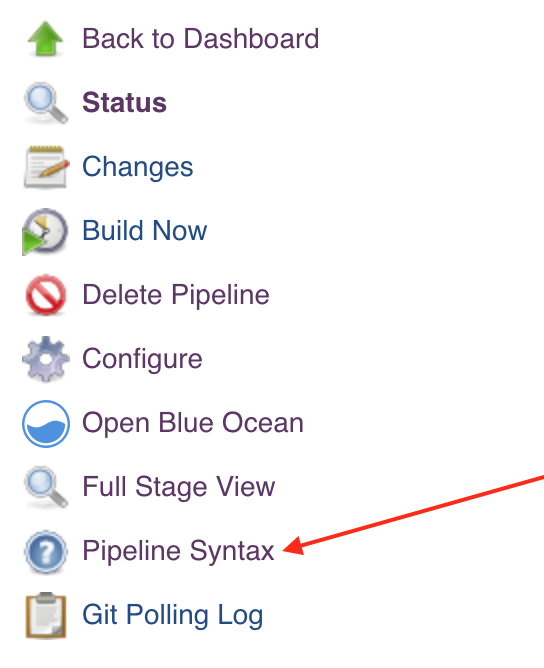

**OSF Builder Suite :: Standalone Sonar Linter Plugin** is a very
easy-to-use Jenkins plugin that is used to lint your JavaScript (for
now; additional plugins can be added upon request) files using an
standalone version of Sonar.

If you have a bug to report or maybe a feature that you wish to request,
please do so [on GitHub, on the project's issues
page](https://github.com/jenkinsci/osf-builder-suite-standalone-sonar-linter-plugin/issues).

 

# Installation

Just go to "`Manage Jenkins > Manage Plugins > Available`", search for
"`OSF Builder Suite`",
select `"OSF Builder Suite :: Standalone Sonar Linter Plugin"` and click
"`Download now and install after restart`" button.

 

# Configuration

{width="800"}

Pattern (relative to the workspace) to be used by the linter to get the
list of files that you want to be linted.   
  
When a path is matched against a pattern, the following special
characters can be used:

-   ?   
    Matches one character (any character except path separators)
-   \*   
    Matches zero or more characters (not including path separators)
-   \*\*   
    Matches zero or more path segments

Examples:

-   \*\*/\*.js  
    Matches all .js files/dirs in a directory tree
-   node\_modules/\*\*  
    Matches the node\_modules folder and all its contents
-   test/a??.js  
    Matches all files/dirs which start with an a, then two more
    characters and then .js, in a directory called test
-   \*\*  
    Matches everything in a directory tree
-   \*\*/test/\*\*/XYZ\*  
    Matches all files/dirs which start with XYZ and where there is a
    parent directory called test (e.g. abc/test/def/ghi/XYZ123)

 

{width="800"}

List of patterns to be ignored. If a path matches any of the patterns in
this list then it will be ignored.   
The pattern needs to be relative to the workspace.   
  
When a path is matched against a pattern, the following special
characters can be used:

-   ?   
    Matches one character (any character except path separators)
-   \*   
    Matches zero or more characters (not including path separators)
-   \*\*   
    Matches zero or more path segments

Examples:

-   \*\*/\*.js  
    Matches all .js files/dirs in a directory tree
-   node\_modules/\*\*  
    Matches the node\_modules folder and all its contents
-   test/a??.js  
    Matches all files/dirs which start with an a, then two more
    characters and then .js, in a directory called test
-   \*\*  
    Matches everything in a directory tree
-   \*\*/test/\*\*/XYZ\*  
    Matches all files/dirs which start with XYZ and where there is a
    parent directory called test (e.g. abc/test/def/ghi/XYZ123)

 

 

# Jenkins Pipeline Configuration

Here's a sample pipeline configuration to get you started:

{height="250"}

 

You can also always consult the pipelines documentation available
at <https://jenkins.io/doc/book/pipeline/> or check the pipeline syntax
link right inside Jenkins on the left navigation menu.

{height="250"}

 

# Version history

<https://github.com/jenkinsci/osf-builder-suite-standalone-sonar-linter-plugin/releases>

 
