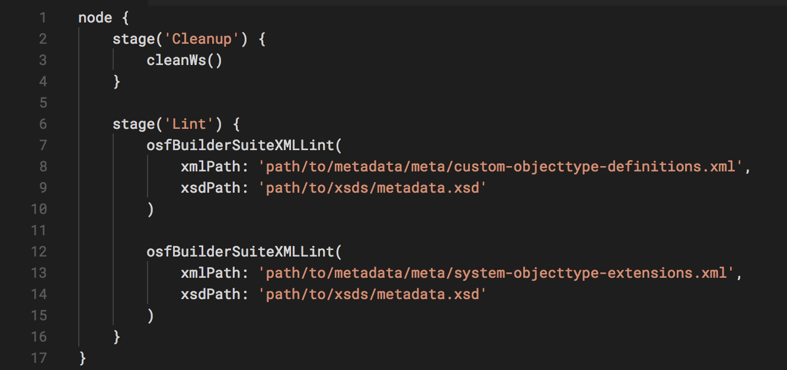

**OSF Builder Suite :: XML Linter** is a very easy-to-use Jenkins plugin
that is used to lint your XML file against a XSD file.

If you have a bug to report or maybe a feature that you wish to request,
please do so [on GitHub, on the project's issues
page](https://github.com/jenkinsci/osf-builder-suite-xml-linter-plugin/issues).

 

# Installation

Just go to "`Manage Jenkins > Manage Plugins > Available`", search for
"`OSF Builder Suite`", select `"OSF Builder Suite :: XML Linter"` and
click "`Download now and install after restart`" button.

 

 

# Configuration

{width="800"}

Path (relative to the workspace) to the XML file you want to lint.   
  
Example: path/to/file.xml

 

{width="800"}

Path (relative to the workspace) to the XSD file you wish to lint your
XML file against.   
  
Example: path/to/file.xsd

 

# Jenkins Pipeline Configuration

Here's a sample pipeline configuration to get you started:

{width="600"}

 

You can also always consult the pipelines documentation available
at <https://jenkins.io/doc/book/pipeline/> or check the pipeline syntax
link right inside Jenkins on the left navigation menu.

{height="250"}

 

# Version history

<https://github.com/jenkinsci/osf-builder-suite-xml-linter-plugin/releases>
