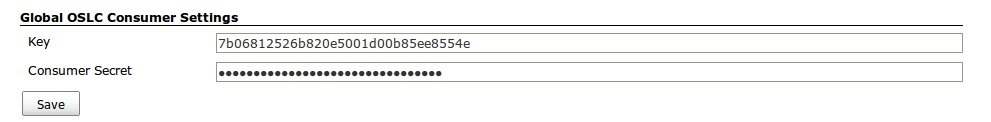
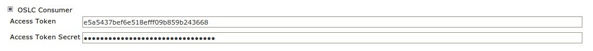
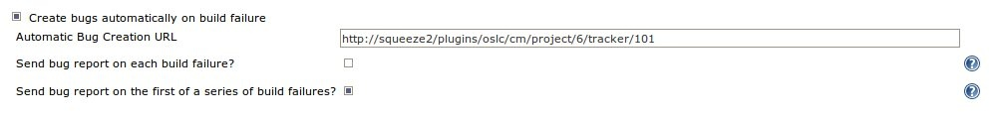
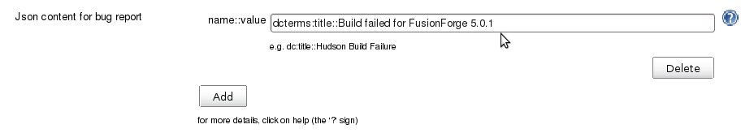
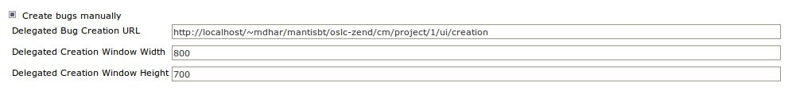

Connects to different remote bug trackers via the OSLC protocol

#### Code

The source code is at <https://github.com/jenkinsci/oslc-cm-plugin>

#### Configuration

The plugin uses OAuth as mode of authentification. Jenkins thus has to
be registered as an OAuth consumer with the concerned bug-tracker. The
corresponding Customer key and secret are to be entered in the Global
Configuration page as below:

With the above, we can now request an access token and secret from the
bugtracker. A sample script which does so, is available
[here](https://github.com/jenkinsci/oslc-cm-plugin/tree/master/OAuth/src/com/coclico/oauth). 
The token and secret are to be entered in the configuration page for the
corresponding job.

#### Bug Creation

This can be done in two ways.

###### Automatic Creation

###### 

On each build failure (depending on the preferences chosen by the user),
the plugin does an HTTP POST to the URL specified (as in the screenshot
above) on the job configuration page.

The content of the POST request is in json and is configurable.

Clicking on 'Add' opens up textboxes, where the name/value pair of all
attributes of the bug report can be added, separated by a '::' sign, as
shown below. Quotes are not allowed in the textboxes.

If no attributes are specified, the content of the bug report will be as
follows (in json):

{  
    "dcterms:title":"Hudson Build Failure",  
    "dcterms:description":"\<Link to the Build Failure page\>",  
    "oslc\_cm:status":"Open",  
    "helios\_bt:priority":"3",  
    "helios\_bt:assigned\_to":"Nobody"  
}

###### Manual Creation (Delegated Creation)

This creates a link on the build page which takes us to an embedded
iframe containing the content of the url specified (as in the screenshot
above) on the job configuration page.

To be done: Support for creating links to newly-created bugs.

**See also** : a screencast of a demo made with FusionForge trackers :
<http://vimeo.com/23480321>
