This plugin adds a post-build step that allows you to upload any
fingerprinted artifacts to [packagecloud.io](https://packagecloud.io/).

Be sure to check the [packagecloud Jenkins plugin
documentation](https://packagecloud.io/docs#jenkins) as well.

#### **Plugin Installation (Jenkins 1.5 or higher required):**

  
Go to 'Manage Jenkins'  
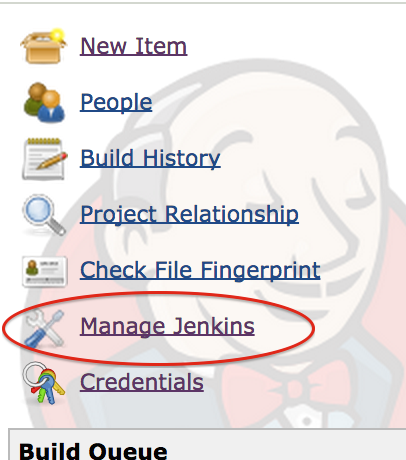{height="200"}

Click 'Manage Plugins'

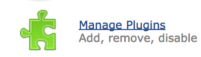{width="200"}

Find the 'packagecloud' plugin under the 'Available' section

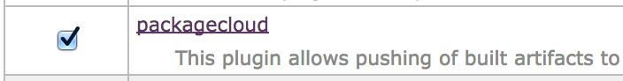{width="300"}

#### **Credentials Setup:**

  
From the main page go to 'Credentials'

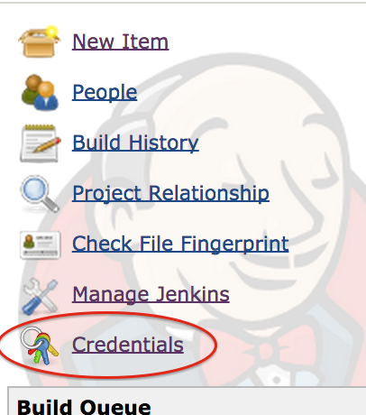{height="200"}

Click 'Add domain' to create a new domain

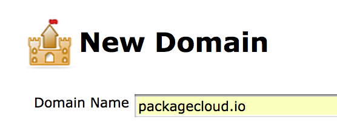{width="200"}

Name it whatever you wish, but make sure you add the 'Hostname'
specification

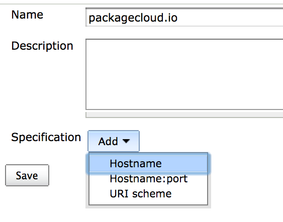{width="200"}

Use 'packagecloud.io' (or your custom
[packagecloud:enterprise](https://enterprise.packagecloud.io/) domain
name) as the 'Include' domain

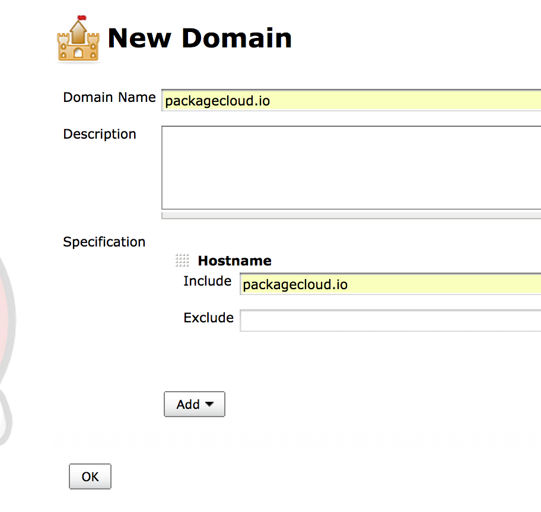{width="200"}

Add a 'Username with password' entry using your
[packagecloud.io](https://packagecloud.io/) (or [packagecloud:enterprise](https://enterprise.packagecloud.io/)) username
as the username and your [API token](https://packagecloud.io/api_token)
as the password.

**You can get your token via the API Token settings page
here: [Packagecloud API Token](https://packagecloud.io/docs/api)**

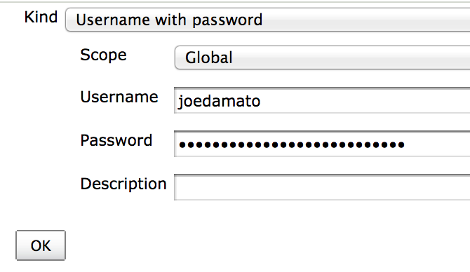{width="200"}

#### **Uploading artifacts from a job:**

Ensure that your build job is set to record fingerprints matching the
artifacts you wish to upload

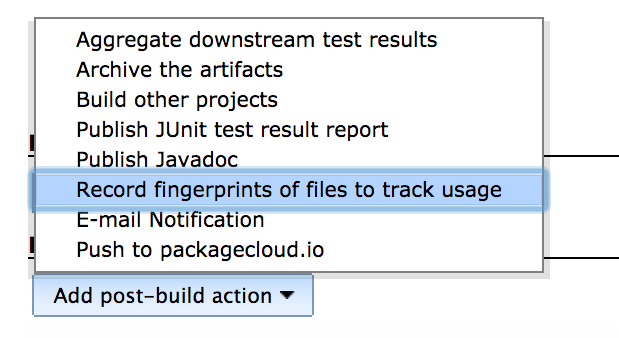{width="200"}  
For example, given a job that builds an rpm, you'd use this as your
fingerprint regular expression

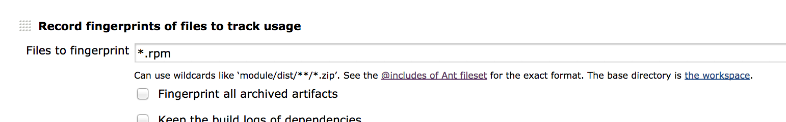{width="200"}

Refer to this table for what regular expression to use for a particular
package type:

| Package Type | Fingerprint Expression                                           |
|--------------|------------------------------------------------------------------|
| rpm          | \*.rpm                                                           |
| dsc          | \*.dsc, \*.bz2, \*.gz, \*.deb                                    |
| deb          | \*.deb                                                           |
| gem          | \*.gem                                                           |
| node         | \*.tgz                                                           |
| python       | \*.gz, \*.bz2, \*.z, \*.tar, \*.egg-info, \*.zip, \*.whl, \*.egg |

Read more about artifact fingerprinting here: [Jenkins
Fingerprint](https://wiki.jenkins-ci.org/display/JENKINS/Fingerprint)

Add the post-build step to your build

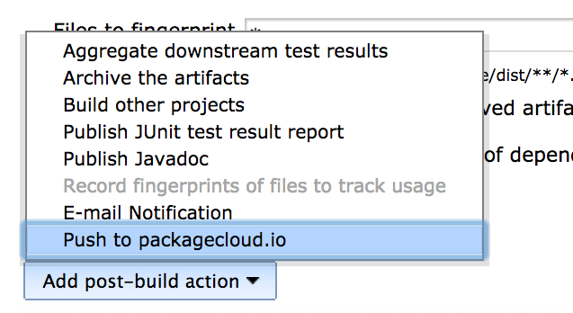{width="200"}  
Set the username, repository and distribution for the artifact:

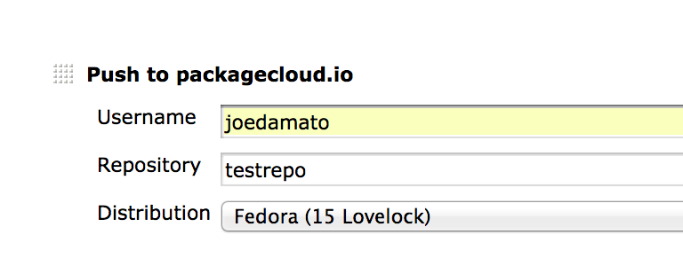{width="200"}

If using [packagecloud:enterprise](https://enterprise.packagecloud.io/),
enter the hostname (same one used for the credentials step above), port
and protocol:

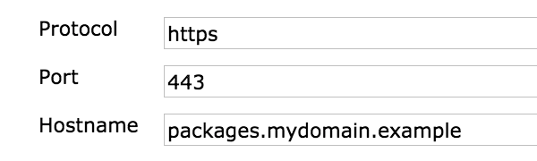{width="200"}

Then build your job as usual, and your artifact will be pushed up to
packagecloud!

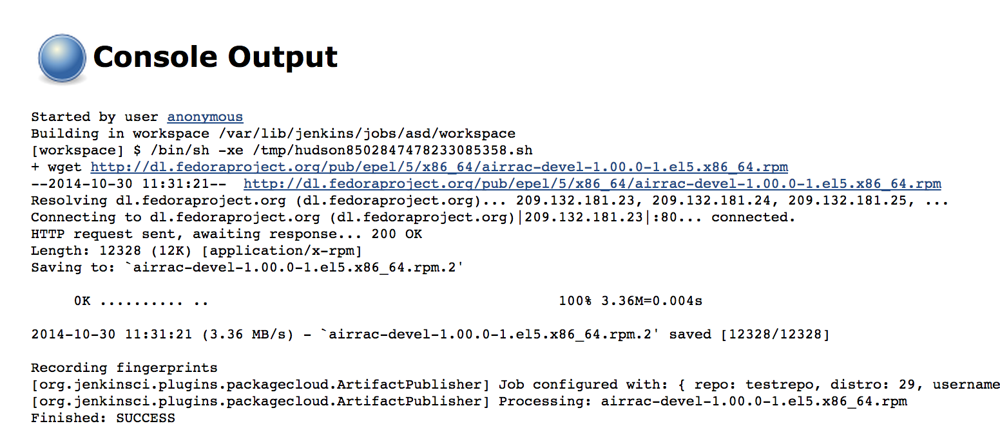{width="200"}
