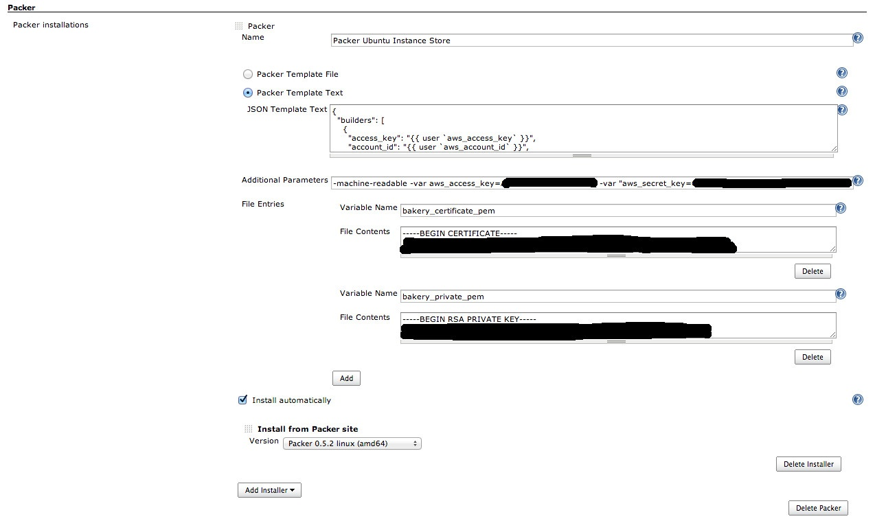

This plugin allows for a job to publish an image generated
[Packer](http://packer.io/)

## Configuration

### System Configuration

At the system level this plugin supports choosing a specific installable
binary to use and a (optional) [packer
template](http://www.packer.io/docs/templates/introduction.html) in the
form of a text or file that is located on the slave node.  If utilized,
jobs can share this global system-wide packer template and specify any
necessary variables, which either replace or add to variables specified
at the system level. Files can also be specified for items such as [x509
certs](http://www.packer.io/docs/builders/amazon-instance.html), and
these files are created temporarily for the packer execution and the
file location bound to the specified variable for use within a template.

### Job Configuration

At the job level this plugin can either use a global system-wide
template for the chosen installation or packer template as text or a
file.  As our available at the system level
[variables](http://www.packer.io/docs/templates/user-variables.html) and
temporary files can be configured and referenced in the template.

The plugin will automatically install the desired version of packer on
the node.

##### Note: this plugin requires Jenkins running under a minimum of Java 7

## **Changelog**

### **Release 1.5 (March 20, 2018)**

-   [ JENKINS-49715](https://issues.jenkins.io/browse/JENKINS-49715) -
    Getting issue details... STATUS
-   increase prefix length for temp files

### Release 1.4 

-   Open requests
-   Packer Push support? <https://packer.io/docs/templates/push.html>

### Release 1.3 (March 18, 2016)

-   <https://github.com/jenkinsci/packer-plugin/issues?q=milestone%3A1.3>

### Release 1.2 (May 18, 2015)

-   <https://issues.jenkins-ci.org/browse/JENKINS-26966>

### Release 1.0 (Apr 04, 2014)

-   Initial release
