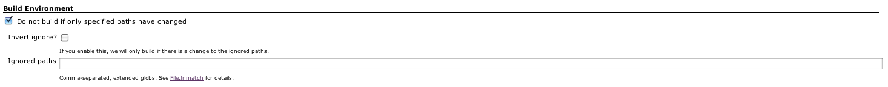

**This plugin is up for adoption.** Want to help improve this plugin?
[Click here to learn
more](http://localhost:8085/display/JENKINS/Adopt+a+Plugin "Adopt a Plugin")!

This plugin allows SCM-triggered jobs to ignore build requests if only
certain paths have changed, or to build if and only if certain paths are
changed.

## Table of Contents

## Description

Pathignore allows you to do one of two things:

1.  Do NOT allow a build to run if **ALL** of the changed paths match a
    given set of patterns.
    -   This allows you to ignore specific paths, not triggering a build
        if only the specified paths have changed.
2.  Only allow a build to run if at least **ONE** of the files changed
    match a given set of patterns.
    -   This allows you to only build for specific paths, not triggering
        a build if the paths you care about haven't changed.

### Setup

To filter whether a build builds based on path, go to the configuration
page of the job you care about, and check the box named
`Do not build if only specified paths have changed`.

The default mode will not rebuild if only the specified paths have
changed. The "inverted" mode will do \#2 above, and only build if the
specific paths have changed.

Patterns are separated by comma, and matched using [Ruby's
fnmatch](http://www.ruby-doc.org/core-1.9.3/File.html#method-c-fnmatch).

A skipped build will be marked as NOT BUILT, not FAILED or SUCCESS.

## Known issues

type

key

summary

assignee

reporter

priority

status

resolution

created

updated

due

Data cannot be retrieved due to an unexpected error.

[View these issues in
Jira](http://issues.jenkins-ci.org/secure/IssueNavigator.jspa?reset=true&jqlQuery=component%20=%20pathignore%20AND%20project%20=%20JENKINS%20AND%20resolution%20=%20Unresolved%20ORDER%20BY%20updated%20DESC&tempMax=1000&src=confmacro)

## Version history

### 0.6 (Nov 17, 2011)

-   Upgrade to ruby-runtime v0.6
-   Upgrade to jenkins-plugin-runtime v0.1.15

This should resolve any ConcurrentModificationException you might have
been seeing.

### 0.5 (Nov 14, 2011)

-   Update metadata to include repository URL and a display name.

### 0.4 (Nov 12, 2011)

-   Integration tests - which means higher quality code!
    
-   Fixed JENKINS-11708: Link not opening in a new window.
-   Workaround for JENKINS-11709: We now provide a blank global.erb so
    that the global config page loads properly.
-   Fixed compatibility with jenkins-plugin-runtime 0.1.11: Builds were
    broken because of an upgrade to jenkins-plugin-runtime.

### 0.3 (Nov 10, 2011)

-   Shortname 'pathfilter'
-   Better metadata

### 0.2 (Nov 10, 2011)

-   First release.
