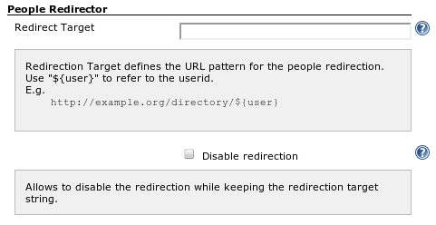

Allows you to integrate with an external user management system.

HTTP requests which go to the Jenkins-internal "people" page are
redirected to the external site.

# Configuration

## Global configuration

# Changelog

##### Version 1.3 (May 11, 2012)

-   Fixed
    [JENKINS-12224](https://issues.jenkins-ci.org/browse/JENKINS-12224)

##### Version 1.2 (Oct 12, 2011)

-   Redirects now also when the URL has a single trailing slash.

##### Version 1.1 (Oct 11, 2011)

-   Fixed
    [JENKINS-11058](https://issues.jenkins-ci.org/browse/JENKINS-11058)
-   Added [unit
    test](https://github.com/jenkinsci/people-redirector-plugin/blob/master/src/test/java/com/cisco/step/jenkins/plugins/people/redirector/BasicTest.java)

##### Version 1.0 (Sep 4, 2011)

-   First release
