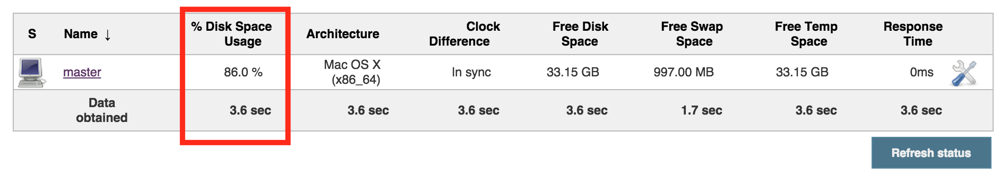

  This plugin just shows the percentage of disk space usage column on
"Manage Nodes" page. 

  

# Usage

You can find it under `<jenkins_url>/computer` or reach it via links in
the sidepanel of the main page. 

## Node Monitoring Configuration

{width="200"}

## Manage Nodes page

{width="1200"}

## Sample groovy script

You can query this monitoring field programmatically in Groovy, see the
below groovy example:

**Groovy Script**

``` syntaxhighlighter-pre
for (node in jenkins.model.Jenkins.instance.slaves) {
  computer = node.toComputer()
  if (computer.getChannel() == null) continue
    rootPath = node.getRootPath()
  def percentage = computer.getMonitorData()['org.jenkins.ci.plugins.percentagecolumn.PercentageDiskSpaceMonitor']
  if (percentage != null ) {
    println("node: ${node.getDisplayName()} has got ${percentage} disk space usage.")
  }
}
```

 Further references: [Jenkins Script
Console](https://wiki.jenkins-ci.org/display/JENKINS/Jenkins+Script+Console)

## Planned upcoming features

-   Security layout.

# Open Issues

# Version history

### Version 0.1.0 (26th Sept)

-   
      Initial release
